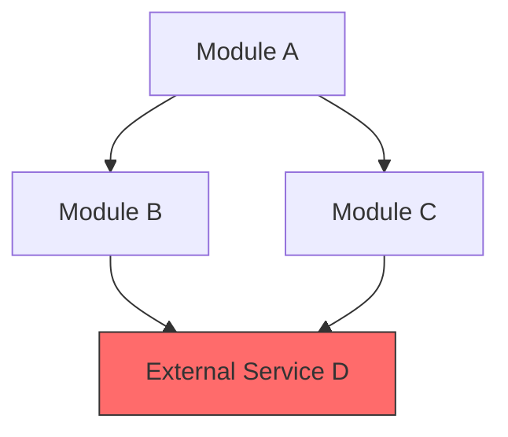
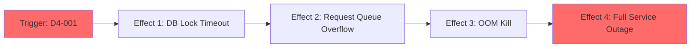

# Stress Test Report: {{change_name}}

> **Generated by**: Plan Stress Test v2.0 — Deep Analysis Engine
> **Date**: {{date}}
> **Change Scale**: {{scale}} (Small / Medium / Large)

---

## 1. Executive Summary

### Plan Health Score: {{score}} / 100 — Grade: {{grade}}

| Classification | Count | Threshold |
|----------------|-------|-----------|
| 🔴 CRITICAL | {{count}} | RPN ≥ 75 |
| 🟠 HIGH | {{count}} | RPN 50–74 |
| 🟡 MEDIUM | {{count}} | RPN 25–49 |
| 🔵 LOW | {{count}} | RPN < 25 |

**Top 3 Critical Findings**:
1. [One-sentence summary of the most dangerous finding]
2. [One-sentence summary of the second most dangerous finding]
3. [One-sentence summary of the third most dangerous finding]

**Overall Assessment**:
[2–3 sentences: Is this plan safe to implement? What must be resolved before implementation begins? What are the systemic themes across findings?]

---

## 2. Cross-Validation Matrix

> Verifies consistency across proposal.md ↔ design.md ↔ tasks.md

| Aspect | proposal.md Says | design.md Says | tasks.md Says | Consistent? | Issue |
|--------|------------------|----------------|---------------|-------------|-------|
| [Feature A] | [Quote/summary] | [Quote/summary] | [Quote/summary] | ✅ / ❌ | [Contradiction details if ❌] |
| [Feature B] | [Quote/summary] | [Quote/summary] | [Quote/summary] | ✅ / ❌ | [Contradiction details if ❌] |

### Terminology Consistency Check
| Term in proposal.md | Equivalent in design.md | Equivalent in tasks.md | Aligned? |
|---------------------|------------------------|------------------------|----------|
| [Term] | [Term or MISSING] | [Term or MISSING] | ✅ / ❌ |

### Coverage Gap Analysis
- **Features in proposal.md without design**: [List or "None"]
- **Design elements without implementation tasks**: [List or "None"]
- **Tasks without design justification**: [List or "None"]
- **Non-functional requirements without implementation strategy**: [List or "None"]

---

## 3. Dependency Graph

> Map all explicit and implicit dependencies. Identify single points of failure and circular dependencies.

### 3.1 Module Dependency Diagram

> 🔴 Nodes in red are single points of failure.
> 🟡 Nodes in yellow are high fan-in nodes (many dependents).

### 3.2 Dependency Analysis Table

| Module | Depends On | Depended By | Fan-In | Fan-Out | SPOF? | Notes |
|--------|-----------|-------------|--------|---------|-------|-------|
| [Name] | [List] | [List] | [N] | [N] | Yes/No | [Fragility notes] |

### 3.3 Critical Dependency Chains
List the longest dependency chains. If any chain has >5 links, flag it as a fragility risk.

1. `A → B → C → D` — Chain length: 4 — Risk: [Assessment]
2. `E → F → G → H → I → J` — Chain length: 6 — 🔴 FRAGILE

### 3.4 Implicit Dependencies
Dependencies NOT stated in the plan but inferred from the design:
- [Implicit dependency 1]: [Why it exists, what breaks if unmet]
- [Implicit dependency 2]: [Why it exists, what breaks if unmet]

---

## 4. 11-Dimension Deep Audit

> For each dimension, document findings using the format below.
> Every finding MUST have an RPN score (see `references/severity-matrix.md`).
> Use questions from `references/probing-questions.md` filtered by change scale.

### D1: 需求完整性 (Requirement Completeness)

#### Findings
| ID | Finding | Impact | Likelihood | Detectability | RPN | Classification |
|----|---------|--------|------------|---------------|-----|----------------|
| D1-001 | [Description] | [1-5] | [1-5] | [1-5] | [calc] | 🔴/🟠/🟡/🔵 |

#### 5-Why Root Cause Analysis (for CRITICAL/HIGH findings only)
**D1-001**: [Finding title]
- **Why 1**: [Surface-level cause]
  - **Why 2**: [Deeper cause]
    - **Why 3**: [Root cause]
- **Root Cause**: [Final determination]
- **Systemic Pattern**: [Does this root cause appear elsewhere?]

---

### D2: 設計一致性 (Design Consistency)

#### Findings
| ID | Finding | Impact | Likelihood | Detectability | RPN | Classification |
|----|---------|--------|------------|---------------|-----|----------------|
| D2-001 | [Description] | [1-5] | [1-5] | [1-5] | [calc] | 🔴/🟠/🟡/🔵 |

#### 5-Why Root Cause Analysis (for CRITICAL/HIGH findings only)
[Same format as D1]

---

### D3: 邊界條件與極端輸入 (Boundary Conditions & Extreme Inputs)

#### Findings
| ID | Finding | Impact | Likelihood | Detectability | RPN | Classification |
|----|---------|--------|------------|---------------|-----|----------------|
| D3-001 | [Description] | [1-5] | [1-5] | [1-5] | [calc] | 🔴/🟠/🟡/🔵 |

#### 5-Why Root Cause Analysis (for CRITICAL/HIGH findings only)
[Same format as D1]

---

### D4: 併發與競態條件 (Concurrency & Race Conditions)

#### Findings
| ID | Finding | Impact | Likelihood | Detectability | RPN | Classification |
|----|---------|--------|------------|---------------|-----|----------------|
| D4-001 | [Description] | [1-5] | [1-5] | [1-5] | [calc] | 🔴/🟠/🟡/🔵 |

#### 5-Why Root Cause Analysis (for CRITICAL/HIGH findings only)
[Same format as D1]

---

### D5: 錯誤處理與故障恢復 (Error Handling & Fault Recovery)

#### Findings
| ID | Finding | Impact | Likelihood | Detectability | RPN | Classification |
|----|---------|--------|------------|---------------|-----|----------------|
| D5-001 | [Description] | [1-5] | [1-5] | [1-5] | [calc] | 🔴/🟠/🟡/🔵 |

#### 5-Why Root Cause Analysis (for CRITICAL/HIGH findings only)
[Same format as D1]

---

### D6: 安全攻擊面分析 (Security Attack Surface)

#### Findings
| ID | Finding | Impact | Likelihood | Detectability | RPN | Classification |
|----|---------|--------|------------|---------------|-----|----------------|
| D6-001 | [Description] | [1-5] | [1-5] | [1-5] | [calc] | 🔴/🟠/🟡/🔵 |

#### 5-Why Root Cause Analysis (for CRITICAL/HIGH findings only)
[Same format as D1]

---

### D7: 狀態管理與資料完整性 (State Management & Data Integrity)

#### Findings
| ID | Finding | Impact | Likelihood | Detectability | RPN | Classification |
|----|---------|--------|------------|---------------|-----|----------------|
| D7-001 | [Description] | [1-5] | [1-5] | [1-5] | [calc] | 🔴/🟠/🟡/🔵 |

#### 5-Why Root Cause Analysis (for CRITICAL/HIGH findings only)
[Same format as D1]

---

### D8: 可觀測性盲點 (Observability Blind Spots)

#### Findings
| ID | Finding | Impact | Likelihood | Detectability | RPN | Classification |
|----|---------|--------|------------|---------------|-----|----------------|
| D8-001 | [Description] | [1-5] | [1-5] | [1-5] | [calc] | 🔴/🟠/🟡/🔵 |

#### 5-Why Root Cause Analysis (for CRITICAL/HIGH findings only)
[Same format as D1]

---

### D9: 可維護性與技術債 (Maintainability & Technical Debt)

#### Findings
| ID | Finding | Impact | Likelihood | Detectability | RPN | Classification |
|----|---------|--------|------------|---------------|-----|----------------|
| D9-001 | [Description] | [1-5] | [1-5] | [1-5] | [calc] | 🔴/🟠/🟡/🔵 |

#### 5-Why Root Cause Analysis (for CRITICAL/HIGH findings only)
[Same format as D1]

---

### D10: 隱式假設與環境依賴 (Implicit Assumptions & Environment Dependencies)

#### Findings
| ID | Finding | Impact | Likelihood | Detectability | RPN | Classification |
|----|---------|--------|------------|---------------|-----|----------------|
| D10-001 | [Description] | [1-5] | [1-5] | [1-5] | [calc] | 🔴/🟠/🟡/🔵 |

#### 5-Why Root Cause Analysis (for CRITICAL/HIGH findings only)
[Same format as D1]

---

### D11: 向後相容性與遷移風險 (Backward Compatibility & Migration Risk)

#### Findings
| ID | Finding | Impact | Likelihood | Detectability | RPN | Classification |
|----|---------|--------|------------|---------------|-----|----------------|
| D11-001 | [Description] | [1-5] | [1-5] | [1-5] | [calc] | 🔴/🟠/🟡/🔵 |

#### 5-Why Root Cause Analysis (for CRITICAL/HIGH findings only)
[Same format as D1]

---

## 5. Cascading Failure Analysis

> For each CRITICAL and HIGH finding, simulate what happens if the failure is NOT mitigated.

| Trigger | Immediate Effect | 2nd-Order Effect | 3rd-Order Effect | Blast Radius | Recovery Difficulty |
|---------|-----------------|-------------------|-------------------|--------------|---------------------|
| [Finding ID + description] | [What breaks first] | [What breaks next] | [Worst-case cascade] | [# modules affected] | [Easy/Medium/Hard/Impossible] |

### Cascade Diagram (for top 3 cascades)

---

## 6. Adversarial Attack Scenarios

> The analyst MUST adopt the perspective of each adversarial role and document at least ONE scenario per role.

### 🎭 Role: Security Adversary
| Attack Vector | Target | Preconditions | Steps | Expected Impact | Mitigation |
|---------------|--------|---------------|-------|-----------------|------------|
| [e.g., Input injection] | [Module/endpoint] | [What attacker needs] | [1. 2. 3.] | [Data breach, etc.] | [Fix] |

### 🎭 Role: Chaos Engineer
| Failure Injection | Target | Scenario | Expected Behavior | Actual (Predicted) Behavior | Gap |
|-------------------|--------|----------|--------------------|-----------------------------|-----|
| [e.g., Kill database] | [Module] | [Under load X] | [Graceful degradation] | [Likely crash] | [Fix needed] |

### 🎭 Role: Domain Skeptic
| Assumption Challenged | Evidence For | Evidence Against | Risk if Wrong | Recommendation |
|----------------------|-------------|-----------------|---------------|----------------|
| [e.g., "Users will always have internet"] | [Design says...] | [Mobile users on subway] | [Data loss] | [Offline queue] |

### 🎭 Role: Maintainability Critic
| Concern | Location | Current Design | Problem in 6 Months | Suggested Improvement |
|---------|----------|----------------|---------------------|----------------------|
| [e.g., God class forming] | [Module X] | [Single file, 500 LOC] | [Unmaintainable] | [Split into 3 services] |

---

## 7. Comprehensive Test Matrix

| Priority | Module | Test Scenario | Dimension | Type | Automation | Preconditions | Expected Outcome | Risk if Untested |
|----------|--------|---------------|-----------|------|------------|---------------|------------------|------------------|
| P0 | [Name] | [Scenario] | D1-D11 | Unit/Integration/E2E/Perf | Auto/Manual | [Setup needed] | [Expected] | [RPN of gap] |
| P1 | [Name] | [Scenario] | D1-D11 | Unit/Integration/E2E/Perf | Auto/Manual | [Setup needed] | [Expected] | [RPN of gap] |

### Test Coverage Summary
| Dimension | Total Scenarios | P0 | P1 | P2 | Auto-able | Manual-only |
|-----------|----------------|----|----|----|-----------| ------------|
| D1 | [N] | [N] | [N] | [N] | [N] | [N] |
| D2 | [N] | [N] | [N] | [N] | [N] | [N] |
| ... | ... | ... | ... | ... | ... | ... |

---

## 8. Consolidated Risk Register

> All findings from all dimensions, sorted by RPN descending.

| Rank | ID | Finding | Dimension | Impact | Likelihood | Detectability | RPN | Classification | Mitigation | Owner Module | Status |
|------|----|---------|-----------|--------|------------|---------------|-----|----------------|------------|-------------|--------|
| 1 | [ID] | [Description] | D[N] | [1-5] | [1-5] | [1-5] | [calc] | 🔴 | [Action] | [Module] | Open |

---

## 9. Mitigation Action Plan

> Prioritized actions to address findings before implementation.

### 🔴 CRITICAL — Must Fix Before Implementation
| # | Finding ID | Action | Affected Files | Effort Estimate | Dependency |
|---|-----------|--------|----------------|-----------------|------------|
| 1 | [ID] | [Specific action to take] | [Files to modify] | [S/M/L] | [Blocked by?] |

### 🟠 HIGH — Should Fix During Implementation
| # | Finding ID | Action | Affected Files | Effort Estimate | Dependency |
|---|-----------|--------|----------------|-----------------|------------|
| 1 | [ID] | [Specific action to take] | [Files to modify] | [S/M/L] | [Blocked by?] |

### 🟡 MEDIUM — Track and Address
| # | Finding ID | Action | Notes |
|---|-----------|--------|-------|
| 1 | [ID] | [Action] | [When to address] |

### 🔵 LOW — Acknowledge and Monitor
| # | Finding ID | Action | Notes |
|---|-----------|--------|-------|
| 1 | [ID] | [Action] | [Future consideration] |
