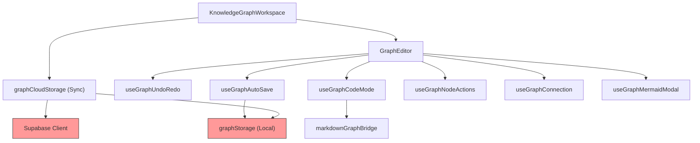

# Stress Test Report: knowledge-graph-v2-upgrade

> **Generated by**: Plan Stress Test v2.0 — Deep Analysis Engine
> **Date**: 2026-07-12
> **Change Scale**: Large [L]
> **Rationale**: 觸及超過 10 個檔案，包含架構重構（拆分 6 個 Hook）、資料庫 Schema 變更（LocalStorage v3）、以及引入新的外部相依服務模型（Supabase Table & Storage Bucket）。

---

## 1. Executive Summary

### Plan Health Score: 55 / 100 — Grade: 🟡 C — Needs Work

| Classification | Count | Threshold |
|----------------|-------|-----------|
| 🔴 CRITICAL | 1 | RPN ≥ 75 |
| 🟠 HIGH | 2 | RPN 50–74 |
| 🟡 MEDIUM | 4 | RPN 25–49 |
| 🔵 LOW | 3 | RPN < 25 |

**Top 3 Critical Findings**:
1. **D6-001 (CRITICAL)**: 未定義 Supabase Storage Bucket 的安全策略（RLS & MIME 限制），攻擊者可直接透過 API 上傳惡意檔案或耗盡配額。
2. **D4-001 (HIGH)**: 使用粗粒度的 Document-level Last-Write-Wins (LWW) 同步策略，將導致離線編輯的圖表在連線時被無聲覆寫，造成資料遺失。
3. **D10-001 (HIGH)**: 解決同名衝突的 `title:depth` 方案忽略了「視覺模式建立的節點預設沒有深度資訊」，將導致切換至程式碼模式時自訂屬性大量遺失。

**Overall Assessment**:
計畫的結構清晰且任務劃分詳細，具備很好的可執行性。然而，計畫在「雲端整合的安全性」與「資料同步的邊界條件」上存在顯著的盲點。目前狀態**不建議立即實作**，必須先解決 CRITICAL 和 HIGH 級別的問題（特別是 Storage RLS 政策與 `title:depth` 鍵值設計的缺陷），修訂計畫後再行開發。

---

## 2. Cross-Validation Matrix

> Verifies consistency across proposal.md ↔ design.md ↔ tasks.md

| Aspect | proposal.md Says | design.md Says | tasks.md Says | Consistent? | Issue |
|--------|------------------|----------------|---------------|-------------|-------|
| **Supabase 儲存** | 建立 table 與 storage bucket 支援圖片上傳 | 定義了 table schema 與 bucket 路徑規則 | 新增 `graphCloudStorage.ts` 處理上傳與同步 | ✅ | 無 |
| **同名衝突修復** | 解決同名節點屬性丟失問題 | 改用 `title:depth` 複合鍵 | 實作 `title:depth` 匹配邏輯 | ✅ | 邏輯一致，但設計本身存在缺陷（見 D10-001） |
| **錯誤碼系統** | 新增錯誤碼系統取代中文 | 定義 `GraphErrorCode` Enum | 全面替換中文字串並更新測試 | ✅ | 無 |
| **Hook 重構** | 拆分為獨立 Hooks | 拆分 6 個具體 Hooks | 任務 4.1~4.15 逐步拆分並驗證 | ✅ | 無 |

### Terminology Consistency Check
| Term in proposal.md | Equivalent in design.md | Equivalent in tasks.md | Aligned? |
|---------------------|------------------------|------------------------|----------|
| 純色背景 | solid background / translucent | `backgroundOpacity` | ✅ |
| 顏色模板 | Themes / 預設配色盤 | `theme` / `GRAPH_THEMES` | ✅ |

### Coverage Gap Analysis
- **Features in proposal.md without design**: 無
- **Design elements without implementation tasks**: 無
- **Tasks without design justification**: 無
- **Non-functional requirements without implementation strategy**: Proposal 提到防呆與上限保護，但 UI 缺乏圖片上傳的狀態回饋與取消機制。

---

## 3. Dependency Graph

### 3.1 Module Dependency Diagram

> 🔴 Nodes in red are single points of failure. (Local Storage & Supabase)

### 3.2 Dependency Analysis Table

| Module | Depends On | Depended By | Fan-In | Fan-Out | SPOF? | Notes |
|--------|-----------|-------------|--------|---------|-------|-------|
| `GraphEditor` | 6 Hooks, `markdownGraphBridge` | `KnowledgeGraphWorkspace` | 1 | 7 | No | 核心協調者，需確保 Props Drilling 不會導致過度渲染 |
| `graphStorage` | LocalStorage API | `useGraphAutoSave`, `graphCloudStorage` | 2 | 1 | Yes | 所有的資料持久化瓶頸 |
| `graphCloudStorage` | `Supabase`, `graphStorage` | `KnowledgeGraphWorkspace` | 1 | 2 | No | 網路狀態的依賴點 |

### 3.4 Implicit Dependencies
- **Canvas API (Image Compression)**: 依賴於瀏覽器環境支援 `<canvas>` 與 `toBlob('image/webp')`，在無頭瀏覽器測試環境下可能失效。
- **React Flow Context**: 拆分出的 Hooks (`useGraphConnection`, `useGraphNodeActions`) 隱含依賴於其必須在 `<ReactFlowProvider>` 的子元件中執行，否則 `useReactFlow()` 會崩潰。

---

## 4. 11-Dimension Deep Audit

### D1: 需求完整性 (Requirement Completeness)

| ID | Finding | Impact | Likelihood | Detectability | RPN | Classification |
|----|---------|--------|------------|---------------|-----|----------------|
| D1-001 | 圖片上傳缺乏載入中（Loading）狀態、進度條與失敗重試機制，網路緩慢時會導致 UX 混亂 | 2 | 4 | 2 | 16 | 🔵 LOW |
| D1-002 | 放射狀與樹狀佈局演算法未定義當圖表存在「循環（Cycle）」或「孤立節點群」時的處理行為，可能導致無限迴圈或崩潰 | 4 | 3 | 3 | 36 | 🟡 MEDIUM |

### D2: 設計一致性 (Design Consistency)

| ID | Finding | Impact | Likelihood | Detectability | RPN | Classification |
|----|---------|--------|------------|---------------|-----|----------------|
| D2-001 | 使用 `title:depth` 作為辨識鍵，意味著當使用者在代碼模式中透過縮排改變節點層級（depth）時，該節點將被視為「新節點」，從而丟失所有自訂顏色與形狀，這與「保留自訂顏色」的初衷矛盾 | 4 | 4 | 2 | 32 | 🟡 MEDIUM |

### D4: 併發與競態條件 (Concurrency & Race Conditions)

| ID | Finding | Impact | Likelihood | Detectability | RPN | Classification |
|----|---------|--------|------------|---------------|-----|----------------|
| D4-001 | 圖表層級的 Last-Write-Wins 同步策略，會導致離線編輯的圖表在連線時，若雲端時間戳較新，則本地工作成果會被無聲抹除 | 5 | 3 | 4 | 60 | 🟠 HIGH |

#### 5-Why Root Cause Analysis (D4-001)
- **Why 1**: 離線編輯的成果被無聲覆寫。
  - **Why 2**: 因為同步邏輯使用了基於 `updatedAt` 的整份圖表 Last-Write-Wins (LWW) 策略。
    - **Why 3**: 因為設計上直接沿用了現有題庫（Question Bank）的同步機制。
      - **Root Cause**: 將適用於粗粒度、低頻修改的靜態資源同步策略，錯誤地套用於高頻互動、具協作潛力的視覺化圖表結構上。
- **Systemic Pattern**: 架構設計時過度依賴既有模式，未針對資料屬性（互動圖表）調整策略。

### D5: 錯誤處理與故障恢復 (Error Handling & Fault Recovery)

| ID | Finding | Impact | Likelihood | Detectability | RPN | Classification |
|----|---------|--------|------------|---------------|-----|----------------|
| D5-001 | Dirty fallback (`mindspark_dirty_graphs`) 缺乏自動重試排程，若使用者不重新整理頁面或重新登入，失敗的同步資料將永遠留在本地 | 3 | 4 | 3 | 36 | 🟡 MEDIUM |

### D6: 安全攻擊面分析 (Security Attack Surface)

| ID | Finding | Impact | Likelihood | Detectability | RPN | Classification |
|----|---------|--------|------------|---------------|-----|----------------|
| D6-001 | 計畫未定義 Supabase `graph-images` Bucket 的 Storage RLS 政策，攻擊者可繞過前端，透過 API 直接上傳惡意檔案 (如含 XSS 的 SVG) 或無限量檔案耗盡配額 | 5 | 4 | 5 | 100 | 🔴 CRITICAL |

#### 5-Why Root Cause Analysis (D6-001)
- **Why 1**: 攻擊者可以上傳任意惡意檔案到 Storage Bucket。
  - **Why 2**: 因為 Supabase Storage Bucket 沒有配置檔案類型限制與容量配額的 RLS。
    - **Why 3**: 計畫僅關注了前端 Canvas 的 WebP 壓縮與 Database Table 的 RLS。
      - **Root Cause**: 信任前端（Client-side validation），在後端儲存層缺乏零信任（Zero-Trust）安全防護。
- **Systemic Pattern**: 全端開發常見盲點，認為前端擋下即可，忽略 API 層面的直接攻擊面。

### D8: 可觀測性盲點 (Observability Blind Spots)

| ID | Finding | Impact | Likelihood | Detectability | RPN | Classification |
|----|---------|--------|------------|---------------|-----|----------------|
| D8-001 | 自動佈局演算法或 Markdown 解析崩潰時，錯誤會被靜默吞噬或直接導致白畫面，缺乏向用戶顯示友善錯誤訊息的機制 | 3 | 2 | 4 | 24 | 🔵 LOW |

### D9: 可維護性與技術債 (Maintainability & Technical Debt)

| ID | Finding | Impact | Likelihood | Detectability | RPN | Classification |
|----|---------|--------|------------|---------------|-----|----------------|
| D9-001 | `useGraphAutoSave` 依賴於頻繁變動的 `nodes` 與 `edges`。若未正確使用 refs，會導致大量不必要的 re-renders 或儲存過時的閉包狀態 | 4 | 4 | 1 | 16 | 🔵 LOW |

### D10: 隱式假設與環境依賴 (Implicit Assumptions & Environment Dependencies)

| ID | Finding | Impact | Likelihood | Detectability | RPN | Classification |
|----|---------|--------|------------|---------------|-----|----------------|
| D10-001 | 依賴 `title:depth` 作為辨識鍵，假設了所有節點都有 `depth`。但視覺模式下拖曳建立的新節點缺乏計算 `depth` 的機制，切換代碼模式時將導致屬性丟失 | 4 | 5 | 3 | 60 | 🟠 HIGH |

#### 5-Why Root Cause Analysis (D10-001)
- **Why 1**: 視覺模式建立的節點在切換到代碼模式時丟失了自訂顏色。
  - **Why 2**: 因為 `handleCodeChange` 找不到對應的 `title:depth` 鍵值。
    - **Why 3**: 因為視覺模式新增節點時，並未計算該節點在樹狀結構中的深度（depth）。
      - **Root Cause**: 資料模型的不對稱性——解析器依賴深度，但視覺畫布的無向圖/有向圖模型並不保證深度的即時存在。

### D11: 向後相容性與遷移風險 (Backward Compatibility & Migration Risk)

| ID | Finding | Impact | Likelihood | Detectability | RPN | Classification |
|----|---------|--------|------------|---------------|-----|----------------|
| D11-001 | 升級到 Schema v3 後，若使用者的 PWA 暫存加載了舊版前端程式碼，舊版 `graphStorage` 的嚴格驗證會拒絕讀取 v3 資料，導致圖表全部消失 | 3 | 3 | 4 | 36 | 🟡 MEDIUM |

---

## 5. Cascading Failure Analysis

| Trigger | Immediate Effect | 2nd-Order Effect | 3rd-Order Effect | Blast Radius | Recovery Difficulty |
|---------|-----------------|-------------------|-------------------|--------------|---------------------|
| **D6-001**: 攻擊者寫入腳本上傳大量 2MB 垃圾檔案 | 塞滿 Supabase Storage Free Tier 配額 | 正常用戶的圖片上傳功能全面失效 | 系統暫停服務或產生高額未預期帳單 | 全站用戶 | Medium (需編寫腳本清理惡意檔案並封鎖 IP) |
| **D4-001**: 用戶離線工作2小時，隨後連線 | 雲端時間戳較新（如另一裝置開啟）觸發 LWW | 本地 2 小時的心智圖擴充被無聲覆蓋為舊版本 | 用戶流失，強烈的不信任感 | 單一用戶 | Impossible (資料已永久丟失) |
| **D10-001**: 用戶用視覺模式繪製了精美的心智圖並配色 | 用戶點擊「代碼模式」想修改錯字 | 切回視覺模式時，因為缺乏 depth 資訊導致匹配失敗 | 所有節點變回預設顏色，精美排版毀於一旦 | 單一用戶 | Medium (可透過 Undo 復原，但極度挫折) |

---

## 6. Adversarial Attack Scenarios

### 🎭 Role: Security Adversary
| Attack Vector | Target | Preconditions | Steps | Expected Impact | Mitigation |
|---------------|--------|---------------|-------|-----------------|------------|
| 儲存層 XSS | Supabase `graph-images` | 擁有普通登入權限 | 1. 攔截前端上傳請求。 2. 將 payload 改為含有 `<script>` 的 `.svg` 檔案。 3. 在知識圖中引用該 SVG URL 並分享。 | 受害者瀏覽知識圖時觸發 XSS，竊取 Session。 | 在 Supabase Storage RLS 中強制限制 `mime_type` 只能是 `image/webp`。 |

### 🎭 Role: Chaos Engineer
| Failure Injection | Target | Scenario | Expected Behavior | Actual (Predicted) Behavior | Gap |
|-------------------|--------|----------|--------------------|-----------------------------|-----|
| 網路節流 (10kbps) | 圖片上傳模組 | 上傳 2MB 圖片 | 顯示 Loading 狀態，允許取消 | 點擊後 UI 無反應，用戶以為失敗而刪除節點。後台持續上傳產生孤兒檔案。 | 缺乏上傳進度狀態與 Promise Cancellation 機制。 |

### 🎭 Role: Domain Skeptic
| Assumption Challenged | Evidence For | Evidence Against | Risk if Wrong | Recommendation |
|----------------------|-------------|-----------------|---------------|----------------|
| 「樹狀佈局 (Tree) 等同於從上到下 (TB)」 | dagre 預設為 TB | 心智圖常有左到右 (LR) 的需求 | 佈局功能被認為半殘 | 在佈局切換中增加「樹狀(水平)」選項。 |

### 🎭 Role: Maintainability Critic
| Concern | Location | Current Design | Problem in 6 Months | Suggested Improvement |
|---------|----------|----------------|---------------------|----------------------|
| Props Drilling 危機 | `GraphEditor.tsx` | 拆分出 6 個 Hook，傳遞大量相同參數 | 每次新增全域狀態都要修改 4 個 Hook 的 signature | 考慮使用 Zustand 切片（Slices）或 Context 管理圖表狀態。 |

---

## 7. Comprehensive Test Matrix

| Priority | Module | Test Scenario | Dimension | Type | Automation | Preconditions | Expected Outcome | Risk if Untested |
|----------|--------|---------------|-----------|------|------------|---------------|------------------|------------------|
| P0 | `graphCloudStorage` | 測試離線編輯後的衝突合併 | D4 | Unit | Auto | 模擬本地與雲端時間戳衝突 | 應觸發分叉 (Fork) 提示而非直接覆寫 | 60 |
| P0 | `Supabase` | 驗證非 WebP 檔案上傳被拒絕 | D6 | E2E/Int | Manual | 配置惡意 SVG 檔案 | Supabase 返回 403 Forbidden | 100 |
| P1 | `useGraphCodeMode` | 視覺節點切換到代碼並切回 | D10 | Unit | Auto | 建立無 depth 屬性的節點 | 顏色與形狀必須保留 | 60 |
| P1 | `graphStorage` | 模擬舊版客戶端讀取 v3 格式 | D11 | Unit | Auto | 建構 v3 JSON 給 v2 邏輯 | 忽略未知欄位，成功載入 | 36 |

---

## 8. Consolidated Risk Register

| Rank | ID | Finding | Dimension | Impact | Likelihood | Detectability | RPN | Classification | Mitigation | Owner Module | Status |
|------|----|---------|-----------|--------|------------|---------------|-----|----------------|------------|-------------|--------|
| 1 | D6-001 | 缺少 Storage Bucket RLS 與 MIME 限制 | D6 | 5 | 4 | 5 | **100** | 🔴 CRITICAL | 加入 Supabase 儲存安全策略腳本 | Supabase | Open |
| 2 | D4-001 | LWW 導致離線編輯被無聲覆寫 | D4 | 5 | 3 | 4 | **60** | 🟠 HIGH | 實作雙向合併提示或保留副本 | CloudSync | Open |
| 3 | D10-001 | 視覺節點無 depth 導致屬性丟失 | D10 | 4 | 5 | 3 | **60** | 🟠 HIGH | 改用 UUID 映射，而非依賴 `title:depth` | EditorHook | Open |
| 4 | D1-002 | 佈局演算法遇循環圖表崩潰 | D1 | 4 | 3 | 3 | **36** | 🟡 MEDIUM | 加入循環偵測或 try-catch 防護 | Layout | Open |
| 5 | D5-001 | Dirty fallback 無重試排程 | D5 | 3 | 4 | 3 | **36** | 🟡 MEDIUM | 在 visibilitychange 事件觸發重試 | CloudSync | Open |
| 6 | D11-001 | v3 格式向前相容性崩潰 | D11 | 3 | 3 | 4 | **36** | 🟡 MEDIUM | 確認 schema 驗證允許未知額外欄位 | Storage | Open |
| 7 | D2-001 | 改變縮排層級導致屬性丟失 | D2 | 4 | 4 | 2 | **32** | 🟡 MEDIUM | 改用 UUID 映射 | EditorHook | Open |
| 8 | D8-001 | 缺乏佈局崩潰的 Error Boundary | D8 | 3 | 2 | 4 | **24** | 🔵 LOW | 加入 UI 錯誤邊界與 Toast 提示 | UI | Open |
| 9 | D1-001 | 圖片上傳缺乏狀態與進度反饋 | D1 | 2 | 4 | 2 | **16** | 🔵 LOW | 節點資料加入 `isUploading` 狀態 | UI | Open |
| 10 | D9-001 | `useGraphAutoSave` 的閉包陷阱 | D9 | 4 | 4 | 1 | **16** | 🔵 LOW | 使用 `useRef` 追蹤最新狀態避免依賴 | EditorHook | Open |

---

## 9. Mitigation Action Plan

### 🔴 CRITICAL — Must Fix Before Implementation
| # | Finding ID | Action | Affected Files | Effort Estimate | Dependency |
|---|-----------|--------|----------------|-----------------|------------|
| 1 | D6-001 | **新增 Storage 政策**：在任務清單中新增資料庫遷移腳本任務，強制 `graph-images` bucket 的插入政策驗證 `(storage.extension(name) = 'webp')` 以及檔案大小 `< 2MB`。 | `design.md`, `tasks.md` | S | None |

### 🟠 HIGH — Should Fix During Implementation
| # | Finding ID | Action | Affected Files | Effort Estimate | Dependency |
|---|-----------|--------|----------------|-----------------|------------|
| 1 | D10-001, D2-001 | **修改匹配策略**：放棄使用 `title:depth`。改為在 Markdown 解析時保留 UUID（透過 HTML 註解如 `<!-- id:xxx -->` 隱藏插入），實現絕對的精準匹配，徹底解決同名與層級變動問題。 | `design.md`, `markdownGraphBridge.ts` | M | None |
| 2 | D4-001 | **增強同步邏輯**：如果發現雲端與本地的 `updatedAt` 不一致且都有修改，不直接覆蓋，而是將較舊的一方儲存為「圖表名稱 (衝突副本)」。 | `graphCloudStorage.ts` | M | None |

### 🟡 MEDIUM — Track and Address
| # | Finding ID | Action | Notes |
|---|-----------|--------|-------|
| 1 | D1-002, D8-001 | **防護佈局演算法**：在 `applyRadialLayout` 和 `applyDagreLayout` 外部包裝 try-catch，失敗時回退到自由模式並顯示 Toast 警告「圖表存在循環，無法自動排版」。 | 實作期間加入 |
| 2 | D5-001 | **新增重試觸發器**：在 `app.tsx` 監聽 `online` 事件，連線恢復時主動執行 dirty graphs 同步。 | 實作期間加入 |

### 🔵 LOW — Acknowledge and Monitor
| # | Finding ID | Action | Notes |
|---|-----------|--------|-------|
| 1 | D1-001 | 圖片上傳增加 Loading 游標或簡單字樣。 | 可在後續 UX 迭代優化 |
| 2 | D9-001 | 確保 `useGraphAutoSave` 使用 `useRef` 存取最新 `nodes`。 | Code Review 時把關 |
