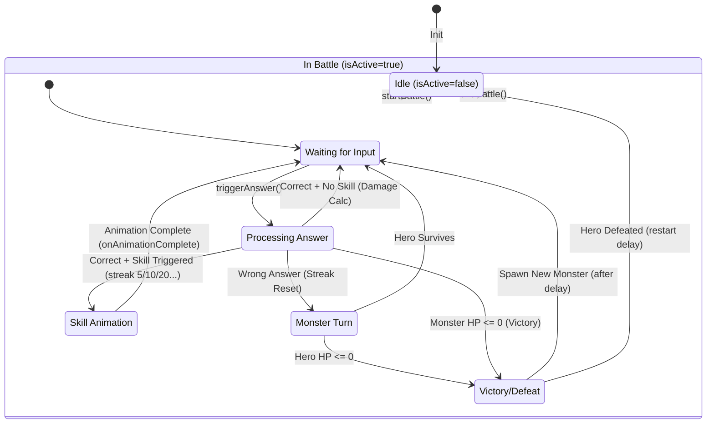

# Battle System State Diagram

此文檔描述 `useBattleSystem` 的核心狀態流轉邏輯。

## Key State Transitions

| Trigger | From | To | Side Effects |
|---------|------|----|--------------|
| `startBattle` | Idle | InBattle | Reset HP, Spawn Monster, Streak=0 |
| `triggerAnswer(correct)` | Waiting | Processing | Streak++, Damage Calc |
| `triggerAnswer(wrong)` | Waiting | MonsterTurn | Streak=0, Hero Damage |
| `shouldTriggerSkill` | Processing | SkillAnim | Set `pendingSkill`, `currentAnimation` |
| `monsterHp <= 0` | Processing | EndState | `monstersDefeated`++, Spawn Timer |
