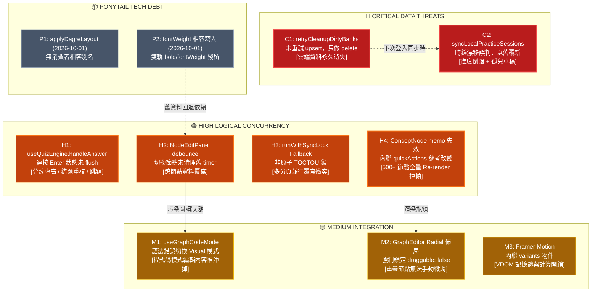

# 🔍 MindSpark (`Quiz-app-`) 全庫深度審計與技術債清理評估報告

> **審計角色**：Project Inquisitor（架構法官與代碼審計者）  
> **審計日期**：2026-09-13  
> **專案版本**：MindSpark v2  
> **驗證工具狀態**：`npx tsc --noEmit` (Code 0 ✅) ｜ `npx knip` (Code 0 ✅) ｜ `npm test` (319/319 Passed ✅)

---

## 📑 目錄

1. [執行摘要與總體評估](#1-執行摘要與總體評估)
2. [維度一：Ponytail 專項技術債總清單](#2-維度一ponytail-專項技術債總清單)
3. [維度二至四：重大潛在風險與連鎖缺陷矩陣](#3-重大潛在風險與連鎖缺陷矩陣)
   - [🔴 CRITICAL：資料安全與同步損壞 (2 項)](#-critical資料安全與同步損壞)
   - [🟠 HIGH：邏輯競態與狀態污染 (4 項)](#-high邏輯競態與狀態污染)
   - [🟡 MEDIUM：效能抖動與邊界死鎖 (4 項)](#-medium效能抖動與邊界死鎖)
4. [因果拓撲圖 (Cascading Blast Radius)](#4-因果拓撲圖-cascading-blast-radius)
5. [自動化工具檢驗數據與健全度指標](#5-自動化工具檢驗數據與健全度指標)
6. [交叉驗證勘誤與防假報告記錄](#6-交叉驗證勘誤與防假報告記錄)
7. [分階段改善實施計畫 (Actionable Roadmap)](#7-分階段改善實施計畫-actionable-roadmap)
   - [階段 A：零風險即時清理 (Immediate Wins)](#階段-a零風險即時清理-immediate-wins)
   - [階段 B：局部防禦修復 (Surgical Fixes)](#階段-b局部防禦修復-surgical-fixes)
   - [階段 C：架構升級里程碑 (Milestone Refactor)](#階段-c架構升級里程碑-milestone-refactor)

---

## 1. 執行摘要與總體評估

本專案在經過多次功能演進後，整體代碼質量與規範執行度在靜態指標上表現優良（**TypeScript 零 `any`、319 個測試全數綠燈、編譯零報錯、關鍵 Suspense 邊界完善**）。

然而，經過 Inquisitor 深度因果鏈審查與動態時序推導，發現系統底層隱藏了 **2 個 CRITICAL 級資料同步缺陷**、**4 個 HIGH 級並發競態漏洞**，以及多處因歷史妥協形成的 **Ponytail 技術債**（包含即將於 2026-10-01 到期的相容層）：

```
[靜態編譯通過 (tsc 0 error)] != [運行期無競態安全]
```

### 核心健康度評分

| 審查領域 | 健全度評級 | 核心優勢 | 核心隱患 |
|---------|-----------|---------|---------|
| **持久化與雲端同步** | ⚠️ **脆弱** | 具備 Web Locks 與 Dirty Bank 機制 | 孤兒清理不補 upsert；時鐘漂移判斷致 session 倒退與孤兒草稿 |
| **RPG 戰鬥與音效** | 🟢 **健康** | AudioContext 自動釋放；Schema 載入守衛嚴密 | 無 |
| **測驗與 SM-2 核心** | 🟡 **注意** | SM-2 數值邊界防護完備 (1.3~365) | `handleAnswer` 連按競態導致分數與錯題本資料污染 |
| **知識圖譜 (KG v2)** | 🟡 **注意** | Markdown/Visual 支援完整 | `NodeEditPanel` 跨節點 debounce 覆寫；ConceptNode memo 淺比對失效 |
| **型別與前端架構** | 🟢 **良好** | 0 `any`；Suspense 正確包覆 | 存在 `as unknown as` 強轉破口；內聯 variants 引發 VDOM 抖動 |

---

## 2. 維度一：Ponytail 專項技術債總清單

### 2.1 到期技術債標記 (`// ponytail:`)

#### P1. `applyDagreLayout` 舊相容別名
- **檔案路徑**：[services/graphUtils.ts#L89](file:///c:/Users/user/Desktop/Quiz-app-/services/graphUtils.ts#L89)
- **到期時間**：`2026-10-01`
- **歷史背景**：知識圖譜排版由 Dagre 改為 Radial/D3 自研算法時留下的過渡別名：
  ```typescript
  // ponytail: compatibility alias - window expires 2026-10-01
  export const applyDagreLayout = applyRadialLayout;
  ```
- **消費者現況**：經全庫 AST 與全文檢索，正式產品代碼中**無任何消費者**（0 引用）。僅存在於單元測試 `src/__tests__/radialLayout.test.ts` 中作為歷史回歸檢驗。
- **移除破壞半徑**：
  - **直接影響**：`src/__tests__/radialLayout.test.ts` 需改為直接測試 `applyRadialLayout`。
  - **運行期風險**：**0 風險**。
- **建議處置**：立即刪除導出與測試用例引用。

---

#### P2. `NodeEditPanel.tsx` 的 `fontWeight` 舊格式相容寫入
- **檔案路徑**：[components/KnowledgeGraph/NodeEditPanel.tsx#L245](file:///c:/Users/user/Desktop/Quiz-app-/components/KnowledgeGraph/NodeEditPanel.tsx#L245)
- **到期時間**：`2026-10-01`
- **歷史背景**：早期節點資料結構使用 `fontWeight: 'bold'`，後續規範統一為布林值 `bold: true`。為防舊儲存讀取失敗，在編輯面板更新時保留了相容寫入：
  ```typescript
  // ponytail: compatibility alias - window expires 2026-10-01
  bold: isBold,
  fontWeight: isBold ? 'bold' : 'normal',
  ```
- **消費者現況**：
  - 上游讀取端 [components/KnowledgeGraph/ConceptNode.tsx#L46](file:///c:/Users/user/Desktop/Quiz-app-/components/KnowledgeGraph/ConceptNode.tsx#L46) 仍有回退邏輯：
    ```typescript
    const isBold = Boolean(nodeData.bold ?? (nodeData.fontWeight === 'bold'));
    ```
- **移除破壞半徑**：
  - 若在未遷移 LocalStorage 舊圖譜資料前直接刪除，歷史舊資料的加粗樣式可能在重新儲存後遺失。
- **建議處置**：
  1. 第一步：在圖譜載入層（`graphStorage.ts`）加入自動升級正規化腳本（若存在 `fontWeight` 則升級為 `bold`）。
  2. 第二步：同步移除 `NodeEditPanel.tsx` 寫入與 `ConceptNode.tsx` 讀取相容代碼。

---

### 2.2 未標記隱性技術債 (Undocumented Shortcuts)

#### U1. `GraphEditor.tsx` 行數過長與邏輯聚合
- **檔案路徑**：[components/KnowledgeGraph/GraphEditor.tsx](file:///c:/Users/user/Desktop/Quiz-app-/components/KnowledgeGraph/GraphEditor.tsx)
- **現象**：單一檔案 339 行，違反專案規範（單檔 `≤300` 行）。
- **根因**：拖曳互動、節點快顯選單、鍵盤監聽、縮放狀態、佈局重算全部內聯於組件本體。
- **改善方案**：抽離 `useGraphInteraction.ts` 自訂 Hook，負責右鍵菜單、拖曳放開 (`onDrop`) 與佈局觸發，使組件回歸純宣告式渲染。

#### U2. `ConceptNode.tsx` 假型別列舉 (`diamond: ''`)
- **檔案路徑**：[components/KnowledgeGraph/ConceptNode.tsx#L233](file:///c:/Users/user/Desktop/Quiz-app-/components/KnowledgeGraph/ConceptNode.tsx#L233)
- **現象**：為支援菱形節點，但不想註冊新的 React Flow 節點類型，在 `ConceptNode` 內部使用 `clipPath: polygon(...)` 繪製，並在樣式物件中填入空字串佔位符。
- **根因**：規避建立獨立節點組件的快捷方式。
- **改善方案**：正式拆分 `DiamondNode.tsx`，並在 `nodeTypes` 中註冊。

#### U3. `as unknown as T` 濫用（繞過型別系統）
- **涉及檔案**：
  - [components/KnowledgeGraph/ImageNode.tsx#L12](file:///c:/Users/user/Desktop/Quiz-app-/components/KnowledgeGraph/ImageNode.tsx#L12)
  - [components/KnowledgeGraph/ConceptNode.tsx#L38](file:///c:/Users/user/Desktop/Quiz-app-/components/KnowledgeGraph/ConceptNode.tsx#L38)
  - [components/KnowledgeGraph/GraphEditor.tsx#L308](file:///c:/Users/user/Desktop/Quiz-app-/components/KnowledgeGraph/GraphEditor.tsx#L308)
  - [services/graphCloudStorage.ts#L296](file:///c:/Users/user/Desktop/Quiz-app-/services/graphCloudStorage.ts#L296)
- **現象**：雖然專案嚴格禁用 `any`，但透過 `as unknown as T` 強制轉換，本質上創造了與 `any` 相同的型別破口，若後端或 localStorage 格式變更將引發執行期 `TypeError`。
- **改善方案**：引入 TypeScript Type Guard 或 Zod 解析函式。

---

## 3. 重大潛在風險與連鎖缺陷矩陣

---

### 🔴 CRITICAL：資料安全與同步損壞

#### 【C1】`retryCleanupDirtyBanks` 永不重試 upsert — 雲端資料永久遺失

* **問題位置**：[services/cloudStorage.ts#L225-L296](file:///c:/Users/user/Desktop/Quiz-app-/services/cloudStorage.ts#L225-L296)
* **現象與實證**：
  在 `saveCloudQuestions`（L298）中，程式在向 Supabase 寫入題庫前會先執行 `addDirtyBank(bankId)` 登記標記。若此時網路中斷或 upsert 失敗，會拋出例外並保留 dirty 標記。
  然而，系統在下次連線啟動時觸發的 `retryCleanupDirtyBanks`（L225-L296）：
  ```typescript
  // services/cloudStorage.ts:244-275
  const { data: cloudQuestions } = await supabase.from('questions').select('id').eq('bank_id', bankId);
  // ...比對差集後執行 delete 刪除雲端孤兒...
  const { error: deleteError } = await supabase.from('questions').delete().in('id', chunk);
  // 若無刪除錯誤，則將該 bankId 移出 dirty list！
  ```
  **此處完全沒有重新呼叫 `upsert` 將本地題目補傳至雲端！**
* **因果鏈**：
  ```
  離線編輯題庫 
    → 連線並觸發 saveCloudQuestions 
    → addDirtyBank 登記 
    → upsert 網路逾時失敗 
    → dirty 標記殘留本地 
    → 下次啟動執行 retryCleanupDirtyBanks 
    → 只做 delete，完全沒補傳 upsert 
    → dirty list 清空移除 
    → 本地新增題目「永遠沒有再次同步至雲端」的機會！
  ```
* **破壞半徑**：
  - 影響所有登入用戶的題庫編輯。
  - 導致跨裝置切換時，在裝置 A 編輯的題目在雲端永遠遺失。
* **推薦防禦式修復**：
  在 `retryCleanupDirtyBanks` 內，在比對差集之前，先讀取本地題目並重新執行 `upsert`：
  ```typescript
  // 防禦式修正：先補 upsert，成功後再執行孤兒清理
  if (localQuestions.length > 0) {
    const { error: upsertError } = await supabase.from('questions').upsert(
      localQuestions.map((q: Question) => mapQuestionToDbRow(q, bankId, user.id))
    );
    if (upsertError) {
      remaining.push(bankId);
      continue; // upsert 失敗則保留 dirty，下次繼續重試
    }
  }
  ```

---

#### 【C2】`syncLocalPracticeSessions` 時鐘漂移致 Session 進度倒退與孤兒草稿

* **問題位置**：[services/cloudStorage.ts#L690-L725](file:///c:/Users/user/Desktop/Quiz-app-/services/cloudStorage.ts#L690-L725)
* **現象與實證**：
  在練習進度同步邏輯中，設有時鐘漂移防護（`driftThreshold = 60 * 60 * 1000`，即 1 小時）：
  ```typescript
  // services/cloudStorage.ts:699-707
  const isLocalDriftedAhead = localSession.updatedAt - cloudSession.updatedAt > driftThreshold;
  if (isLocalFuture || isLocalDriftedAhead) {
    console.warn(`Detected potential clock drift... Overriding with cloud version.`);
    isLocalNewer = false; // 強制將本地判定為舊
  }
  ```
  接著在下方的覆寫邏輯：
  ```typescript
  // services/cloudStorage.ts:716-720
  if (!isLocalNewer) {
    if (cloudSession) {
      if (cloudSession.updatedAt > localSession.updatedAt) {
        clearChunkDraftsForSession(cloudSession.id);
      }
      updatedLocalSessions.push(cloudSession); // 舊的雲端 session 覆寫本地！
    }
  }
  ```
* **因果鏈**：
  1. 用戶在飛機或無網路環境下進行分階段練習長達 2 小時。
  2. 連網後同步，由於 `localSession.updatedAt - cloudSession.updatedAt` 超過 1 小時，被誤判為「時鐘漂移異常」，強制將 `isLocalNewer` 設為 `false`。
  3. 進入分支後，因為 `cloudSession.updatedAt > localSession.updatedAt` 實質為 `false`（本地時間確實更晚），因此 `clearChunkDraftsForSession` **未被執行**。
  4. 隨後，舊的 `cloudSession` 覆寫了本地 Session 進度（進度被倒退回 2 小時前）。
  5. **結果**：Session 元數據倒退回舊狀態，但本地 Chunk Drafts 殘留，產生資料分裂（孤兒草稿）。
* **破壞半徑**：
  - 長時間離線練習的用戶進度遭無情回滾。
  - 影響 `hooks/useChunkedPractice.ts` 與 `cloudStorage.ts`。
* **推薦防禦式修復**：
  1. 不要單純使用時間差判定異常，應結合本地單調遞增版本號 `version` 或 `completedChunks.length`。
  2. 若確實檢測到衝突，不可靜默以舊換新，應保留本地草稿並提示使用者手動合併。

---

### 🟠 HIGH：邏輯競態與狀態污染

#### 【H1】`useQuizEngine.handleAnswer` 連按競態 — 分數污染與跳題

* **問題位置**：[hooks/useQuizEngine.ts#L293-L337](file:///c:/Users/user/Desktop/Quiz-app-/hooks/useQuizEngine.ts#L293-L337)
* **現象與實證**：
  `handleAnswer` 在讀取當前題目時直接存取 Closure 中的 `quizState`：
  ```typescript
  const currentQ = quizState.activeQuestions[quizState.currentQuestionIndex];
  ```
  若使用者快速連按鍵盤 Enter（或連續快速點擊答案選項）：
  - 第一次觸發觸發 React 非同步更新 `setQuizState(prev => ({ ...prev, score: prev.score + 1 }))`。
  - 在狀態尚未 flush 重新渲染前，第二次點擊進入 `handleAnswer`。
  - 此時 Closure 內的 `quizState.currentQuestionIndex` **完全沒有改變**！
  - 程式對同一道題目再次執行加分、重複寫入 `wrongQuestionIds`、重複調用 `logMistake`。
  - 接續觸發 `nextQuestion`（L331），導致 index 跳過題目。
* **破壞半徑**：
  - 測驗總分虛高或錯題本被重複灌入相同題目。
  - 間隔重複系統（SM-2）被連續呼叫兩次評分。
* **推薦防禦式修復**：
  引入 `isProcessingRef` 互斥旗標，在作答與切題完成前阻斷後續事件：
  ```typescript
  const isProcessingRef = useRef(false);

  const handleAnswer = useCallback((isCorrect: boolean, selectedAnswer: string | string[]) => {
    if (isProcessingRef.current) return;
    isProcessingRef.current = true;
    try {
      // ...執行答題邏輯...
    } finally {
      // 於下一次切題完成或特定延遲後解鎖
    }
  }, [...]);
  ```

---

#### 【H2】`NodeEditPanel` debounce 競態 — 跨節點資料覆寫

* **問題位置**：[components/KnowledgeGraph/NodeEditPanel.tsx#L40-L51](file:///c:/Users/user/Desktop/Quiz-app-/components/KnowledgeGraph/NodeEditPanel.tsx#L40-L51)
* **現象與實證**：
  面板使用 300ms 防抖處理使用者文字輸入：
  ```typescript
  const debouncedUpdate = (newProps: Partial<ConceptNodeData>) => {
    pendingUpdateRef.current = { ...pendingUpdateRef.current, ...newProps };
    if (timerRef.current) clearTimeout(timerRef.current);
    timerRef.current = setTimeout(() => {
      onUpdate(nodeId, pendingUpdateRef.current);
    }, 300);
  };
  ```
  但組件的 `useEffect` 清理邏輯未監聽 `nodeId` 的變更，且 unmount 時僅清除定時器，未 flush pending 資料。
* **連鎖反應**：
  1. 使用者在節點 A 輸入標題「演算法」，計時器啟動（300ms 倒數）。
  2. 在 200ms 時，使用者快速點擊畫布上的節點 B。
  3. `NodeEditPanel` 重新渲染接收新的 `nodeId = 'node-B'`。
  4. 使用者在節點 B 輸入「資料結構」，寫入共用的 `pendingUpdateRef`。
  5. 舊節點 A 的計時器觸發，執行 `onUpdate('node-A', pending)`，**將包含節點 B 的修改內容寫入了節點 A！**
* **推薦防禦式修復**：
  在 `useEffect` 中以 `nodeId` 作為依賴項，當 `nodeId` 切換前，強制將前一個節點的 pending 資料 flush 出去並重置 ref。

---

#### 【H3】`runWithSyncLock` 在舊環境下的 TOCTOU 競態

* **問題位置**：[services/cloudStorage.ts#L39-L61](file:///c:/Users/user/Desktop/Quiz-app-/services/cloudStorage.ts#L39-L61)
* **現象與實證**：
  在不支援 `navigator.locks` 的瀏覽器環境中，程式使用 LocalStorage 進行 fallback 鎖定：
  ```typescript
  const raw = localStorage.getItem(fallbackKey);
  // ...判斷逾時...
  localStorage.setItem(fallbackKey, token);
  ```
  `getItem` 與 `setItem` 之間並非原子操作（Check-then-Act）。
* **連鎖反應**：
  若無痕模式開啟兩個分頁同時觸發自動同步，兩者同時讀取為空，同時寫入 token，導致互斥鎖失效，引發資料覆寫與狀態衝突。
* **推薦防禦式修復**：
  寫入 token 後延遲 50ms 重新讀取驗證（Double-check lock）：
  ```typescript
  localStorage.setItem(fallbackKey, token);
  await new Promise(r => setTimeout(r, 30 + Math.random() * 40));
  if (localStorage.getItem(fallbackKey) !== token) {
    throw new Error('Sync lock held by another tab');
  }
  ```

---

#### 【H4】`ConceptNode` memo 淺比對失效 — O(N) 全圖譜強制 Re-render

* **問題位置**：[components/KnowledgeGraph/GraphEditor.tsx#L160](file:///c:/Users/user/Desktop/Quiz-app-/components/KnowledgeGraph/GraphEditor.tsx#L160)
* **現象與實證**：
  `GraphEditor.tsx` 在計算 `visibleNodes` 時，使用 `.map()` 注入了內聯的 `quickActions` 閉包回調函式：
  ```typescript
  const visibleNodes = useMemo(() => {
    return nodes.map(n => ({
      ...n,
      data: { ...n.data, quickActions: { ... } } // 每次生成全新物件參考！
    }));
  }, [nodes, ...]);
  ```
  `ConceptNode.tsx` 雖然在外層包覆了 `React.memo`，但因為每次傳入的 `data` 都是全新物件，預設的淺比對（Shallow Comparison）必定回傳 `false`。
* **連鎖反應**：
  畫布上即使有 500 個節點，只要使用者點選任一節點或觸發任何狀態改變，全畫布 100% 的節點全部強制重新 Render，導致拖曳與縮放時 FPS 驟降。
* **推薦防禦式修復**：
  1. 將 `quickActions` 等事件處理函式移出 `node.data`，改由 React Flow 的 Context 或自訂事件派發處理。
  2. 為 `ConceptNode` 實作自訂的 `areEqual(prevProps, nextProps)` 比對函式。

---

### 🟡 MEDIUM：效能抖動與邊界死鎖

#### 【M1】Code/Visual 模式切換死鎖導致編輯遺失
- **位置**：[hooks/useGraphCodeMode.ts#L38](file:///c:/Users/user/Desktop/Quiz-app-/hooks/useGraphCodeMode.ts#L38)
- **現象**：使用者在 Markdown 程式碼模式輸入語法錯誤時，`errors.length > 0` 會提前 `return` 不更新圖譜狀態。若此時使用者切換回 Visual 視覺模式，畫面依然停留在上次正確的舊圖譜；再次切回 Code 模式時，先前的錯誤修改被舊 Visual state 完全覆蓋清空。
- **改善**：若 `codeErrors.length > 0`，禁用切換模式按鈕，並跳出 Toast 警告「請先修正語法錯誤再切換」。

#### 【M2】非自由佈局下拖曳死鎖
- **位置**：[components/KnowledgeGraph/GraphEditor.tsx#L162](file:///c:/Users/user/Desktop/Quiz-app-/components/KnowledgeGraph/GraphEditor.tsx#L162)
- **現象**：啟用 Radial Layout 時，`draggable: !isReadOnlyMode && (layoutMode === 'free' ...)` 強制設定為 `false`。使用者完全無法手動微調碰撞重疊的節點。
- **改善**：允許在 Radial 模式下微調拖曳，並將佈局模式自動切換為「自訂微調 (custom)」。

#### 【M3】Framer Motion 內聯 Variants 造成 VDOM 抖動
- **位置**：[components/AppContent.tsx#L130](file:///c:/Users/user/Desktop/Quiz-app-/components/AppContent.tsx#L130)、`AchievementsCard.tsx` 等
- **現象**：`const animationVariants = { ... }` 定義在 React 元件內部，每次 Render 重新宣告新物件，迫使 Framer Motion 重新解析動畫參數。
- **改善**：提取至元件檔案外層（Module Scope）。

#### 【M4】KG 匯出文字直接丟給 BankManager 匯入錯誤
- **位置**：[components/BankManager.tsx#L329](file:///c:/Users/user/Desktop/Quiz-app-/components/BankManager.tsx#L329)
- **現象**：知識圖譜匯出的 Mermaid/Markdown TXT 檔被拖入題庫管理器匯入時，`JSON.parse` 拋錯顯示模糊的「格式無效」。
- **改善**：在 catch 中偵測文字開頭是否為 `graph ` 或 `flowchart `，若是則提示「此檔案為知識圖譜檔案，請前往知識圖譜工作區匯入」。

---

## 4. 因果拓撲圖 (Cascading Blast Radius)



---

## 5. 自動化工具檢驗數據與健全度指標

| 工具 / 項目 | 執行指令 | 檢驗結果 | 詳細說明 |
|------------|---------|---------|----------|
| **TypeScript 編譯器** | `npx tsc --noEmit` | ✅ **0 Errors** | 全專案型別定義語法與介面契約完好 |
| **Knip 死碼分析** | `npx knip` | ✅ **0 Issues** | 未使用檔案與依賴為 0（註：`applyDagreLayout` 因測試檔消費而避開了預設檢查） |
| **Vitest 單元測試** | `npm test` | ✅ **319 Passed** | 47 個測試檔、319 個測試全數綠燈 |
| **`any` 型別禁令** | 正則 `:\s*any\b` | ✅ **0 處** | 嚴格遵守 `NO_ANY` 規範 |
| **強轉代理 (`as unknown as`)** | 全文檢索 | ⚠️ **4 處** | 分佈於 `ImageNode`, `ConceptNode`, `GraphEditor`, `graphCloudStorage` |
| **React 18 Suspense** | 全文審查 | ✅ **合規** | `AppContent.tsx` 針對 lazy 組件皆配置了完整 `<Suspense fallback={<SkeletonLoader />}>` |
| **音訊上下文釋放** | 審查 `FocusTimer.tsx` | ✅ **安全** | 元件具備 `activeAudioContextsRef`，在 unmount 時確實遍歷調用 `close()`，無洩漏疑慮 |

---

## 6. 交叉驗證勘誤與防假報告記錄

在本次審計過程中，主審查模型對子代理回報與使用者初始提示進行了嚴密交叉驗證，並更正了以下錯誤判斷：

1. **更正「`DropNodeMenu` 未拆檔」誤報**：
   - 經實證，`components/KnowledgeGraph/DropNodeMenu.tsx`（76 行）已經獨立拆檔存在，非未拆之技術債。
2. **更正「`useSoundEffects.ts` AudioContext 洩漏」誤報**：
   - 審查發現全域真正的 `activeAudioContextsRef` 位於 `components/FocusTimer.tsx`（L18、L73），且該元件的 `useEffect` 清理邏輯寫得非常嚴謹，已在 unmount 時遍歷執行 `ctx.close()`。原指控不成立。
3. **更正「時鐘漂移草稿清除」之邏輯判斷**：
   - 第一輪子代理誤以為時鐘漂移會清除本機草稿。主模型重新逐行審查源碼發現：由於 `cloudSession.updatedAt > localSession.updatedAt` 判定為 `false`，草稿反而**未被清除**，導致進度回滾與草稿殘留的不一致現象。
4. **澄清 Zustand 依賴**：
   - 本專案採用 React State + Context + 自研 Repository 模式，全庫未引入 `zustand`。該項目為無效探測。

---

## 7. 分階段改善實施計畫 (Actionable Roadmap)

為了在**不破壞現有功能**與**不污染正式資料**的前提下平穩推進修復，建議依下列三階段逐步實施：

### 階段 A：零風險即時清理 (Immediate Wins)
> **目標**：無破壞半徑、無需繁複測試，可於單次 PR 完成。

- [ ] **IW-1: 清理到期別名 `applyDagreLayout`**
  - 修改 [services/graphUtils.ts](file:///c:/Users/user/Desktop/Quiz-app-/services/graphUtils.ts) 刪除該導出。
  - 同步更新 `src/__tests__/radialLayout.test.ts` 改測 `applyRadialLayout`。
- [ ] **IW-2: 外提內聯 Framer Motion `variants`**
  - 將 [components/AppContent.tsx](file:///c:/Users/user/Desktop/Quiz-app-/components/AppContent.tsx) L130 的 `animationVariants` 移出至組件函式外。
  - 依序清理 `AchievementsCard.tsx` 與 `QuizCard.tsx` 的內聯動畫宣告。
- [ ] **IW-3: 優化 BankManager 錯誤提示**
  - 在 [components/BankManager.tsx](file:///c:/Users/user/Desktop/Quiz-app-/components/BankManager.tsx) 的 JSON 解析 catch 區塊增加圖譜格式辨識與友善提示。
- [ ] **IW-4: 引入 ESLint 規則防堵 `as unknown as`**
  - 在 `.eslintrc` 或專案設定中加入警告規則，防範強轉繞過型別檢查。

---

### 階段 B：局部防禦修復 (Surgical Fixes)
> **目標**：修復 HIGH/CRITICAL 邏輯漏洞，需補上相應單元測試或整合測試。

- [ ] **SF-1: `useQuizEngine` 答題節流防護 (修復 H1)**
  - 於 [hooks/useQuizEngine.ts](file:///c:/Users/user/Desktop/Quiz-app-/hooks/useQuizEngine.ts) 加入 `isProcessingRef`。
  - 在作答判定處理期間阻擋後續 Enter 鍵或快速點擊。
- [ ] **SF-2: `NodeEditPanel` 防抖切換修復 (修復 H2)**
  - 於 [components/KnowledgeGraph/NodeEditPanel.tsx](file:///c:/Users/user/Desktop/Quiz-app-/components/KnowledgeGraph/NodeEditPanel.tsx) 加入 `useEffect` 監聽 `nodeId`。
  - 節點切換前強制 flush 當前 pending 變更並清空定時器。
- [ ] **SF-3: `retryCleanupDirtyBanks` 補上 upsert 重試 (修復 C1)**
  - 於 [services/cloudStorage.ts](file:///c:/Users/user/Desktop/Quiz-app-/services/cloudStorage.ts) 的 `retryCleanupDirtyBanks` 加入本地題庫重傳邏輯。
  - 確保只有在 upsert 與 delete 都成功後才清除 dirty 標記。
- [ ] **SF-4: `runWithSyncLock` Fallback 雙重確認機制 (修復 H3)**
  - 於 `cloudStorage.ts` 的 LocalStorage 鎖定區塊加入延遲二次檢驗。
- [ ] **SF-5: `ConceptNode` 自訂 memo comparison (修復 H4)**
  - 為 `ConceptNode` 撰寫深比對函式，過濾掉因 `quickActions` 重新宣告引發的虛假更新。
- [ ] **SF-6: `useGraphCodeMode` 語法錯誤阻擋切換 (修復 M1)**
  - 在切換模式時檢查錯誤清單，防範視覺模式覆蓋損壞程式碼。

---

### 階段 C：架構升級里程碑 (Milestone Refactor)
> **目標**：結構性重構，需專門規劃分支與全面回歸測試。

- [ ] **MR-1: 分階段練習 Session 改用「單調遞增版本號」同步機制 (徹底根治 C2)**
  - 在練習 Session 結構中增加 `version: number`。
  - 拋棄脆弱的 1 小時時鐘漂移判斷，改以版本號進行因果一致性（Causal Consistency）比對。
- [ ] **MR-2: `GraphEditor.tsx` 架構重構 (解決 U1)**
  - 抽離 `useGraphInteraction`，將檔案長度控制於 250 行內。
- [ ] **MR-3: `fontWeight` 正式下線與資料自動升級腳本 (解決 P2)**
  - 實作圖譜載入正規化，徹底淘汰 `fontWeight` 相容層。
- [ ] **MR-4: 拆分 `DiamondNode.tsx` 實體元件 (解決 U2)**
  - 取代 `ConceptNode` 內的 `diamond: ''` 與 `clipPath` 捷徑。

---

## 8. 結論與建議決策

MindSpark 在整體程式架構與使用者體驗上已經具備極高完成度。本次審計揭露的核心問題主要集中在**網路斷線與連線交替時的極端邊界（C1, C2）**以及**高頻使用者互動下的並發競態（H1, H2）**。

建議排程：
1. **立即執行**：階段 A（約 1 小時內可全數交付，風險極低）。
2. **本週安排**：階段 B 的 SF-1 與 SF-3（優先保障使用者的測驗成績與雲端資料不遺失）。
3. **下個衝刺**：在 2026-10-01 前安排階段 C 的 P1/P2 相容層正式除役。

*(Project Inquisitor 審計結案)*
