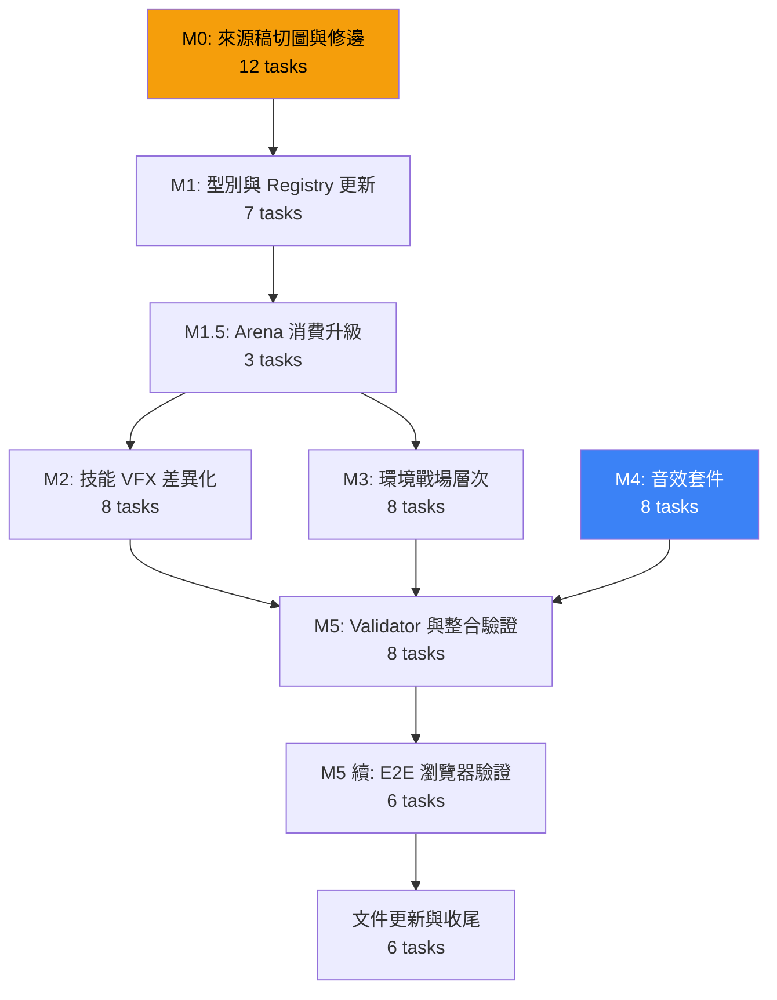

# 戰鬥視覺升級完整實作計畫

完整的 OpenSpec change `battle-visual-upgrade` 已建立，包含 proposal、design、7 個 specs 和 56 項任務清單。

## 變更概要

將戰鬥系統從「每個角色只有 idle 圖、技能幾乎相同、音效只有共用 cue」升級為完整的視覺與聽覺體驗。

> [!IMPORTANT]
> 本計畫不新增任何外部依賴，不建立第二 audio controller / animation queue / asset registry。完全在既有架構上擴充。

## 已建立的 OpenSpec Artifacts

| Artifact | 路徑 | 狀態 |
|----------|------|------|
| Proposal | [proposal.md](file:///c:/Users/user/Desktop/Quiz-app-/openspec/changes/battle-visual-upgrade/proposal.md) | ✅ Done |
| Design | [design.md](file:///c:/Users/user/Desktop/Quiz-app-/openspec/changes/battle-visual-upgrade/design.md) | ✅ Done |
| Spec: battle-character-actions | [spec.md](file:///c:/Users/user/Desktop/Quiz-app-/openspec/changes/battle-visual-upgrade/specs/battle-character-actions/spec.md) | ✅ Done |
| Spec: battle-skill-vfx-library | [spec.md](file:///c:/Users/user/Desktop/Quiz-app-/openspec/changes/battle-visual-upgrade/specs/battle-skill-vfx-library/spec.md) | ✅ Done |
| Spec: battle-environment-presentation | [spec.md](file:///c:/Users/user/Desktop/Quiz-app-/openspec/changes/battle-visual-upgrade/specs/battle-environment-presentation/spec.md) | ✅ Done |
| Spec: battle-audio-cue-library | [spec.md](file:///c:/Users/user/Desktop/Quiz-app-/openspec/changes/battle-visual-upgrade/specs/battle-audio-cue-library/spec.md) | ✅ Done |
| Spec: battle-asset-pipeline | [spec.md](file:///c:/Users/user/Desktop/Quiz-app-/openspec/changes/battle-visual-upgrade/specs/battle-asset-pipeline/spec.md) | ✅ Done |
| Spec: battle-mode (delta) | [spec.md](file:///c:/Users/user/Desktop/Quiz-app-/openspec/changes/battle-visual-upgrade/specs/battle-mode/spec.md) | ✅ Done |
| Spec: skill-effects-engine (delta) | [spec.md](file:///c:/Users/user/Desktop/Quiz-app-/openspec/changes/battle-visual-upgrade/specs/skill-effects-engine/spec.md) | ✅ Done |
| Tasks | [tasks.md](file:///c:/Users/user/Desktop/Quiz-app-/openspec/changes/battle-visual-upgrade/tasks.md) | ✅ Done |

## 執行路線（9 個 Milestone）

> [!NOTE]
> M2（技能 VFX）、M3（環境）、M4（音效）可並行執行，它們互不依賴。

## 素材缺口報告

> [!WARNING]
> 以下素材目前尚未具備，需要你協助創造：

### 🔴 必須提供的素材（阻塞 M4 音效套件）

| 素材 | 建議檔名 | 長度 | 用途 |
|------|----------|------|------|
| 一般命中音效 | `hit_basic.ogg` | 80-180ms | hero_attack impact |
| 暴擊音效 | `hit_critical.ogg` | 150-300ms | 暴擊判定 |
| 護盾吸收音效 | `shield_absorb.ogg` | 150-350ms | 護盾吸收 |
| 怪物倒下音效 | `monster_defeat.ogg` | 300-700ms | monster defeat |
| 怪物生成音效 | `monster_spawn.ogg` | 250-600ms | normal/elite spawn |
| Boss 登場音效 | `boss_entrance.ogg` | 700-1500ms | Boss entrance |
| 火系施法音效 | `skill_fire_cast.ogg` | - | 火系 charge/release |
| 火系命中音效 | `skill_fire_impact.ogg` | - | 火系 impact |
| 冰系施法音效 | `skill_ice_cast.ogg` | - | 冰系 charge/release |
| 冰系命中音效 | `skill_ice_impact.ogg` | - | 冰裂 impact |
| 雷系施法音效 | `skill_lightning_cast.ogg` | - | 雷系 charge/release |
| 雷系命中音效 | `skill_lightning_impact.ogg` | - | 雷擊 impact |
| 勝利音效 | `battle_victory.ogg` | - | 結束/Boss defeat |

### 🟡 可能需要調整的素材（切圖後才知道）

- `production-source-v2/` 的 atlas 切圖後可能有 **比例漂移** 或 **色溢** 需要修正
- 某些 cell 的 **pivot 對齊** 可能需要人工調整
- VFX atlas 的 **發光邊緣** 在 dungeon 背景上可能需要 despill

## 影響分析

### 會修改的檔案

| 檔案 | 變更類型 | 風險等級 |
|------|----------|----------|
| [battleTypes.ts](file:///c:/Users/user/Desktop/Quiz-app-/types/battleTypes.ts) | 新增 `entrance` action | 🟢 低 |
| [battleAssetRegistry.ts](file:///c:/Users/user/Desktop/Quiz-app-/constants/battleAssetRegistry.ts) | 新增 ~35 entries | 🟢 低（附加式）|
| [BattleArena.tsx](file:///c:/Users/user/Desktop/Quiz-app-/components/BattleArena.tsx) | 新增 entrance action + 環境層 | 🟡 中 |
| [BattleSkillOverlay.tsx](file:///c:/Users/user/Desktop/Quiz-app-/components/BattleSkillOverlay.tsx) | 新增 SkillVfxRenderer | 🟡 中 |
| [useSoundEffects.ts](file:///c:/Users/user/Desktop/Quiz-app-/hooks/useSoundEffects.ts) | 擴充 cue mapping | 🟡 中 |
| [validateBattleAssets.ts](file:///c:/Users/user/Desktop/Quiz-app-/scripts/validateBattleAssets.ts) | 擴充驗證規則 | 🟢 低 |

### 會新增的檔案

| 檔案 | 用途 |
|------|------|
| `components/SkillVfxRenderer.tsx` | 技能 VFX 四階段動畫子元件 |
| `components/BattleEnvironmentLayer.tsx` | 環境 overlay 層元件 |
| `scripts/sliceSpriteAtlas.ts` | Atlas 切割腳本 |
| `scripts/promoteAsset.ts` | 資產升格腳本 |
| `scripts/checkAtlasAlpha.ts` | Atlas alpha 檢查腳本 |
| `public/battle/characters/*/*.webp` | ~27 張角色 action sprites |
| `public/battle/vfx/*/*.webp` | ~12 張 VFX phase sprites |
| `public/battle/environment/*.webp` | ~8 張環境 overlay |
| `public/sounds/battle/*.ogg` | ~13 個音效 cue |

### 不會修改的檔案（安全邊界）

- `useBattlePresentation.ts` — phase timing 已由 MotionProfile 控制，無需改動
- `services/battle/battleEngine.ts` — 純引擎邏輯不受視覺變更影響
- `services/battle/battlePersistence.ts` — 持久化格式不變
- `hooks/useBattleSystem.ts` — 狀態管理不變
- `App.tsx` — 不新增 provider 或路由
- `types.ts` — 主型別檔不變（只改 battleTypes.ts）

## 驗證計畫

每個 Milestone 都有自動化 gate：

| Gate | 指令 | 時機 |
|------|------|------|
| TypeScript | `npx tsc --noEmit` | 每個 Milestone |
| Unit Tests | `npm test` | 每個 Milestone |
| Asset Validator | `npx tsx scripts/validateBattleAssets.ts` | M1, M2, M3, M4, M5 |
| Build | `npm run build` | M5 |
| Dead Code | `npx -y knip --reporter compact` | M5 |
| E2E | `npx playwright test battle-assets battle-flow` | M5 續 |
| Browser | webapp-testing Chromium 截圖 | M5 續 |

## 開始執行

準備好後，使用 `/opsx-apply` 開始實作。建議從 **M0（切圖）** 開始，這是所有後續任務的基礎。

**但在此之前**，請先提供上述 🔴 標記的 13 個音效檔案，或告訴我你希望我用其他方式處理（例如先跳過 M4 音效套件，優先完成視覺升級）。
