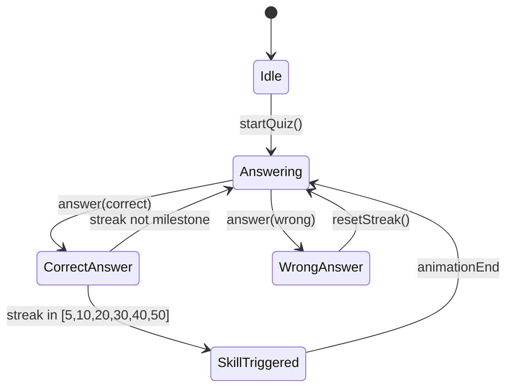

# Skills-Based Optimization - Design

## Architecture Overview

此優化計劃涉及以下模組，按層級組織：

```
┌─────────────────────────────────────────────────────────────┐
│                        App Layer                             │
│  App.tsx (效能優化), components/Dashboard.tsx                │
├─────────────────────────────────────────────────────────────┤
│                       Service Layer                          │
│  services/ai.ts (Prompt 優化)                                │
├─────────────────────────────────────────────────────────────┤
│                        Hook Layer                            │
│  hooks/useBattleSystem.ts (偵錯強化)                         │
├─────────────────────────────────────────────────────────────┤
│                       Constants Layer                        │
│  constants/skillsData.ts (觸發邏輯驗證)                      │
├─────────────────────────────────────────────────────────────┤
│                       Config Layer                           │
│  index.html (CSP), vite.config.ts (安全配置)                 │
└─────────────────────────────────────────────────────────────┘
```

## Design Decisions

### DD-1: AI Prompt 結構化輸出
**決策**: 採用 Structured Output Pattern + Few-Shot Examples
**理由**: 
- JSON Schema 在 Prompt 中明確定義可大幅提升格式一致性
- Few-Shot 範例提供 LLM 明確的輸出格式參考
- Error Recovery 機制確保即使格式略有偏差也能解析

**實作方式**:
```typescript
// services/ai.ts
const QUESTION_SCHEMA = `{
  "id": "string (UUID)",
  "question": "string",
  "options": ["string", ...],
  "correctAnswers": [number, ...],
  "type": "single | multiple",
  "hint": "string (optional)",
  "explanation": "string"
}`;
```

### DD-2: React 效能優化策略
**決策**: 審查而非重構
**理由**:
- `App.tsx` 雖有 888 行，但功能完整，大規模重構風險高
- 優先識別明顯的效能問題 (錯誤依賴、缺失 memo)
- 採用增量優化而非一次性重寫

**審查重點**:
1. `useEffect` 依賴陣列完整性
2. 頻繁更新的 state 是否導致大範圍重渲染
3. Context 邊界是否合理

### DD-3: 戰鬥系統可觀測性
**決策**: DEV-only 日誌 + Mermaid 狀態圖
**理由**:
- 生產環境不需要除錯日誌 (使用 `import.meta.env.DEV` 條件)
- Mermaid 圖可直接在 Markdown 文檔中渲染

**狀態圖** (簡化版):


### DD-4: 安全審計三層架構
**決策**: 依賴 + 編碼 + 靜態分析 三層檢查
**理由**:
- `npm audit` 處理供應鏈安全
- `frontend-security-coder` 處理 XSS/CSP
- `SAST` 處理程式碼層級漏洞

## Data Flow

### AI 題目生成流程
```
User uploads PDF
       ↓
extractTextFromPDF() → raw text
       ↓
buildPrompt(text, options) → structured prompt with schema + examples
       ↓
LLM API call → raw response
       ↓
cleanJsonResponse() → remove markdown, fix common issues
       ↓
JSON.parse() → Question[]
       ↓
validateQuestions() → filter invalid, report errors
       ↓
saveToStorage() → localStorage
```

## File Changes Summary

| 檔案 | 變更類型 | 說明 |
|------|---------|------|
| `services/ai.ts` | MODIFY | Prompt 結構化 + Error Recovery |
| `App.tsx` | MODIFY | 效能審查與增量優化 |
| `components/Dashboard.tsx` | MODIFY | memo 檢查 |
| `hooks/useBattleSystem.ts` | MODIFY | DEV 日誌 |
| `src/__tests__/useBattleSystem.test.ts` | NEW | 單元測試 |
| `docs/battle-state-diagram.md` | NEW | 狀態圖文檔 |
