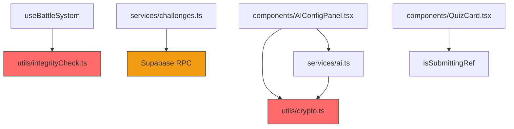
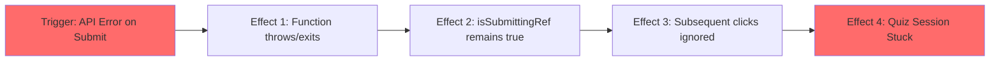

# Stress Test Report: security-audit-remediation

> **Generated by**: Plan Stress Test v2.0 — Deep Analysis Engine
> **Date**: 2026-06-09
> **Change Scale**: Large [L] (Touches >10 files, modifies 5+ modules, introduces new crypto/async patterns)

---

## 1. Executive Summary

### Plan Health Score: 31 / 100 — Grade: 🟠 D — Poor

| Classification | Count | Threshold |
|----------------|-------|-----------|
| 🔴 CRITICAL | 3 | RPN ≥ 75 |
| 🟠 HIGH | 3 | RPN 50–74 |
| 🟡 MEDIUM | 0 | RPN 25–49 |
| 🔵 LOW | 0 | RPN < 25 |

**Top 3 Critical Findings**:
1. **Security Bypass via Fallback (D6-001)**: 聯賽分數 RPC 失敗時的回退機制完全破壞了該防禦的有效性，攻擊者可故意阻斷 RPC 來觸發回退並竄改分數。
2. **UI Deadlock on Submit Error (D5-001)**: 答題雙擊防護的 `isSubmittingRef` 在提交發生網路錯誤時不會重置，導致該題永久卡死無法再次提交。
3. **Fragile Encryption Key Derivation (D10-001)**: 使用 `navigator.userAgent` 作為加密 API Key 的指紋派生來源，在瀏覽器自動更新後會導致密鑰變更，造成所有用戶遺失 API Key 設定。

**Overall Assessment**:
計畫存在嚴重的安全邏輯漏洞與非同步狀態死鎖風險，不應直接進入實作階段。RPC 的降級回退設計破壞了修復的根本目的，加密派生與非同步 API 的改造也忽略了前端環境的變動性與 React 狀態初始化的同步限制。必須在修訂這些關鍵設計後再行實作。

---

## 2. Cross-Validation Matrix

> Verifies consistency across proposal.md ↔ design.md ↔ tasks.md

| Aspect | proposal.md Says | design.md Says | tasks.md Says | Consistent? | Issue |
|--------|------------------|----------------|---------------|-------------|-------|
| 聯賽 RPC 判定 | 移除前端判定，改用後端 RPC | 建立 RPC，若無配置則 fallback 前端判定 | 實作優先嘗試 RPC，失敗則 fallback 前端 | ✅ | 一致，但此設計本身存在嚴重安全漏洞。 |
| API Key 加密 | 實施客戶端加密混淆 | 使用 AES-GCM，密鑰從 user-agent + screen resolution 派生 | 從 user-agent 的 SHA-256 hash 派生 | ❌ | tasks.md 遺漏了 screen resolution，導致實作細節不一致。 |
| 答題雙擊防護 | 加入 useRef 鎖 | 在 submitAnswer 使用 useRef，新題目到達時重置 | 相同，但未提及錯誤處理重置 | ✅ | 一致，但設計有缺陷。 |

### Terminology Consistency Check
| Term in proposal.md | Equivalent in design.md | Equivalent in tasks.md | Aligned? |
|---------------------|------------------------|------------------------|----------|
| 完整性簽名驗證機制 | HMAC-SHA256 簽名 | utils/integrityCheck.ts | ✅ |

### Coverage Gap Analysis
- **Tasks without design justification**: 無。
- **Non-functional requirements without implementation strategy**: proposal 提到「向後相容現有用戶 localStorage 資料」，但 `useBattleSystem` 的非同步讀取改造會破壞原有的同步 `useState` 初始化，缺乏針對 React 生命週期的具體設計。

---

## 3. Dependency Graph

### 3.1 Module Dependency Diagram

### 3.2 Dependency Analysis Table

| Module | Depends On | Depended By | Fan-In | Fan-Out | SPOF? | Notes |
|--------|-----------|-------------|--------|---------|-------|-------|
| utils/crypto.ts | WebCrypto API, userAgent | ai.ts, AIConfigPanel | 2 | 1 | Yes | 瀏覽器更新將導致依賴此模組的所有資料無法解密 |
| utils/integrityCheck.ts | WebCrypto API | useBattleSystem, achievements | 2 | 1 | No | 固定鹽值設計使其形同虛設 |
| services/challenges.ts | Supabase RPC | Battle/Quiz UI | N/A | 1 | No | 降級機制使其依賴變得不可靠 |

---

## 4. 11-Dimension Deep Audit

### D6: 安全攻擊面分析 (Security Attack Surface)

#### Findings
| ID | Finding | Impact | Likelihood | Detectability | RPN | Classification |
|----|---------|--------|------------|---------------|-----|----------------|
| D6-001 | **Security Bypass via Fallback**: `submitChallengeScore` 在 RPC 失敗時 fallback 到前端判定，攻擊者只需故意阻斷 RPC 請求（如使用 AdBlocker 或 DevTools），就能強迫系統使用前端判定並送出偽造的勝利結果，完全破壞了本次安全修復的目的。 | 4 | 5 | 4 | **80** | 🔴 CRITICAL |

#### 5-Why Root Cause Analysis
**D6-001**: Security Bypass via Fallback
- **Why 1**: 系統允許在沒有後端驗證的情況下提交分數。
  - **Why 2**: 因為設計中加入了 RPC 失敗時的 fallback 機制。
    - **Why 3**: 為了在 Supabase 管理員尚未部署 RPC 腳本時保持系統可用性。
- **Root Cause**: 在安全性（防止作弊）與可用性（RPC 尚未部署時的相容）之間做了錯誤的折衷，將「不安全的狀態」當作可接受的 fallback。
- **Systemic Pattern**: 信任不受控的客戶端狀態。

---

### D5: 錯誤處理與故障恢復 (Error Handling & Fault Recovery)

#### Findings
| ID | Finding | Impact | Likelihood | Detectability | RPN | Classification |
|----|---------|--------|------------|---------------|-----|----------------|
| D5-001 | **UI Deadlock on Submit Error**: `QuizCard` 的 `isSubmittingRef` 在 `submitAnswer` 開頭設為 `true`，但計畫中並未指示在 `try/catch` 的 `catch` 區塊或 API 請求失敗時將其重設為 `false`。若提交失敗，用戶將永遠無法再次點擊該題。 | 3 | 5 | 5 | **75** | 🔴 CRITICAL |

#### 5-Why Root Cause Analysis
**D5-001**: UI Deadlock on Submit Error
- **Why 1**: 用戶在發生網路錯誤後無法再次提交答案。
  - **Why 2**: `isSubmittingRef.current` 仍然是 `true`。
    - **Why 3**: 設計只規定在「切換下一題」時重置 ref，忽略了提交本身的失敗路徑。
- **Root Cause**: 狀態鎖定機制的生命週期設計不完整，缺乏異常控制流的涵蓋。
- **Systemic Pattern**: 樂觀 UI 設計未考慮網路故障。

---

### D10: 隱式假設與環境依賴 (Implicit Assumptions & Environment Dependencies)

#### Findings
| ID | Finding | Impact | Likelihood | Detectability | RPN | Classification |
|----|---------|--------|------------|---------------|-----|----------------|
| D10-001 | **Fragile Encryption Key Derivation**: `getDeviceKey` 使用 `navigator.userAgent` 派生密鑰。瀏覽器背景自動更新（如 Chrome 121 -> 122）會改變 user-agent，導致派生的密鑰不同，舊有加密的 API Key 將無法解密。 | 4 | 5 | 4 | **80** | 🔴 CRITICAL |

#### 5-Why Root Cause Analysis
**D10-001**: Fragile Encryption Key Derivation
- **Why 1**: 用戶的 API Key 無預警遺失。
  - **Why 2**: 解密失敗，因為密鑰不匹配。
    - **Why 3**: 派生密鑰的輸入參數（user-agent）發生了變化。
- **Root Cause**: 錯誤假設了 `navigator.userAgent` 是一個穩定不變的設備識別碼。
- **Systemic Pattern**: 客戶端指紋技術的濫用。

---

### D11: 向後相容性與遷移風險 (Backward Compatibility & Migration Risk)

#### Findings
| ID | Finding | Impact | Likelihood | Detectability | RPN | Classification |
|----|---------|--------|------------|---------------|-----|----------------|
| D11-001 | **Async Hook Breakage in React**: 將 `getAIConfig` 和 `useBattleSystem` 的資料載入改為 `async`（因 WebCrypto API 限制），會破壞原本使用同步初始化的 React hooks。若組件依賴 `useState(() => getAIConfig())`，將會得到 Promise 物件而非資料，導致白屏崩潰。 | 4 | 4 | 4 | **64** | 🟠 HIGH |

---

### D6: 安全攻擊面分析 (Security Attack Surface)

#### Findings
| ID | Finding | Impact | Likelihood | Detectability | RPN | Classification |
|----|---------|--------|------------|---------------|-----|----------------|
| D6-002 | **HMAC Salt Hardcoding**: localStorage 簽名的鹽值（`'mindspark_integrity_v1'` + 應用版本）硬編碼在客戶端 JS 中。攻擊者只需打開 DevTools 即可讀取鹽值，並使用相同的演算法偽造任何戰鬥狀態，HMAC 機制形同虛設。 | 3 | 5 | 4 | **60** | 🟠 HIGH |

---

### D4: 併發與競態條件 (Concurrency & Race Conditions)

#### Findings
| ID | Finding | Impact | Likelihood | Detectability | RPN | Classification |
|----|---------|--------|------------|---------------|-----|----------------|
| D4-001 | **Async State Save Race Condition**: `useBattleSystem` 中的 `battleState` 頻繁更新，若 `signData` 是非同步的，快速連續的狀態變化可能導致非同步的簽名計算與 `localStorage.setItem` 執行順序錯亂，寫入不匹配的資料與簽名。 | 3 | 4 | 5 | **60** | 🟠 HIGH |

---

## 5. Cascading Failure Analysis

| Trigger | Immediate Effect | 2nd-Order Effect | Blast Radius | Recovery Difficulty |
|---------|-----------------|-------------------|--------------|---------------------|
| D6-001: 攔截 RPC | RPC 呼叫失敗 | 系統 fallback 前端邏輯 | 聯賽排行榜 | Easy (Require redesign) |
| D5-001: 提交發生 Timeout | `submitAnswer` 拋出錯誤中止 | ref 鎖死，按鈕失效 | 單一用戶答題流程 | Medium (Needs page reload) |
| D10-001: Chrome 背景更新 | User-Agent 改變 | API Key 解密失敗被清空 | 所有依賴 AI 的功能 | Hard (User must re-enter Key) |

### Cascade Diagram (UI Deadlock)

---

## 6. Adversarial Attack Scenarios

### 🎭 Role: Security Adversary
| Attack Vector | Target | Preconditions | Steps | Expected Impact | Mitigation |
|---------------|--------|---------------|-------|-----------------|------------|
| Bypass RPC via AdBlock | `submit_challenge_score` | 瀏覽器安裝自訂擋廣告規則 | 1. 在 DevTools 將 RPC endpoint 加入黑名單   2. 遊玩挑戰模式並輸掉   3. 前端觸發 fallback，計算出假分數並以傳統 API 提交 | 成功竄改排行榜，無效化安全修復 | 移除 fallback，RPC 失敗即視為操作失敗 |

### 🎭 Role: Chaos Engineer
| Failure Injection | Target | Scenario | Expected Behavior | Actual (Predicted) Behavior | Gap |
|-------------------|--------|----------|--------------------|-----------------------------|-----|
| 網路隨機斷線 | `QuizCard.submitAnswer` | 用戶在搭地鐵時答題 | 顯示網路錯誤，允許重試 | 按鈕無反應，永遠卡在該題 | `catch` 區塊缺少狀態重置 |

### 🎭 Role: Domain Skeptic
| Assumption Challenged | Evidence For | Evidence Against | Risk if Wrong | Recommendation |
|----------------------|-------------|-----------------|---------------|----------------|
| `navigator.userAgent` 是穩定的 | 在同一次瀏覽期間不變 | 瀏覽器靜默更新、用戶切換桌面/行動檢視、反追蹤插件 | 加密資料遺失 | 改用生成隨機 UUID 並存於未加密欄位作為 local salt |

### 🎭 Role: Maintainability Critic
| Concern | Location | Current Design | Problem in 6 Months | Suggested Improvement |
|---------|----------|----------------|---------------------|----------------------|
| 硬編碼的 HMAC 鹽值 | `utils/integrityCheck.ts` | 客戶端常數拼接 | 被破解後需發布新版本更改前綴，導致所有合法用戶舊資料失效 | 認知到純前端防篡改的侷限性，與其使用繁重的非同步 HMAC，不如使用簡單的同步 checksum |

---

## 7. Comprehensive Test Matrix

| Priority | Module | Test Scenario | Dimension | Type | Automation | Expected Outcome |
|----------|--------|---------------|-----------|------|------------|------------------|
| P0 | Challenges | RPC 失敗時的處理 | D6 | Integration | Auto | 必須拋出錯誤並中斷，不可送出舊版偽造請求 |
| P0 | QuizCard | 答題錯誤恢復 | D5 | Component | Auto | `submitAnswer` 拋出異常後，按鈕仍可點擊 |
| P0 | AI Config | User-Agent 改變 | D10 | Unit | Auto | 模擬 UA 改變，確保系統不會直接清空配置 |
| P1 | BattleSystem | 快速連續更新 | D4 | Component | Auto | 連續觸發 5 次攻擊，localStorage 資料與簽名最終一致 |

---

## 8. Consolidated Risk Register

| Rank | ID | Finding | Impact | Likelihood | Detectability | RPN | Classification | Mitigation |
|------|----|---------|--------|------------|---------------|-----|----------------|------------|
| 1 | D6-001 | Security Bypass via Fallback | 4 | 5 | 4 | 80 | 🔴 CRITICAL | 移除 `submitChallengeScore` 的 fallback 邏輯，RPC 失敗時拋出錯誤並終止流程。 |
| 2 | D10-001 | Fragile Encryption Key Derivation | 4 | 5 | 4 | 80 | 🔴 CRITICAL | 放棄依賴 User-Agent。改為：在首次加密時生成隨機 Salt 存入 localStorage，與 API Key 的密文分開存放。 |
| 3 | D5-001 | UI Deadlock on Submit Error | 3 | 5 | 5 | 75 | 🔴 CRITICAL | 在 `submitAnswer` 使用 `finally { isSubmittingRef.current = false; }` 確保異常時釋放鎖。 |
| 4 | D11-001 | Async Hook Breakage in React | 4 | 4 | 4 | 64 | 🟠 HIGH | 提供同步版本的 `getAIConfigSync` (若可行) 或引入 `useEffect` 管理 loading 狀態，避免組件崩潰。 |
| 5 | D6-002 | HMAC Salt Hardcoding | 3 | 5 | 4 | 60 | 🟠 HIGH | 文件需明確標示此為「防君子不防小人」的完整性校驗，而非絕對安全。 |
| 6 | D4-001 | Async State Save Race Condition | 3 | 4 | 5 | 60 | 🟠 HIGH | 對 `localStorage.setItem` 實施序列化佇列（Queue）或使用簡單的同步 Hash（如 CRC32/SHA-1 輕量版）代替 WebCrypto。 |

---

## 9. Mitigation Action Plan

### 🔴 CRITICAL — Must Fix Before Implementation
| # | Finding ID | Action | Affected Files |
|---|-----------|--------|----------------|
| 1 | D6-001 | 移除 `submitChallengeScore` 的 fallback 邏輯，強制依賴 RPC。 | `services/challenges.ts`, `specs/supabase-security-hardening/spec.md` |
| 2 | D10-001 | 重新設計密鑰派生機制，改用本地隨機生成的固定 Salt，不依賴環境變數。 | `utils/crypto.ts`, `specs/api-key-protection/spec.md` |
| 3 | D5-001 | 在 `QuizCard.tsx` 的提交邏輯中加入 `try/finally` 確保 ref 鎖重置。 | `components/QuizCard.tsx`, `tasks.md` |

### 🟠 HIGH — Should Fix During Implementation
| # | Finding ID | Action | Affected Files |
|---|-----------|--------|----------------|
| 4 | D11-001 | 重構所有呼叫 `getAIConfig` 與 `useBattleSystem` 的元件，妥善處理非同步載入狀態。 | `components/AIConfigPanel.tsx`, `App.tsx` |
| 5 | D4-001 | 評估是否將 WebCrypto HMAC 替換為同步的 SHA-256 實作以避免 React 渲染競爭。 | `utils/integrityCheck.ts`, `hooks/useBattleSystem.ts` |
