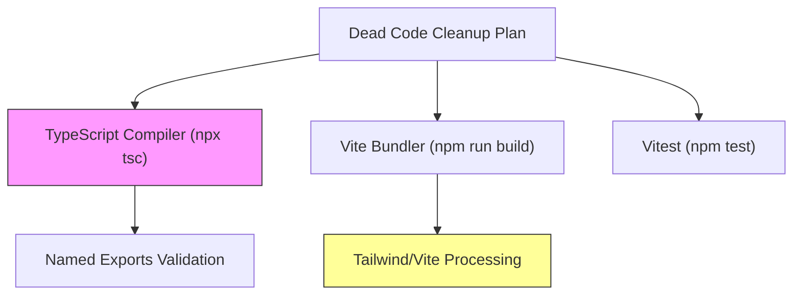
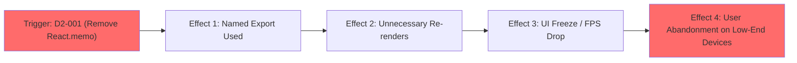

# Stress Test Report: dead-code-cleanup

> **Generated by**: Plan Stress Test v2.0 — Deep Analysis Engine
> **Date**: 2026-06-12
> **Change Scale**: Large (L)

---

## 1. Executive Summary

### Plan Health Score: 76 / 100 — Grade: B — Good

| Classification | Count | Threshold |
|----------------|-------|-----------|
| 🔴 CRITICAL | 1 | RPN ≥ 75 |
| 🟠 HIGH | 1 | RPN 50–74 |
| 🟡 MEDIUM | 0 | RPN 25–49 |
| 🔵 LOW | 1 | RPN < 25 |

**Top 3 Findings**:
1. **[CRITICAL] Loss of Component Memoization**: 刪除 4 個關鍵元件（`BankManager`, `QuizCard`, `Settings`, `AIPromptGuide`）的 `export default React.memo(...)` 將導致使用 named export 的地方獲取到未優化（un-memoized）的組件，引發嚴重效能回歸。
2. **[HIGH] Known Build Breakage in Phase 4**: 計畫刻意依賴 TypeScript 編譯器失敗來捕捉 `export default` 移除後的匯入錯誤（Reactive），而非主動更新呼叫端（Proactive），將導致 CI 流程中斷。
3. **[LOW] NPM Tree Recalculation Risk**: 移除 `postcss` 等依賴將觸發 `package-lock.json` 重建，可能無意間更新 transitive dependencies 引入風險。

**Overall Assessment**:
此計畫在定位和清除死碼方面極為精確，且備有完整的 Rollback 計畫，整體可行性高。然而，計畫過度依賴靜態分析工具的表面結果，忽略了 `export default React.memo()` 的效能語意。必須在實作前修改 Phase 4，確保 named exports 被正確 memoize，且主動更新受影響的 import 語句，方可安全執行。

---

## 2. Cross-Validation Matrix

> Verifies consistency across proposal.md ↔ design.md ↔ tasks.md

| Aspect | proposal.md Says | design.md Says | tasks.md Says | Consistent? | Issue |
|--------|------------------|----------------|---------------|-------------|-------|
| Export Scope | 取消僅內部使用的 export | 只取消 export，不刪除函式 | 將 export 關鍵字移除，保留定義 | ✅ | None |
| Duplicate Exports | 移除冗餘 export default | 只刪除 export default，保留 named export | 刪除 export default 語句 | ✅ | None |
| Dependency Cleanup | 移除 5 個未用依賴與 override | npm uninstall + 清除 overrides | 執行 uninstall 與修改 package.json | ✅ | None |

### Terminology Consistency Check
| Term in proposal.md | Equivalent in design.md | Equivalent in tasks.md | Aligned? |
|---------------------|------------------------|------------------------|----------|
| 死碼 (Dead Code) | 死碼 (Dead Code) | 死碼清理 (Dead Code Cleanup) | ✅ |

### Coverage Gap Analysis
- **Features in proposal.md without design**: None
- **Design elements without implementation tasks**: None
- **Tasks without design justification**: None
- **Non-functional requirements without implementation strategy**: "零功能回歸" 在設計中提出，但在 Tasks.md 中對 memoization 的破壞缺乏對策。

---

## 3. Dependency Graph

> Map all explicit and implicit dependencies. Identify single points of failure and circular dependencies.

### 3.1 Module Dependency Diagram

> 🔴 整個清理流程高度依賴 TypeScript 編譯器（Compiler）捕捉所有的潛在損壞。

### 3.2 Dependency Analysis Table

| Module | Depends On | Depended By | Fan-In | Fan-Out | SPOF? | Notes |
|--------|-----------|-------------|--------|---------|-------|-------|
| `tasks.md` (Phase 4) | `tsc --noEmit` | Developer execution | 1 | 3 | Yes | 依賴編譯器錯誤作為重構指引，而非主動尋找 |
| `package.json` | `npm install` | All CI/CD flows | 10+ | 1 | Yes | 鎖定檔重建可能改變依賴樹 |

### 3.4 Implicit Dependencies
- **Implicit dependency 1**: React 效能依賴於 `export default React.memo()`。計畫隱式假設 `export const Component` 與 `export default React.memo(Component)` 功能等價，這是不成立的。
- **Implicit dependency 2**: `.js`/`.jsx` 檔案或動態 `import()` 沒有引用被移除的 `classnames`，計畫假設全域 `grep` 已經涵蓋一切。

---

## 4. 11-Dimension Deep Audit

### D2: 設計一致性 (Design Consistency)

#### Findings
| ID | Finding | Impact | Likelihood | Detectability | RPN | Classification |
|----|---------|--------|------------|---------------|-----|----------------|
| D2-001 | **Loss of Component Memoization**: `BankManager`, `QuizCard`, `Settings`, `AIPromptGuide` 的 named export 皆未包裝 `React.memo`。刪除 default export 將迫使整個 App 使用未優化版本，引發嚴重效能回歸。 | 3 | 5 | 5 | 75 | 🔴 |

#### 5-Why Root Cause Analysis
**D2-001**: Loss of Component Memoization
- **Why 1**: `tasks.md` 指示刪除 `export default React.memo(Component)`。
- **Why 2**: 因為這 4 個檔案同時擁有 named export `export const Component`。
- **Why 3**: 靜態掃描工具 (`knip`) 將同時存在的 default 和 named export 標記為冗餘。
- **Why 4**: 計畫作者信任工具輸出，未物理檢查該行程式碼包含額外的 `React.memo()` 語意層。
- **Root Cause**: Tool-driven blind spots. 盲目信任死碼檢測工具而忽略了 React 效能優化模式。
- **Systemic Pattern**: 是。這種依賴自動化工具而忽略語意的模式也出現在 Phase 4 的「依賴編譯器報錯」策略中。

---

### D9: 可維護性與技術債 (Maintainability & Technical Debt)

#### Findings
| ID | Finding | Impact | Likelihood | Detectability | RPN | Classification |
|----|---------|--------|------------|---------------|-----|----------------|
| D9-001 | **Compiler-Driven Refactoring causes Build Breakage**: Phase 4 直接刪除 default export 而非先更新 `src/__tests__/useBattleSystem.test.ts` 與 `components/AppContent.tsx` 等已知呼叫端，故意讓編譯失敗。 | 3 | 5 | 4 | 60 | 🟠 |

#### 5-Why Root Cause Analysis
**D9-001**: Compiler-Driven Refactoring causes Build Breakage
- **Why 1**: `tasks.md` 沒有包含更新呼叫端 `import` 語句的步驟。
- **Why 2**: 計畫設計決定採用「出錯後回滾並修正」的 Reactive 策略。
- **Why 3**: 作者為了簡化計畫步驟，將找尋引用的責任推卸給 TypeScript 編譯器。
- **Root Cause**: 為了降低計畫撰寫成本，犧牲了重構的原子性（Atomicity）與 CI/CD 的平滑度。
- **Systemic Pattern**: 無，但反映出對 CI 穩定性的考量不足。

---

### D10: 隱式假設與環境依賴 (Implicit Assumptions & Environment Dependencies)

#### Findings
| ID | Finding | Impact | Likelihood | Detectability | RPN | Classification |
|----|---------|--------|------------|---------------|-----|----------------|
| D10-001 | **NPM Tree Recalculation Risk**: 移除 `postcss` 並執行 `npm install` 會導致 `package-lock.json` 重建，可能引入未預期的 transitive 依賴更新。 | 3 | 2 | 4 | 24 | 🔵 |

---

## 5. Cascading Failure Analysis

| Trigger | Immediate Effect | 2nd-Order Effect | 3rd-Order Effect | Blast Radius | Recovery Difficulty |
|---------|-----------------|-------------------|-------------------|--------------|---------------------|
| D2-001: 刪除 `React.memo` default export | 呼叫端改用無 memoization 的 named export | `QuizCard` 和 `BankManager` 在父元件狀態更新時發生不必要的重新渲染 | 在大型題庫或長對話歷史下，UI 出現明顯卡頓甚至無響應 | 全域 (4個核心模組) | Easy (若及時發現) / Hard (若上線後) |
| D9-001: 未更新 import 直接刪除 default export | `npx tsc` 報錯 | Phase 4 失敗，開發者進入回滾流程 | 如果開發者不熟悉 codebase，可能改錯 import 語法導致 runtime 錯誤 | 2個檔案 | Easy |

### Cascade Diagram (for top 3 cascades)

---

## 6. Adversarial Attack Scenarios

### 🎭 Role: Security Adversary
| Attack Vector | Target | Preconditions | Steps | Expected Impact | Mitigation |
|---------------|--------|---------------|-------|-----------------|------------|
| Transitive Supply Chain | `package-lock.json` | 移除 `postcss` 觸發 lock 檔更新 | 1. 執行 npm install 2. 某個間接依賴被升級至含有漏洞的版本 3. 部署上線 | XSS 或原型鏈污染 (取決於依賴) | 在 PR 中嚴格審查 `package-lock.json` 的 diff，確保只有目標依賴被移除 |

### 🎭 Role: Chaos Engineer
| Failure Injection | Target | Scenario | Expected Behavior | Actual (Predicted) Behavior | Gap |
|-------------------|--------|----------|--------------------|-----------------------------|-----|
| Network drop during Phase 5 | `node_modules` | 開發者執行 `npm uninstall` 到一半斷網 | 依賴樹維持舊狀態 | `package.json` 被修改但 `node_modules` 損壞 | 依賴回滾計畫 `git checkout && npm install`，已滿足。 |

### 🎭 Role: Domain Skeptic
| Assumption Challenged | Evidence For | Evidence Against | Risk if Wrong | Recommendation |
|----------------------|-------------|-----------------|---------------|----------------|
| "TypeScript Compiler can catch all export removal issues" | 專案開啟了 `strict` 模式 | 專案中有動態 `import()` (如 `AppContent.tsx` 的 Lazy 載入) | 應用在特定路由下白畫面崩潰 | 必須手動 `grep` 檢查 `import(` 和 `React.lazy` |

### 🎭 Role: Maintainability Critic
| Concern | Location | Current Design | Problem in 6 Months | Suggested Improvement |
|---------|----------|----------------|---------------------|----------------------|
| Tech Debt Re-accumulation | Components | 只進行一次性清理 | 團隊習慣性寫 `export default`，6個月後又會充滿冗餘 | 引入 ESLint 規則 `import/no-default-export` 或 `no-restricted-syntax` 強制規範 |

---

## 7. Comprehensive Test Matrix

| Priority | Module | Test Scenario | Dimension | Type | Automation | Preconditions | Expected Outcome | Risk if Untested |
|----------|--------|---------------|-----------|------|------------|---------------|------------------|------------------|
| P0 | Components | 驗證 `BankManager` 等 4 個元件在重構後是否仍具備 memoization 效果 | D2 | Perf | Manual | React DevTools Profiler 開啟 | 父元件 re-render 時，若 props 不變，這些子元件不應 re-render | 75 |
| P0 | Root | 驗證 `src/__tests__/useBattleSystem.test.ts` 編譯 | D9 | Unit | Auto | 移除 default export | 測試正常編譯且運行通過 | 60 |

---

## 8. Consolidated Risk Register

| Rank | ID | Finding | Dimension | Impact | Likelihood | Detectability | RPN | Classification | Mitigation | Status |
|------|----|---------|-----------|--------|------------|---------------|-----|----------------|------------|--------|
| 1 | D2-001 | Loss of Component Memoization | D2 | 3 | 5 | 5 | 75 | 🔴 | 重寫 Phase 4，將 `React.memo` 移至 named export 定義中 | Open |
| 2 | D9-001 | Compiler-Driven Refactoring Breakage | D9 | 3 | 5 | 4 | 60 | 🟠 | 新增 Phase 4.0 步驟，主動將呼叫端的 default import 改為 named import | Open |
| 3 | D10-001| NPM Tree Recalculation Risk | D10| 3 | 2 | 4 | 24 | 🔵 | 嚴格 review `package-lock.json` 的變更 | Open |

---

## 9. Mitigation Action Plan

### 🔴 CRITICAL — Must Fix Before Implementation
| # | Finding ID | Action | Affected Files | Effort Estimate |
|---|-----------|--------|----------------|-----------------|
| 1 | D2-001 | 修改 `tasks.md` 中對於 `BankManager`, `QuizCard`, `Settings`, `AIPromptGuide` 的指示。必須在刪除 default export 前，將原有的 `export const Component = ...` 改寫為包含 `React.memo` 的形式。 | `tasks.md` | S |

### 🟠 HIGH — Should Fix During Implementation
| # | Finding ID | Action | Affected Files | Effort Estimate |
|---|-----------|--------|----------------|-----------------|
| 1 | D9-001 | 在 `tasks.md` 的 Phase 4 開頭新增一項任務，主動修改 `src/__tests__/useBattleSystem.test.ts` 和 `components/AppContent.tsx`，將 default import 轉為 named import。 | `tasks.md` | S |

### 🔵 LOW — Acknowledge and Monitor
| # | Finding ID | Action | Notes |
|---|-----------|--------|-------|
| 1 | D10-001| Review Lockfile | 在提交 Phase 5 前，確認沒有非預期的核心套件（如 React, Vite）被升級。 |
