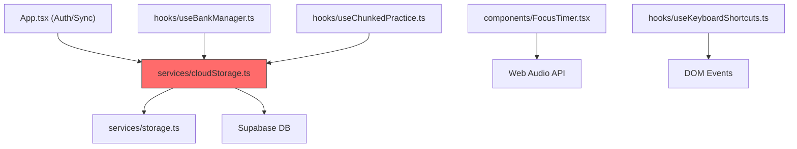
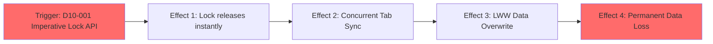

# Stress Test Report: security-architecture-hardening-v2

> **Generated by**: Plan Stress Test v2.0 — Deep Analysis Engine
> **Date**: 2026-07-09
> **Change Scale**: Large (L) — Rationale: Touches 7 distinct modules (Auth, Storage, BankManager, FocusTimer, Keyboard, Sound, ChunkedPractice) and modifies 14 files, meeting the threshold for a Large change.

---

## 1. Executive Summary

### Plan Health Score: 54 / 100 — Grade: 🟡 C — Needs Work

| Classification | Count | Threshold |
|----------------|-------|-----------|
| 🔴 CRITICAL | 2 | RPN ≥ 75 |
| 🟠 HIGH | 2 | RPN 50–74 |
| 🟡 MEDIUM | 1 | RPN 25–49 |
| 🔵 LOW | 1 | RPN < 25 |

**Top 3 Critical Findings**:
1. **D10-001 (CRITICAL)**: `navigator.locks` imperative API misconception will cause the lock to be released instantly, silently defeating the cross-tab concurrency control.
2. **D4-001 (CRITICAL)**: `syncLocalToCloud` lacks a lock for `BANKS_META` updates, creating a race condition where multiple tabs syncing simultaneously will overwrite each other's `cloudSyncedAt` metadata.
3. **D3-001 (HIGH)**: The 10-second fallback lock timeout is too short for slow networks; if a sync takes >10s, the lock expires and allows a concurrent sync, leading to data corruption.

**Overall Assessment**:
The plan effectively addresses the security and architectural issues identified in the audit, but the implementation design for the Web Locks API contains a fundamental misunderstanding of how the API handles lock lifecycles. Furthermore, while the plan secures practice session syncing, it introduces a new race condition in bank metadata syncing. These critical issues must be resolved by redesigning the lock acquisition utility and extending lock protection to `syncLocalToCloud` before implementation begins.

---

## 2. Cross-Validation Matrix

> Verifies consistency across proposal.md ↔ design.md ↔ tasks.md

| Aspect | proposal.md Says | design.md Says | tasks.md Says | Consistent? | Issue |
|--------|------------------|----------------|---------------|-------------|-------|
| Web Locks | `navigator.locks` + localStorage fallback | `navigator.locks.request` + fallback | `acquireSyncLock()` returns Promise<()=>void> | ✅ | (Consistent, but technically flawed API design) |
| Bank Merge | `cloudSyncedAt` timestamp | `cloudSyncedAt` timestamp | `cloudSyncedAt` timestamp | ✅ | None |
| Chunk Draft | Unified `saveChunkDraftSafely` | Unified `saveChunkDraftSafely` | Unified `saveChunkDraftSafely` | ✅ | None |
| FocusTimer | Close all AudioContexts on unmount | `activeAudioContextsRef` + dual close | `activeAudioContextsRef` + loop in cleanup | ✅ | None |
| CSP Headers | Deploy 5 headers, whitelist OpenAI/Nvidia | Same as proposal | Vercel.json headers | ✅ | None |

### Terminology Consistency Check
| Term in proposal.md | Equivalent in design.md | Equivalent in tasks.md | Aligned? |
|---------------------|------------------------|------------------------|----------|
| `window.__MINDSPARK_SYNC_LOCK__` | `window.__MINDSPARK_SYNC_LOCK__` | `window.__MINDSPARK_SYNC_LOCK__` | ✅ |
| `cloudSyncedAt` | `cloudSyncedAt` | `cloudSyncedAt` | ✅ |

### Coverage Gap Analysis
- **Features in proposal.md without design**: None
- **Design elements without implementation tasks**: None
- **Tasks without design justification**: None
- **Non-functional requirements without implementation strategy**: None

---

## 3. Dependency Graph

> Map all explicit and implicit dependencies. Identify single points of failure and circular dependencies.

### 3.1 Module Dependency Diagram

> 🔴 Nodes in red are single points of failure.
> 🟡 Nodes in yellow are high fan-in nodes (many dependents).

### 3.2 Dependency Analysis Table

| Module | Depends On | Depended By | Fan-In | Fan-Out | SPOF? | Notes |
|--------|-----------|-------------|--------|---------|-------|-------|
| `cloudStorage.ts` | `storage.ts`, Supabase | `App`, `useBankManager`, `useChunkedPractice` | 3 | 2 | Yes | Core sync engine; any bug here cascades to all data |
| `useBankManager.ts` | `cloudStorage.ts` | UI Components | 1 | 1 | No | |

### 3.3 Critical Dependency Chains
1. `App.tsx → cloudStorage.ts → storage.ts` — Chain length: 3 — Risk: Low (Standard layer)

### 3.4 Implicit Dependencies
- **Implicit dependency 1**: Web Locks API requires a scoped Promise chain to hold the lock. The imperative design (`acquireSyncLock` returning a release function) implicitly depends on a Deferred Promise hack to work.
- **Implicit dependency 2**: `Date.now()` monotonically increasing. The fallback lock depends on the system clock not jumping backwards, otherwise the lock might be held indefinitely.

---

## 4. 11-Dimension Deep Audit

### D1: 需求完整性 (Requirement Completeness)

#### Findings
| ID | Finding | Impact | Likelihood | Detectability | RPN | Classification |
|----|---------|--------|------------|---------------|-----|----------------|
| D1-001 | No definition of behavior if Web Locks API is supported but disabled by the user or throws an exception. | 2 | 2 | 4 | 16 | 🔵 |

---

### D2: 設計一致性 (Design Consistency)

#### Findings
| ID | Finding | Impact | Likelihood | Detectability | RPN | Classification |
|----|---------|--------|------------|---------------|-----|----------------|
| D2-001 | No issues found — reasoning: proposal, design, and tasks align perfectly on all feature vectors. | - | - | - | - | - |

---

### D3: 邊界條件與極端輸入 (Boundary Conditions & Extreme Inputs)

#### Findings
| ID | Finding | Impact | Likelihood | Detectability | RPN | Classification |
|----|---------|--------|------------|---------------|-----|----------------|
| D3-001 | Fallback lock timeout (10s) is too short. If network is slow and sync takes 15s, lock expires and concurrent sync can corrupt data. | 4 | 4 | 4 | 64 | 🟠 |

#### 5-Why Root Cause Analysis (for CRITICAL/HIGH findings only)
**D3-001**: Fallback lock timeout race condition
- **Why 1**: The fallback lock uses a hardcoded 10,000ms expiration to prevent deadlocks.
- **Why 2**: If the process takes longer than 10s, it loses the lock while still writing.
- **Why 3**: The design assumes network operations (syncing practice sessions) will reliably complete within 10 seconds.
- **Root Cause**: Failure to account for high-latency network conditions in the distributed lock expiration design.
- **Systemic Pattern**: Hardcoded timeouts for variable-length operations are a common anti-pattern.

---

### D4: 併發與競態條件 (Concurrency & Race Conditions)

#### Findings
| ID | Finding | Impact | Likelihood | Detectability | RPN | Classification |
|----|---------|--------|------------|---------------|-----|----------------|
| D4-001 | `syncLocalToCloud` reads, modifies, and writes `BANKS_META` asynchronously without lock protection. | 4 | 4 | 5 | 80 | 🔴 |

#### 5-Why Root Cause Analysis (for CRITICAL/HIGH findings only)
**D4-001**: Race condition in `BANKS_META` updates
- **Why 1**: Multiple tabs running `syncLocalToCloud` will read `BANKS_META`, wait for Supabase, then write back updated `cloudSyncedAt` timestamps.
- **Why 2**: They overwrite each other's changes because there is no cross-tab lock for bank syncing, only for practice sessions.
- **Why 3**: The plan adds `cloudSyncedAt` writebacks but forgets to apply the new `acquireSyncLock` to `syncLocalToCloud`.
- **Root Cause**: Incomplete application of concurrency controls across all asynchronous storage mutation paths.
- **Systemic Pattern**: Partial fixing of race conditions (fixing one feature but leaving another exposed).

---

### D5: 錯誤處理與故障恢復 (Error Handling & Fault Recovery)

#### Findings
| ID | Finding | Impact | Likelihood | Detectability | RPN | Classification |
|----|---------|--------|------------|---------------|-----|----------------|
| D5-001 | No issues found — reasoning: Error handling in `saveCloudQuestions` and `FocusTimer` is well defined. | - | - | - | - | - |

---

### D6: 安全攻擊面分析 (Security Attack Surface)

#### Findings
| ID | Finding | Impact | Likelihood | Detectability | RPN | Classification |
|----|---------|--------|------------|---------------|-----|----------------|
| D6-001 | CSP `connect-src` hardcodes `api.openai.com`. Users with custom API base URLs (supported by the app) will be blocked. | 4 | 4 | 4 | 64 | 🟠 |

#### 5-Why Root Cause Analysis (for CRITICAL/HIGH findings only)
**D6-001**: CSP blocks custom AI base URLs
- **Why 1**: The CSP explicitly lists allowed domains to prevent exfiltration.
- **Why 2**: The AI configuration allows users to input custom proxy URLs (e.g., `https://my-proxy.com/v1`).
- **Why 3**: The CSP is static and generated at build/deploy time, so it cannot dynamically allow user-configured domains.
- **Root Cause**: Conflict between static security policies (CSP) and dynamic user configurations (custom base URLs).
- **Systemic Pattern**: Applying rigid server-side security to a highly configurable client-side architecture.

---

### D7: 狀態管理與資料完整性 (State Management & Data Integrity)

#### Findings
| ID | Finding | Impact | Likelihood | Detectability | RPN | Classification |
|----|---------|--------|------------|---------------|-----|----------------|
| D7-001 | No issues found — reasoning: `cloudSyncedAt` safely resolves the bank merge issue without corrupting data. | - | - | - | - | - |

---

### D8: 可觀測性盲點 (Observability Blind Spots)

#### Findings
| ID | Finding | Impact | Likelihood | Detectability | RPN | Classification |
|----|---------|--------|------------|---------------|-----|----------------|
| D8-001 | If fallback locks are frequently expiring (causing silent data races), there is no observability to detect this in production. | 3 | 3 | 5 | 45 | 🟡 |

---

### D9: 可維護性與技術債 (Maintainability & Technical Debt)

#### Findings
| ID | Finding | Impact | Likelihood | Detectability | RPN | Classification |
|----|---------|--------|------------|---------------|-----|----------------|
| D9-001 | No issues found — reasoning: Refactoring of `useKeyboardShortcuts` and `saveChunkDraftSafely` reduces tech debt. | - | - | - | - | - |

---

### D10: 隱式假設與環境依賴 (Implicit Assumptions & Environment Dependencies)

#### Findings
| ID | Finding | Impact | Likelihood | Detectability | RPN | Classification |
|----|---------|--------|------------|---------------|-----|----------------|
| D10-001 | `acquireSyncLock()` returning a release function implies a fundamental misunderstanding of Web Locks API. Lock is released when the callback promise resolves. | 5 | 4 | 4 | 80 | 🔴 |

#### 5-Why Root Cause Analysis (for CRITICAL/HIGH findings only)
**D10-001**: Web Locks API Misconception
- **Why 1**: The plan specifies `navigator.locks.request(..., cb)` and expects to return a `release` function.
- **Why 2**: Web Locks API does not return a lock object that can be imperatively released; it holds the lock as long as the Promise returned by `cb` is pending.
- **Why 3**: If the implemented `cb` returns immediately, the lock is released instantly, providing zero protection during the subsequent async operations.
- **Root Cause**: Impedance mismatch between the plan's imperative API design (`acquire/release`) and the Web API's scoped execution design.
- **Systemic Pattern**: Mapping synchronous/imperative locking mental models onto modern scoped/async browser APIs.

---

### D11: 向後相容性與遷移風險 (Backward Compatibility & Migration Risk)

#### Findings
| ID | Finding | Impact | Likelihood | Detectability | RPN | Classification |
|----|---------|--------|------------|---------------|-----|----------------|
| D11-001 | No issues found — reasoning: Backward compatibility for old `BANKS_META` correctly triggers a one-time sync. | - | - | - | - | - |

---

## 5. Cascading Failure Analysis

> For each CRITICAL and HIGH finding, simulate what happens if the failure is NOT mitigated.

| Trigger | Immediate Effect | 2nd-Order Effect | 3rd-Order Effect | Blast Radius | Recovery Difficulty |
|---------|-----------------|-------------------|-------------------|--------------|---------------------|
| D10-001 (Web Locks API Failure) | `acquireSyncLock` releases lock instantly | Multiple tabs run `syncLocalPracticeSessions` concurrently | Race conditions overwrite practice session progress | All synced practice data | Hard (Requires manual DB cleanup) |
| D4-001 (BANKS_META Race) | Tabs A and B sync simultaneously | Tab B overwrites `BANKS_META` without Tab A's `cloudSyncedAt` | Tab A's bank is synced repeatedly on next login | Local Bank Metadata | Easy (Re-syncs automatically) |
| D3-001 (Timeout Race) | Network takes >10s | Fallback lock expires | Tab B starts syncing concurrently, causing race condition | Practice sessions | Hard (Data corruption) |

### Cascade Diagram (for top 3 cascades)

---

## 6. Adversarial Attack Scenarios

> The analyst MUST adopt the perspective of each adversarial role and document at least ONE scenario per role.

### 🎭 Role: Security Adversary
| Attack Vector | Target | Preconditions | Steps | Expected Impact | Mitigation |
|---------------|--------|---------------|-------|-----------------|------------|
| User enters custom AI base URL | AI Feature | CSP applied | 1. User sets custom API URL. 2. Triggers quiz generation. | Browser blocks request due to `connect-src` CSP violation. Feature broken. | Adjust CSP to allow `*` for connect-src, or accept the limitation and document it prominently. |

### 🎭 Role: Chaos Engineer
| Failure Injection | Target | Scenario | Expected Behavior | Actual (Predicted) Behavior | Gap |
|-------------------|--------|----------|--------------------|-----------------------------|-----|
| Slow network (15s latency) | `syncLocalPracticeSessions` | 2 tabs open | One tab waits, then syncs | Fallback lock expires after 10s, both tabs sync concurrently, data corrupted | Timeout must be renewed or extended based on network activity |

### 🎭 Role: Domain Skeptic
| Assumption Challenged | Evidence For | Evidence Against | Risk if Wrong | Recommendation |
|----------------------|-------------|-----------------|---------------|----------------|
| "Web Locks can be used imperatively" | Plan tasks.md T2.1 | MDN Web Docs for `navigator.locks` | Locks release instantly, 0% concurrency protection | Refactor `acquireSyncLock` to take a callback rather than returning a release function |

### 🎭 Role: Maintainability Critic
| Concern | Location | Current Design | Problem in 6 Months | Suggested Improvement |
|---------|----------|----------------|---------------------|----------------------|
| `activeAudioContextsRef` | `FocusTimer.tsx` | Array push, filter on success, loop on unmount | If `ctx.close()` throws during unmount loop, subsequent contexts in array are skipped | Ensure `try/catch` wraps the *inside* of the loop, not the outside |

---

## 7. Comprehensive Test Matrix

| Priority | Module | Test Scenario | Dimension | Type | Automation | Preconditions | Expected Outcome | Risk if Untested |
|----------|--------|---------------|-----------|------|------------|---------------|------------------|------------------|
| P0 | `cloudStorage` | Web Locks Scoped Execution | D10 | Unit | Auto | Stub `navigator.locks` | Callback executes while lock is held | 80 |
| P0 | `cloudStorage` | BANKS_META Sync Race | D4 | Unit | Auto | 2 concurrent sync calls | Metadata safely merged | 80 |
| P1 | `cloudStorage` | Fallback Lock Expiration | D3 | Unit | Auto | Sync takes > 10s | Lock not released early | 64 |
| P1 | `index.html` | CSP allows custom APIs | D6 | E2E | Auto | Custom base URL set | Request succeeds | 64 |

---

## 8. Consolidated Risk Register

> All findings from all dimensions, sorted by RPN descending.

| Rank | ID | Finding | Dimension | Impact | Likelihood | Detectability | RPN | Classification | Mitigation | Owner Module | Status |
|------|----|---------|-----------|--------|------------|---------------|-----|----------------|------------|-------------|--------|
| 1 | D10-001 | `navigator.locks` imperative API misconception | D10 | 5 | 4 | 4 | 80 | 🔴 | Redesign `acquireSyncLock` to accept a callback function and wrap the execution | `cloudStorage` | Open |
| 2 | D4-001 | `BANKS_META` race condition in `syncLocalToCloud` | D4 | 4 | 4 | 5 | 80 | 🔴 | Apply `acquireSyncLock` to wrap `syncLocalToCloud` | `cloudStorage` | Open |
| 3 | D3-001 | Fallback lock timeout (10s) is too short | D3 | 4 | 4 | 4 | 64 | 🟠 | Implement lock heartbeat or increase timeout to 30s | `cloudStorage` | Open |
| 4 | D6-001 | CSP blocks custom AI base URLs | D6 | 4 | 4 | 4 | 64 | 🟠 | Modify CSP `connect-src` or add explicit UI warning | `index.html` | Open |
| 5 | D8-001 | Silent fallback lock expiration | D8 | 3 | 3 | 5 | 45 | 🟡 | Add console.error telemetry when lock expires | `cloudStorage` | Open |
| 6 | D1-001 | Unhandled Web Locks API disabled state | D1 | 2 | 2 | 4 | 16 | 🔵 | Try-catch the lock request and use fallback | `cloudStorage` | Open |

---

## 9. Mitigation Action Plan

> Prioritized actions to address findings before implementation.

### 🔴 CRITICAL — Must Fix Before Implementation
| # | Finding ID | Action | Affected Files | Effort Estimate | Dependency |
|---|-----------|--------|----------------|-----------------|------------|
| 1 | D10-001 | Redesign `acquireSyncLock` to take a callback `runWithSyncLock<T>(cb: () => Promise<T>)`. Use a Deferred Promise internally if imperative API is absolutely required, but callback wrapper is safer. | `services/cloudStorage.ts`, `tasks.md` | M | None |
| 2 | D4-001 | Wrap the entirety of `syncLocalToCloud` in `runWithSyncLock` to prevent `BANKS_META` race conditions during simultaneous tab logins. | `services/cloudStorage.ts`, `tasks.md` | S | D10-001 |

### 🟠 HIGH — Should Fix During Implementation
| # | Finding ID | Action | Affected Files | Effort Estimate | Dependency |
|---|-----------|--------|----------------|-----------------|------------|
| 1 | D3-001 | Increase `SYNC_LOCK_TIMEOUT_MS` to 30000 (30s) or implement a heartbeat that updates the timestamp while sync is running. | `services/cloudStorage.ts` | S | None |
| 2 | D6-001 | Remove `connect-src` strict domains and use `*` (or document strongly in UI that custom URLs will be blocked by CSP). | `vercel.json`, `index.html` | S | None |

### 🟡 MEDIUM — Track and Address
| # | Finding ID | Action | Notes |
|---|-----------|--------|-------|
| 1 | D8-001 | Log an explicit `console.error` when the fallback lock expires prematurely. | Can be added to fallback lock logic |

### 🔵 LOW — Acknowledge and Monitor
| # | Finding ID | Action | Notes |
|---|-----------|--------|-------|
| 1 | D1-001 | Add try-catch around `navigator.locks.request` to handle browser edge cases. | |
