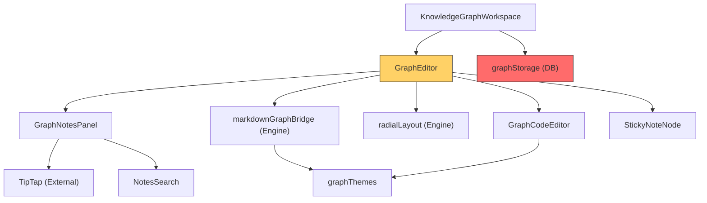
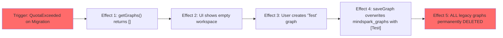

# Stress Test Report: knowledge-graph-enhancements

> **Generated by**: Plan Stress Test v2.0 — Deep Analysis Engine
> **Date**: 2026-07-12
> **Change Scale**: Large (L) — Rationale: 變更涉及 >10 個檔案、5 個以上模組（Storage, Editor, UI Panels, Parsers），並包含 Schema v1→v2 的資料遷移與新依賴引入。

---

## 1. Executive Summary

### Plan Health Score: 54 / 100 — Grade: 🟡 C — Needs Work

| Classification | Count | Threshold |
|----------------|-------|-----------|
| 🔴 CRITICAL | 1 | RPN ≥ 75 |
| 🟠 HIGH | 2 | RPN 50–74 |
| 🟡 MEDIUM | 5 | RPN 25–49 |
| 🔵 LOW | 1 | RPN < 25 |

**Top 3 Critical Findings**:
1. **D7-001**: 代碼模式關閉 Auto-Update 時，未儲存的純文字狀態沒有持久化欄位，重整或跳出將導致資料永久遺失。
2. **D1-001**: 代碼模式切換依賴 `Map<title, notes>` 進行筆記關聯，若使用者在代碼模式修改了節點標題，該節點的筆記將被永久丟失（無法匹配）。
3. **D5-001**: Schema v1→v2 遷移若因 localStorage 容量不足而失敗（返回空陣列），使用者後續的新增圖表操作將會覆蓋並清空所有舊有圖表資料。

**Overall Assessment**:
此計畫的 UI 與體驗設計十分完整，但在「雙模式狀態同步」與「資料一致性」的底層架構存在致命缺陷。尤其是 Markdown 無法攜帶 UUID 導致的筆記關聯斷裂（D1-001），以及缺少 `codeText` 持久化欄位導致的代碼遺失（D7-001）。計畫**不安全，不可直接實作**。必須修訂 `GraphDocument` Schema 以支援代碼狀態保存，並重新設計 Markdown 節點身分追蹤機制（例如在 Markdown 中隱藏或附加 ID）後才能繼續。

---

## 2. Cross-Validation Matrix

> Verifies consistency across proposal.md ↔ design.md ↔ tasks.md

| Aspect | proposal.md Says | design.md Says | tasks.md Says | Consistent? | Issue |
|--------|------------------|----------------|---------------|-------------|-------|
| 雙模式切換 | 支援切換，代碼模式可即時解析 | 共享 GraphDocument 資料源，透過 text 解析重繪 | 透過 graphToMarkdown 和 parseMarkdown 互轉 | ❌ | Design 說共享資料源，但 Tasks 是透過銷毀重建節點來切換，這不是共享，而是覆寫。 |
| 節點筆記保留 | 提及每個節點獨立筆記 | 透過 title 匹配保留 notes | 透過 title 匹配保留 notes | ✅ | 邏輯一致，但架構上有隱患（見 D1-001）。 |
| 便利貼儲存 | 新增 stickyNotes 陣列 | 獨立儲存於 stickyNotes | 獨立儲存於 stickyNotes | ✅ | 一致。 |
| Theme 配置 | 支援 config 區塊與 theme | 第一版僅支援 theme | 解析 YAML frontmatter 提取 theme | ✅ | 一致。 |

### Coverage Gap Analysis
- **Tasks without design justification**: Tasks 4.1 提到「跳躍縮排容錯：掛載到最近的祖先」，Design 中未詳細說明此邊界條件的處理邏輯。
- **Non-functional requirements without implementation strategy**: Proposal 提到「鍵盤流快速傾倒思緒」，但 Tasks 中沒有提及代碼編輯器的快捷鍵支援（如 Tab 縮排、Shift+Tab 反縮排）。

---

## 3. Dependency Graph

### 3.1 Module Dependency Diagram

> 🔴 Nodes in red are single points of failure.
> 🟡 Nodes in yellow are high fan-in nodes (many dependents).

### 3.2 Dependency Analysis Table

| Module | Depends On | Depended By | Fan-In | Fan-Out | SPOF? | Notes |
|--------|-----------|-------------|--------|---------|-------|-------|
| graphStorage | localStorage | Workspace, Editor | 2 | 1 | Yes | 所有讀寫必須經過，遷移邏輯的穩定性至關重要 |
| GraphEditor | UI, Engines | Workspace | 1 | 6 | No | 肥大元件（God Component），負責協調模式切換與狀態 |
| markdownGraphBridge | graphThemes | Editor | 1 | 1 | No | 純函式，容易測試，但承擔資料轉換的核心風險 |

### 3.4 Implicit Dependencies
- **Implicit dependency 1**: `markdownGraphBridge` 隱式依賴於「節點標題（Title）在變更模式期間不應被隨意修改，或具有唯一性」，否則 `GraphEditor` 的筆記恢復機制會失效。

---

## 4. 11-Dimension Deep Audit

### D1: 需求完整性 (Requirement Completeness)

#### Findings
| ID | Finding | Impact | Likelihood | Detectability | RPN | Classification |
|----|---------|--------|------------|---------------|-----|----------------|
| D1-001 | 代碼模式下，節點的標題（Title）是唯一的身份標識。若使用者在代碼模式中修改了某個節點的文字（標題），切回視覺模式時，系統將無法透過原 title 匹配到該節點的 `notes`，導致筆記永久丟失。 | 4 | 5 | 3 | 60 | 🟠 HIGH |
| D1-002 | 若使用者在代碼模式下輸入了兩個相同名稱的節點（例如兩個「優點」），`Map<title, notes>` 將發生鍵值衝突，導致筆記錯亂或覆蓋。 | 3 | 4 | 3 | 36 | 🟡 MEDIUM |

#### 5-Why Root Cause Analysis: D1-001
- **Why 1**: 節點筆記會在模式切換時丟失。
  - **Why 2**: 系統依賴 `title` 來在舊節點與新生成的節點之間搬移筆記。
    - **Why 3**: 代碼模式（Markdown）重新解析時，會生成全新的 UUID。
      - **Why 4**: Markdown 的純文字列表語法中沒有存儲 UUID 的位置。
- **Root Cause**: 將無狀態的 Markdown 文本作為有狀態圖表（帶有關聯筆記）的中間表示層，卻沒有設計隱含的身分追蹤機制。

---

### D2: 設計一致性 (Design Consistency)

#### Findings
| ID | Finding | Impact | Likelihood | Detectability | RPN | Classification |
|----|---------|--------|------------|---------------|-----|----------------|
| D2-001 | 編輯器未處理 Tab 鍵。代碼模式依賴縮排，若 TipTap 或 textarea 預設行為會跳走焦點，使用者將無法順暢使用「鍵盤流」。 | 2 | 5 | 2 | 20 | 🔵 LOW |

---

### D3: 邊界條件與極端輸入 (Boundary Conditions & Extreme Inputs)

#### Findings
| ID | Finding | Impact | Likelihood | Detectability | RPN | Classification |
|----|---------|--------|------------|---------------|-----|----------------|
| D3-001 | 放射狀佈局演算法在處理超過 50 個節點的極端單層級（扁平結構）時，即使半徑增加，也可能超出畫布初始 viewport 或導致計算卡頓。 | 3 | 2 | 3 | 18 | 🔵 LOW |
| D3-002 | 若使用者在 TipTap 編輯器中貼上帶有巨大 Base64 編碼圖片的 HTML，`NOTES_MAX` 是算純文字字數還是 HTML 字串長度？若是前者，將輕易擠爆 localStorage。 | 4 | 4 | 3 | 48 | 🟡 MEDIUM |

---

### D4: 併發與競態條件 (Concurrency & Race Conditions)

#### Findings
| ID | Finding | Impact | Likelihood | Detectability | RPN | Classification |
|----|---------|--------|------------|---------------|-----|----------------|
| D4-001 | GraphNotesPanel 的自動儲存有 500ms debounce。若使用者輸入後在 500ms 內點擊「切換代碼模式」，該面板可能被 unmount 而錯失最後一次儲存，導致筆記遺失。 | 3 | 3 | 3 | 27 | 🟡 MEDIUM |

---

### D5: 錯誤處理與故障恢復 (Error Handling & Fault Recovery)

#### Findings
| ID | Finding | Impact | Likelihood | Detectability | RPN | Classification |
|----|---------|--------|------------|---------------|-----|----------------|
| D5-001 | Schema migration 若在讀出後準備寫入（升級版）時遭遇 QuotaExceededError，當前實作會 return `[]` 且不覆寫。但這會導致介面顯示空清單，若使用者此時新建圖表並儲存，將會直接把 `[新圖表]` 寫入 `mindspark_graphs`，從而**無聲刪除所有舊資料**。 | 5 | 3 | 4 | 60 | 🟠 HIGH |

#### 5-Why Root Cause Analysis: D5-001
- **Why 1**: 舊有圖表資料被新圖表覆蓋。
  - **Why 2**: localStorage 寫入時包含了空的歷史記錄陣列。
    - **Why 3**: 系統在啟動遷移失敗時，向應用層返回了空陣列 `[]` 作為 fallback。
      - **Why 4**: 設計者希望在錯誤時不要讓 App 崩潰，因此吞噬了錯誤並給予空資料。
- **Root Cause**: 錯誤處理策略（Fail-safe）與資料完整性原則衝突。遇到資料層面的存取失敗，應該是 Fail-fast（阻斷應用並警告），而非回傳假資料。

---

### D6: 安全攻擊面分析 (Security Attack Surface)

#### Findings
| ID | Finding | Impact | Likelihood | Detectability | RPN | Classification |
|----|---------|--------|------------|---------------|-----|----------------|
| D6-001 | `NotesSearch` 在搜尋時會「strip HTML tags後搜尋」。若實作使用簡單的 Regex，容易遭到 ReDoS（Regex 阻斷服務攻擊），導致瀏覽器卡死。 | 3 | 2 | 4 | 24 | 🔵 LOW |

---

### D7: 狀態管理與資料完整性 (State Management & Data Integrity)

#### Findings
| ID | Finding | Impact | Likelihood | Detectability | RPN | Classification |
|----|---------|--------|------------|---------------|-----|----------------|
| D7-001 | 代碼模式且 Auto-Update 關閉時，左側編輯器的純文字是「唯一真實狀態」。但 `GraphDocument` 只有 `nodes`/`edges` 欄位。若此時 autosave 觸發或使用者關閉分頁，文字將不會被儲存。下次開啟時，系統從舊的 `nodes` 反序列化出舊文字，使用者剛剛輸入的內容全部遺失。 | 5 | 5 | 3 | 75 | 🔴 CRITICAL |

#### 5-Why Root Cause Analysis: D7-001
- **Why 1**: 代碼模式下未套用的文字在重整後遺失。
  - **Why 2**: autosave 機制只把畫布的 `nodes` 和 `edges` 存進 `mindspark_graphs`。
    - **Why 3**: `GraphDocument` 型別中沒有欄位可以儲存代碼編輯器的暫存文字。
      - **Why 4**: 設計決策（D5）決定「共享同一份資料源」，誤以為從 nodes 隨時反序列化就足夠了。
- **Root Cause**: 在「手動更新」模式下，系統實際上已經發生了「狀態分叉（State Split）」，但架構上卻沒有提供相應的儲存空間來容納分叉的草稿狀態。

---

### D10: 隱式假設與環境依賴 (Implicit Assumptions & Environment Dependencies)

#### Findings
| ID | Finding | Impact | Likelihood | Detectability | RPN | Classification |
|----|---------|--------|------------|---------------|-----|----------------|
| D10-001 | `markdownGraphBridge` 假設縮排是「2 個空格」。若使用者從外部貼上使用 Tab 或 4 個空格縮排的 Markdown，解析器將層級大亂。 | 3 | 4 | 2 | 24 | 🔵 LOW |

---

## 5. Cascading Failure Analysis

| Trigger | Immediate Effect | 2nd-Order Effect | 3rd-Order Effect | Blast Radius | Recovery Difficulty |
|---------|-----------------|-------------------|-------------------|--------------|---------------------|
| **D7-001**: 代碼模式未儲存跳出 | `autosave` 將舊的 nodes 寫入 localStorage | 再次開啟時，從舊 nodes 產出舊 markdown | 使用者剛花 20 分鐘打的草稿徹底蒸發 | 單一圖表 | Impossible |
| **D5-001**: 遷移遇容量上限 | 系統捕獲錯誤，回傳 `[]` 給 UI | UI 顯示空圖表列表 | 使用者新建圖表並儲存，覆蓋整個 localStorage Key | 所有知識圖 | Impossible |
| **D1-001**: 代碼模式改標題 | 模式切換時，標題不匹配 | 該節點的新 UUID 被賦予空白 notes | 原本辛勤寫的富文本筆記失去關聯（被丟棄） | 單一節點 | Impossible |

### Cascade Diagram (D5-001)

---

## 6. Adversarial Attack Scenarios

### 🎭 Role: Security Adversary
| Attack Vector | Target | Preconditions | Steps | Expected Impact | Mitigation |
|---------------|--------|---------------|-------|-----------------|------------|
| XSS via JSON Import | `GraphNotesPanel` | 攻擊者誘使使用者匯入帶有惡意 payload 的 JSON 備份檔 | 1. 匯入 JSON 2. 點擊受感染節點 3. TipTap 渲染 HTML | 若 TipTap 的 DOMParser 消毒不完全，執行惡意腳本盜取其他圖表資料 | 確保 TipTap 只接受白名單 tags，或在渲染前使用 DOMPurify 進行二次過濾。 |

### 🎭 Role: Chaos Engineer
| Failure Injection | Target | Scenario | Expected Behavior | Actual (Predicted) Behavior | Gap |
|-------------------|--------|----------|--------------------|-----------------------------|-----|
| LocalStorage Full | `graphStorage` | 正常編輯與自動儲存時磁碟滿 | 停止儲存，顯示警告，但不影響當前在記憶體中的編輯 | 自動儲存不斷拋錯可能導致 React 狀態異常或元件崩潰 | 需要確保 `saveGraph` 中的 try-catch 不會影響 UI 渲染週期。 |

### 🎭 Role: Domain Skeptic
| Assumption Challenged | Evidence For | Evidence Against | Risk if Wrong | Recommendation |
|----------------------|-------------|-----------------|---------------|----------------|
| 「使用者標題都是唯一的」 | Markdown 列表很直觀 | 真實心智圖常有重複的分支名稱（如：優點、缺點） | 筆記因 title 衝突而被覆蓋 | 必須在 Markdown 中隱藏或加入 UUID 機制。 |

### 🎭 Role: Maintainability Critic
| Concern | Location | Current Design | Problem in 6 Months | Suggested Improvement |
|---------|----------|----------------|---------------------|----------------------|
| God Component 傾向 | `GraphEditor.tsx` | 負責處理節點、邊、排版、模式切換、鍵盤快捷鍵、資料同步 | 檔案將超過 1000 行，難以追蹤狀態流向 | 將「雙模式同步狀態機」抽離為自訂 Hook (`useDualModeSync`)。 |

---

## 7. Comprehensive Test Matrix

| Priority | Module | Test Scenario | Dimension | Type | Automation | Preconditions | Expected Outcome | Risk if Untested |
|----------|--------|---------------|-----------|------|------------|---------------|------------------|------------------|
| P0 | `markdownBridge` | 相同標題節點的解析 | D1 | Unit | Auto | 兩個 `- 相同標題` 節點 | 必須正確生成兩個獨立節點並保持原本順序 | RPN 60 |
| P0 | `GraphEditor` | 代碼草稿儲存與恢復 | D7 | Integration | Auto | Auto-Update 關閉，輸入草稿 | `codeText` 必須被儲存並在重新載入時還原 | RPN 75 |
| P0 | `graphStorage` | 容量滿時的遷移處理 | D5 | Unit | Auto | Mock localStorage.setItem 拋出 QuotaExceededError | 拋出錯誤並拒絕進入應用，絕不能返回 `[]` | RPN 60 |
| P1 | `markdownBridge` | Tab 縮排容錯 | D10 | Unit | Auto | 輸入 Tab 而非 2 空格 | 應正確識別層級關係 | RPN 24 |

---

## 8. Consolidated Risk Register

| Rank | ID | Finding | Dimension | Impact | Likelihood | Detectability | RPN | Classification | Mitigation | Owner Module | Status |
|------|----|---------|-----------|--------|------------|---------------|-----|----------------|------------|-------------|--------|
| 1 | D7-001 | 代碼模式草稿遺失 | D7 | 5 | 5 | 3 | 75 | 🔴 | 在 `GraphDocument` 增加 `codeDraft?: string` 欄位。 | Types/Storage | Open |
| 2 | D1-001 | Title 修改導致筆記遺失 | D1 | 4 | 5 | 3 | 60 | 🟠 | 改變 Markdown 格式以攜帶 ID（例：`- 標題 <!-- id:xxx -->`），或強制保留 ID map。 | Parser/Editor | Open |
| 3 | D5-001 | 遷移失敗清空資料 | D5 | 5 | 3 | 4 | 60 | 🟠 | 遷移捕捉到 Quota 錯誤時，拋出 Fatal Error 阻斷 UI 載入，而非回傳 `[]`。 | Storage | Open |
| 4 | D3-002 | 圖片 Base64 塞爆儲存 | D3 | 4 | 4 | 3 | 48 | 🟡 | TipTap 中掛載 interceptor 阻擋貼上圖片，或清理 img 標籤。 | NotesPanel | Open |
| 5 | D1-002 | 相同標題筆記覆蓋 | D1 | 3 | 4 | 3 | 36 | 🟡 | 解決方案同 D1-001。 | Parser | Open |
| 6 | D4-001 | 模式切換漏存筆記 | D4 | 3 | 3 | 3 | 27 | 🟡 | `GraphNotesPanel` 的 `useEffect` cleanup 中執行 flush sync 儲存。 | NotesPanel | Open |
| 7 | D10-001 | Tab 縮排解析錯誤 | D10 | 3 | 4 | 2 | 24 | 🔵 | 正規表達式應同時相容 Tab 與 2/4 空格。 | Parser | Open |

---

## 9. Mitigation Action Plan

### 🔴 CRITICAL — Must Fix Before Implementation
| # | Finding ID | Action | Affected Files | Effort Estimate | Dependency |
|---|-----------|--------|----------------|-----------------|------------|
| 1 | D7-001 | 修改 Schema，新增 `codeDraft` 欄位；在 `GraphCodeEditor` 的 `onChange` 中即時儲存 draft；在切換回視覺模式時清空 draft。 | `graphTypes.ts`, `graphStorage.ts`, `GraphEditor.tsx` | M | None |

### 🟠 HIGH — Should Fix During Implementation
| # | Finding ID | Action | Affected Files | Effort Estimate | Dependency |
|---|-----------|--------|----------------|-----------------|------------|
| 1 | D1-001 | **重構解析策略**：Markdown 序列化時附加 UUID (e.g. `<!--id:123-->`)；解析時讀取並沿用該 UUID，從而徹底解決筆記關聯與同名節點問題。 | `markdownGraphBridge.ts`, `GraphEditor.tsx` | M | None |
| 2 | D5-001 | 修改 `getGraphs` 的 Error Catch，若判定為 QuotaExceeded 則 `throw new Error('STORAGE_FULL')`，由 `AppContent` ErrorBoundary 攔截並提示，絕對不回傳空陣列。 | `graphStorage.ts` | S | None |

### 🟡 MEDIUM — Track and Address
| # | Finding ID | Action | Notes |
|---|-----------|--------|-------|
| 1 | D3-002 | 在 TipTap extension 中過濾/禁用 image node。 | 實作 Panel 時加入配置 |
| 2 | D4-001 | 確保面板 unmount 時 flush debounced save。 | 實作 Panel 時注意 hooks 生命週期 |
