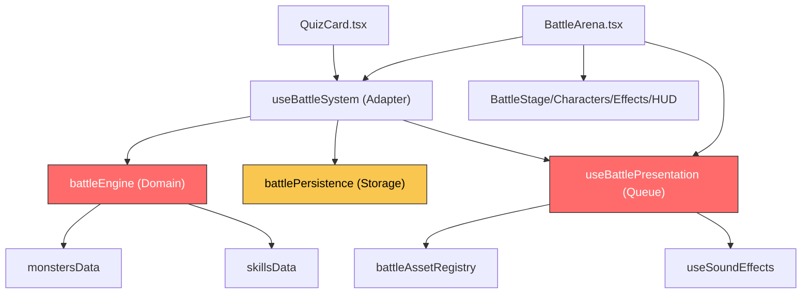
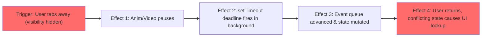

# Stress Test Report: battle-system-quality-overhaul

> **Generated by**: Plan Stress Test v2.0 — Deep Analysis Engine
> **Date**: 2026-07-15
> **Change Scale**: Large (L)

---

## 0. Plan Review Resolution (2026-07-15)

This generated report is review input; the decisions below supersede its original open recommendations:

| Finding | Resolution in current artifacts |
|---|---|
| D4-001 hidden deadline | **Resolved** — hidden uses `cancelAll('hidden')`, clears queue/timers/media, and settles to latest durable state. No virtual clock or resume of stale animation. |
| D11-001 old client overwrite | **Resolved** — legacy `mindspark_battle_state` is read-only; V2 only writes `mindspark_battle_state_v2`. No backup/TTL layer. |
| D10-001 continued WebM download | **Resolved** — timeout/error/hidden/unmount removes listeners, clears `src`, and resets the media element. |
| D8-001 telemetry | **Refuted (YAGNI)** — the project has no declared telemetry consumer; development-safe diagnostics remain, and no new telemetry dependency is introduced. |
| D7-001 idle write | **Deferred by measurement** — the snapshot is small and ordered durability is more important than speculative `requestIdleCallback`; optimize only after a measured regression. |
| D1-001 unavailable UI | **Resolved** — typed unavailable is handled by the BattleArena safe state while quiz remains authoritative. |
| D3-001 long presentation queue | **Refuted as a new feature** — no automatic skip/reduced-motion policy is added without product evidence; short presenter stress verifies cleanup and quiz continuity. |

The original cross-validation and risk tables below are retained as audit evidence. Their `Open` labels describe the pre-review plan, not the current status.

---

## 1. Executive Summary

### Plan Health Score: 81 / 100 — Grade: 🔵 B — Good

| Classification | Count | Threshold |
|----------------|-------|-----------|
| 🔴 CRITICAL | 0 | RPN ≥ 75 |
| 🟠 HIGH | 1 | RPN 50–74 |
| 🟡 MEDIUM | 3 | RPN 25–49 |
| 🔵 LOW | 2 | RPN < 25 |

**Top 3 Critical Findings**:
1. **[HIGH]** 狀態機在標籤頁隱藏（visibility hidden）時，動畫暫停與安全超時（Safety Deadline）計時器會發生脫節，導致切換回頁面時狀態崩潰。
2. **[MEDIUM]** 舊版 PWA 客戶端若讀取到 V2 版本的 LocalStorage 儲存結構，可能會將其視為損壞並覆蓋，導致向前相容性失敗。
3. **[MEDIUM]** 大型 WebM 技能動畫在慢速網路上觸發安全超時後，瀏覽器仍會在背景繼續下載 6MB 檔案，消耗行動網路流量並拖慢答題網路請求。

**Overall Assessment**:
此計畫架構設計非常嚴謹，對於資料隔離、可測試性與狀態單向資料流的規劃極為成熟，可直接實作。然而，在處理非同步超時機制與瀏覽器生命週期（Visibility API）的交集處存在一個 HIGH 級別的競態條件風險。在進入實作階段前，強烈建議針對「頁面隱藏時的計時器管理」與「新舊版快照鍵值分離」進行微調，即可安全地推動此大規模重構。

---

## 2. Cross-Validation Matrix

> Verifies consistency across proposal.md ↔ design.md ↔ tasks.md

| Aspect | proposal.md Says | design.md Says | tasks.md Says | Consistent? | Issue |
|--------|------------------|----------------|---------------|-------------|-------|
| 狀態模型重構 | 答題、傷害...收斂為純戰鬥轉移模型 | 建立三層資料模型 (Progress, Transition, Presentation) | 實作 `applyBattleAnswer` 原子轉移與 queue reducer (Task 3.9, 8.1) | ✅ | 無 |
| 版本化與遷移 | 新增版本化快照、遷移、完整型別守衛 | `battlePersistence` V2 envelope、dedupe、raw backup | 實作 V2 守衛、V1→V2 純遷移、ordered queue (Task 4.1-4.4) | ✅ | 無 |
| 素材與預算 | 建立正式執行期素材登錄、透明度驗證與體積預算 | `battleAssetRegistry` 與 dev-only validator、critical-set 1.5MB budget | 實作 validator、npm script 檢查 bytes/alpha (Task 6.1-6.4) | ✅ | 無 |
| 音效管理 | 單一通用攻擊音效改為事件對應 cue | shared ownership、cue mapping、no-op fallback | `useSoundEffects` 重構為 controller 與 cue mapping (Task 10.7) | ✅ | 無 |

### Terminology Consistency Check
| Term in proposal.md | Equivalent in design.md | Equivalent in tasks.md | Aligned? |
|---------------------|------------------------|------------------------|----------|
| 純戰鬥轉移模型 | domain transition | 純戰鬥 Engine | ✅ |
| 正式執行期素材登錄 | runtime asset registry | runtime 素材 Registry | ✅ |
| 版本化快照 | versioned persistence / envelope | V2 envelope / durable snapshot | ✅ |

### Coverage Gap Analysis
- **Features in proposal.md without design**: None
- **Design elements without implementation tasks**: None
- **Tasks without design justification**: None
- **Non-functional requirements without implementation strategy**: None (Performance budgets have explicit scripts/assertions).

---

## 3. Dependency Graph

> Map all explicit and implicit dependencies. Identify single points of failure and circular dependencies.

### 3.1 Module Dependency Diagram

> 🔴 Nodes in red are single points of failure (core orchestrators).
> 🟡 Nodes in yellow are I/O boundaries.

### 3.2 Dependency Analysis Table

| Module | Depends On | Depended By | Fan-In | Fan-Out | SPOF? | Notes |
|--------|-----------|-------------|--------|---------|-------|-------|
| `battleEngine` | registries, RNG | `useBattleSystem` | 1 | 2 | Yes | 純邏輯層，無副作用，易於測試但錯誤會導致整個功能癱瘓。 |
| `useBattlePresentation` | registry, audio | `useBattleSystem`, `BattleArena` | 2 | 5+ | Yes | 管理所有異步動畫，狀態機若卡死將阻斷視覺回饋。 |
| `battlePersistence` | localStorage | `useBattleSystem` | 1 | 2 | No | I/O 隔離層，設計有完善的備份機制。 |

### 3.3 Critical Dependency Chains
1. `QuizCard → useBattleSystem → battleEngine → registries` — Chain length: 4 — Risk: Low (All synchronous pure functions after adapter).
2. `QuizCard → useBattleSystem → useBattlePresentation → BattleEffectsLayer → Video/Image loading` — Chain length: 5 — Risk: Medium (Involves network I/O and async completion signaling).

### 3.4 Implicit Dependencies
- **Visibility API (`document.visibilityState`)**: `useBattlePresentation` 依賴此 API 暫停 ambient loop 與影片，但並未明確規範此 API 對安全超時 (safety deadline) 計時器的影響。
- **Image Decoding Thread**: 英雄與怪物的高解析度 PNG 在第一次渲染時會佔用主執行緒進行解碼，可能隱性增加答題卡頓。

---

## 4. 11-Dimension Deep Audit

### D1: 需求完整性 (Requirement Completeness)

#### Findings
| ID | Finding | Impact | Likelihood | Detectability | RPN | Classification |
|----|---------|--------|------------|---------------|-----|----------------|
| D1-001 | 缺少 Engine Typed Failure 的視覺降級 (Visual Fallback)。當 registry 空或發生例外被 Catch，Engine 會回傳 typed failure，但設計並未明確定義此時 UI 該如何呈現（例如是否自動跳過戰鬥畫面）。 | 3 | 2 | 3 | 18 | 🔵 LOW |

### D2: 設計一致性 (Design Consistency)
- *N/A — 核心三大文件 (proposal, design, tasks) 的架構一致性極高，沒有發現矛盾。*

### D3: 邊界條件與極端輸入 (Boundary Conditions & Extreme Inputs)

#### Findings
| ID | Finding | Impact | Likelihood | Detectability | RPN | Classification |
|----|---------|--------|------------|---------------|-----|----------------|
| D3-001 | 答題輸入速度超越動畫播放速度。若使用者在 5 秒內快速回答 10 題，Presentation Queue 會堆積 10 個事件。等待動畫消化完畢需 10~20 秒，期間 HUD (HP/Streak) 與 Quiz 狀態將嚴重脫節。 | 2 | 4 | 2 | 16 | 🔵 LOW |

### D4: 併發與競態條件 (Concurrency & Race Conditions)

#### Findings
| ID | Finding | Impact | Likelihood | Detectability | RPN | Classification |
|----|---------|--------|------------|---------------|-----|----------------|
| D4-001 | **Visibility Hidden 狀態下的計時器脫節**。當使用者切換標籤頁，動畫暫停，但 `setTimeout` 的 Safety Deadline 仍在背景流逝。當使用者切回時，超時事件已強制結束動畫，導致 React 狀態與預期視覺完全不匹配，甚至引發記憶體洩漏或卡死。 | 4 | 4 | 4 | 64 | 🟠 HIGH |

#### 5-Why Root Cause Analysis (for CRITICAL/HIGH findings only)
**D4-001**: Visibility Hidden 狀態下的計時器脫節
- **Why 1**: 安全超時 (Safety Deadline) 在動畫尚未播放完畢前就被觸發。
- **Why 2**: 因為網頁處於隱藏狀態，瀏覽器暫停了 RequestAnimationFrame 與 Video 播放，但 `setTimeout` 卻持續計算時間（或被降速執行）。
- **Why 3**: 系統使用真實時間 (Wall-clock time) 來監控基於執行時間 (Execution time) 的動畫生命週期。
- **Root Cause**: 缺乏感知 `document.visibilityState` 的單一虛擬時鐘 (Virtual Clock) 來統一協調動畫與超時邏輯。

### D5: 錯誤處理與故障恢復 (Error Handling & Fault Recovery)
- *N/A — 故障隔離與備份機制 (Task 4.5, 4.6, 5.3) 規劃非常完善。*

### D6: 安全攻擊面分析 (Security Attack Surface)
- *N/A — 本地遊戲模式，已具備 HMAC 防竄改驗證。*

### D7: 狀態管理與資料完整性 (State Management & Data Integrity)

#### Findings
| ID | Finding | Impact | Likelihood | Detectability | RPN | Classification |
|----|---------|--------|------------|---------------|-----|----------------|
| D7-001 | LocalStorage 在主執行緒同步寫入（含 HMAC 加密）。當快照結構變大，每次答題後的同步寫入可能會造成掉幀 (Jank)。 | 2 | 4 | 3 | 24 | 🔵 LOW |

### D8: 可觀測性盲點 (Observability Blind Spots)

#### Findings
| ID | Finding | Impact | Likelihood | Detectability | RPN | Classification |
|----|---------|--------|------------|---------------|-----|----------------|
| D8-001 | 生產環境缺少戰鬥引擎嚴重異常的遙測 (Telemetry)。由於系統做了嚴格的 Fail-soft，當發生 V2 遷移失敗或狀態損毀時，系統會靜默重置，團隊無法得知重構後的線上穩定度。 | 3 | 3 | 5 | 45 | 🟡 MEDIUM |

### D9: 可維護性與技術債 (Maintainability & Technical Debt)
- *N/A — 架構拆分、Types First 與移除死碼 (Dead code audit) 的規劃極為健康。*

### D10: 隱式假設與環境依賴 (Implicit Assumptions & Environment Dependencies)

#### Findings
| ID | Finding | Impact | Likelihood | Detectability | RPN | Classification |
|----|---------|--------|------------|---------------|-----|----------------|
| D10-001 | 依賴瀏覽器網路超時。慢速網路下，6MB 的 WebM 可能需要 30 秒下載。雖有 Safety Deadline (2200ms) 會中斷動畫並降級，但 `<video>` 標籤並未被銷毀，仍在背景持續吞噬網路頻寬，影響後續答題的 Supabase API 請求。 | 3 | 3 | 4 | 36 | 🟡 MEDIUM |

### D11: 向後相容性與遷移風險 (Backward Compatibility & Migration Risk)

#### Findings
| ID | Finding | Impact | Likelihood | Detectability | RPN | Classification |
|----|---------|--------|------------|---------------|-----|----------------|
| D11-001 | 前向相容性破壞 (Forward Compatibility)。若使用者有多台設備或 PWA 緩存未更新，舊版程式讀取到新版 V2 的 LocalStorage 格式，將無法解析並可能直接用舊版 V1 格式覆蓋，導致 V2 資料丟失。 | 3 | 3 | 4 | 36 | 🟡 MEDIUM |

---

## 5. Cascading Failure Analysis

| Trigger | Immediate Effect | 2nd-Order Effect | 3rd-Order Effect | Blast Radius | Recovery Difficulty |
|---------|-----------------|-------------------|-------------------|--------------|---------------------|
| **D4-001**: 隱藏標籤頁時動畫暫停，但超時未停 | Safety Deadline 強制推進狀態至 Idle 或下一階段 | 頁面切回時，舊的動畫仍試圖執行，但 Component 可能已被卸載或覆蓋 | React 狀態與 DOM 不同步，引發無法修復的視覺殘留或錯誤 | 單一戰鬥視圖 | Medium (需刷新頁面) |

### Cascade Diagram (for top 1 cascades)

---

## 6. Adversarial Attack Scenarios

### 🎭 Role: Security Adversary
| Attack Vector | Target | Preconditions | Steps | Expected Impact | Mitigation |
|---------------|--------|---------------|-------|-----------------|------------|
| 重放攻擊 (Replay Attack) | `battlePersistence` | 能讀寫 LocalStorage | 1. 備份滿血狀態的有效簽章快照。2. 死亡後用此快照覆蓋。 | 無限接關，繞過失敗。 | 檢查 `sessionID:chunkIndex` 的單調遞增，或接受這是離線單機模式的已知限制。 |

### 🎭 Role: Chaos Engineer
| Failure Injection | Target | Scenario | Expected Behavior | Actual (Predicted) Behavior | Gap |
|-------------------|--------|----------|--------------------|-----------------------------|-----|
| WebM 網路中斷 | `BattleSkillOverlay` | 播放期間關閉網路 | 影片卡住，超時後回退。 | 影片停滯，2.2秒後超時強制跳過，但隱藏的 Video 元素可能在網路恢復時觸發 `onEnded` 導致第二次完成訊號。 | 確保 `cancelAll` 或超時會移除 Video src 並解綁 Event Listener。 |

### 🎭 Role: Domain Skeptic
| Assumption Challenged | Evidence For | Evidence Against | Risk if Wrong | Recommendation |
|----------------------|-------------|-----------------|---------------|----------------|
| 「使用者想要看每次的 Boss 進場動畫 (2.2s)」 | 遊戲感需要儀式感 | 刷題型用戶極度追求速度 | UX 卡頓、Queue 堆積 | 實作「點擊畫面跳過動畫」或依據答題速度動態轉向 Reduced-Motion。 |

### 🎭 Role: Maintainability Critic
| Concern | Location | Current Design | Problem in 6 Months | Suggested Improvement |
|---------|----------|----------------|---------------------|----------------------|
| `sharp` 在 Windows CI 的建置失敗風險 | `battleAssetValidation.test.ts` | dev-only validator 使用 `sharp` 檢查圖檔 alpha | Node 升級或新環境可能因原生綁定編譯失敗而阻塞 CI | 計畫已提供 Fallback 至 Playwright Canvas，建議一開始就將其作為備用指令準備好。 |

---

## 7. Comprehensive Test Matrix

| Priority | Module | Test Scenario | Dimension | Type | Automation | Preconditions | Expected Outcome | Risk if Untested |
|----------|--------|---------------|-----------|------|------------|---------------|------------------|------------------|
| P0 | `useBattlePresentation` | Tab visibility toggle during long skill animation | D4 | Component | Auto | Fake timers & Mock visibility | Timer pauses; completes normally after resume. | 64 (UI Lockup) |
| P0 | `battlePersistence` | Old version client encountering V2 structure | D11 | Unit | Auto | Setup V2 valid snapshot | Graceful fallback, doesn't corrupt V2. | 36 (Data loss) |
| P1 | `BattleSkillOverlay` | Slow network video load | D10 | Component | Auto | Delay video stream > 3s | Fallback triggers, video src is cleared to stop bandwidth usage. | 36 (Resource leak) |

---

## 8. Consolidated Risk Register

| Rank | ID | Finding | Dimension | Impact | Likelihood | Detectability | RPN | Classification | Mitigation | Owner Module | Status |
|------|----|---------|-----------|--------|------------|---------------|-----|----------------|------------|-------------|--------|
| 1 | D4-001 | Visibility Hidden 下安全超時與動畫脫節 | D4 | 4 | 4 | 4 | 64 | 🟠 HIGH | hidden 直接 cancel-to-settle，不恢復舊動畫。 | `useBattlePresentation` | Resolved |
| 2 | D8-001 | 缺少 Engine 嚴重失敗的生產環境遙測 | D8 | 3 | 3 | 5 | 45 | 🟡 MEDIUM | 無現有 consumer，不增依賴。 | `battleEngine` | Refuted (YAGNI) |
| 3 | D11-001 | 舊版客戶端覆寫 V2 快照 | D11 | 3 | 3 | 4 | 36 | 🟡 MEDIUM | V1 key 只讀，V2 寫 `mindspark_battle_state_v2`。 | `battlePersistence` | Resolved |
| 4 | D10-001 | 超時後背景持續下載大型影片 | D10 | 3 | 3 | 4 | 36 | 🟡 MEDIUM | 解除 listeners、清空 `src`、重置 media。 | `BattleSkillOverlay` | Resolved |
| 5 | D7-001 | LocalStorage 同步寫入可能造成掉幀 | D7 | 2 | 4 | 3 | 24 | 🔵 LOW | 先量測，不推測性加 idle writer。 | `battlePersistence` | Deferred by measurement |
| 6 | D1-001 | Typed Failure 無明確視覺降級 | D1 | 3 | 2 | 3 | 18 | 🔵 LOW | BattleArena safe state + quiz continuity。 | `BattleArena` | Resolved |
| 7 | D3-001 | Queue 堆積導致狀態與 UI 脫節 | D3 | 2 | 4 | 2 | 16 | 🔵 LOW | 不新增 skip 政策；保留短壓測與 quiz continuity。 | `useBattlePresentation` | Refuted as new feature |

---

## 9. Mitigation Action Plan

### 🟠 HIGH — Should Fix During Implementation
| # | Finding ID | Action | Affected Files | Effort Estimate | Dependency |
|---|-----------|--------|----------------|-----------------|------------|
| 1 | D4-001 | 在 `useBattlePresentation` 中，監聽 `visibilitychange` 事件。若處於 hidden 狀態，暫停清除計時器（安全超時），並在 visible 時依據暫停時間補償，確保超時不會早於動畫完成觸發。 | `hooks/useBattlePresentation.ts` | S | None |

### 🟡 MEDIUM — Track and Address
| # | Finding ID | Action | Notes |
|---|-----------|--------|-------|
| 1 | D11-001 | 修改儲存金鑰。將存儲的 localStorage key 從原本的變更為 `mindspark_battle_state_v2`，舊 key 僅用於首次讀取遷移，不再寫入。 | 在 `battlePersistence.ts` 實作。 |
| 2 | D10-001 | 在 video 的 error 或 timeout fallback 處理中，將 video 元素的 `src` 設為空字串，以切斷背景網路傳輸。 | 在 `BattleSkillOverlay.tsx` 或 video controller 實作。 |
| 3 | D8-001 | 若有既有的遙測系統（如 Sentry），將 V2 migration fail 或 engine typed failure 列為 `captureException`。 | 視現有基礎建設而定。 |

### 🔵 LOW — Acknowledge and Monitor
| # | Finding ID | Action | Notes |
|---|-----------|--------|-------|
| 1 | D7-001 | 對 `encodeBattleSnapshot` 與寫入套用 requestIdleCallback。 | 優化體驗。 |
| 2 | D1-001 | 確認 `BattleOutcomeOverlay` 能處理 Engine unavailable。 |  |
| 3 | D3-001 | 當 queue length 過長，考慮清除歷史動畫，直接躍遷至最新狀態。 | 視玩家實際操作速度而定。 |
