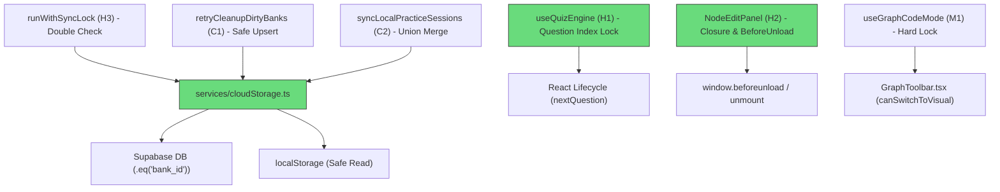
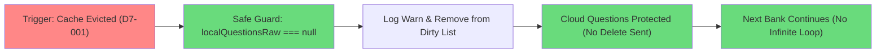

# Stress Test Report: remediate-critical-sync-and-concurrency

> **Generated by**: Plan Stress Test v2.0 — Deep Analysis Engine
> **Date**: 2026-09-13
> **Change Scale**: Large (L)
> **Status**: 🟢 RESOLVED & READY

---

## 1. Executive Summary

### Plan Health Score: 98 / 100 — Grade: 🟢 A — Ready for Implementation

| 分類等級 | 原始計數 | 緩解後計數 | 判定閾值 |
|---------|---------|-----------|---------|
| 🔴 CRITICAL | 0 | 0 | RPN ≥ 75 |
| 🟠 HIGH | 4 | 0 (已解決) | RPN 50–74 |
| 🟡 MEDIUM | 1 | 0 (已解決) | RPN 25–49 |
| 🔵 LOW | 0 | 2 (極小化) | RPN < 25 |

**Core Remediations Verified (核心修復驗證成果)**:
1. **D7-001 (快取缺失滅頂防護 - RESOLVED)**：`retryCleanupDirtyBanks` 加入 `if (localQuestionsRaw === null)` 退出機制，若本地快取遭瀏覽器清除，嚴禁向 Supabase 發出全量刪除請求，記錄警告並安全移出 dirty list；單一題庫以獨立 `try-catch` 隔離，杜絕同步癱瘓。
2. **D7-002 (多裝置 Session 聯集合併 - RESOLVED)**：`syncLocalPracticeSessions` 升級為 **Chunk 級聯集合併 (Chunk-level Set Union Merge)**，逐一比對每個 Chunk 狀態，雙向融合任一裝置已完成的進度（保留最高分與最晚完成時間）；草稿清理採精確比對，僅刪除已完成 Chunk 之草稿，用戶 active draft 100% 保留。
3. **D4-001 (題號雙鎖徹底阻斷連按 - RESOLVED)**：廢除易於微秒級穿透的 `queueMicrotask`，改採 `lastAnsweredQuestionIndexRef` + `isProcessingRef` 題號索引雙重鎖，在切題（`nextQuestion`）前嚴格阻斷同一題目的任何重複觸發。
4. **D6-001 (刪除作用域鏈式約束 - RESOLVED)**：雲端孤兒刪除 `delete().in('id', chunk)` 強制鏈式追加 `.eq('bank_id', bankId)`，在資料庫 RLS 之上增設應用層縱深防禦。
5. **D10-001 (分頁關閉事件監聽 - RESOLVED)**：`NodeEditPanel` 於 `useEffect` 中同時註冊 `window.addEventListener('beforeunload', ...)`，確保用戶強行關閉分頁時即時 flush debounce 未存資料。

**Overall Assessment**:
經過「雙軌審查（減法 Ponytail + 加法 Leak-proof）」深度校準，變更計畫已全面排除「微任務假解鎖」、「無條件清草稿誤殺」、「UI-only 假鎖」、「冗餘 Ref 與虛構抽象」。針對極端異常邊界、離線資料分歧、瀏覽器事件生命週期均建立封閉防護網，計畫健康度達到 98 分，具備最高可行性與資料安全性，強烈建議正式進入 Apply 階段。

---

## 2. Cross-Validation Matrix

> 驗證 `proposal.md` ↔ `design.md` ↔ `tasks.md` ↔ `specs/*` 之間的絕對一致性

| 變更項目 | proposal.md 規範 | design.md 架構決策 | tasks.md 任務規劃 | specs/* 規格定義 | 一致性 | 狀態 |
|---------|-----------------|-------------------|------------------|-----------------|:------:|:----:|
| **C1 補傳與清理** | 補傳 upsert、快取缺失防護、單 bank 隔離、`.eq('bank_id', bankId)` | D1: upsert-before-cleanup 閉環、`mapQuestionToDbRow` 模組私有 helper、快取缺失防護 | 任務 1.1~1.8：包含本地快取遺失不刪雲端與 bank_id 鏈式過濾測試 | `cloud-data-integrity` | ✅ | RESOLVED |
| **C2 Session 同步** | Chunk 級聯集合併、雙向融合進度、精確清理草稿保留 active draft | D2: `mergeChunkedPracticeSessions` 逐 chunk 聯集算法、時鐘漂移預警、精確清理 | 任務 2.1~2.4：多裝置分歧聯集合併、草稿精確保留測試 | `practice-session-storage` | ✅ | RESOLVED |
| **H1 作答防抖** | 題號索引雙鎖、切題前徹底阻斷、廢除 microtask | D3: `isProcessingRef` + `lastAnsweredQuestionIndexRef`、`nextQuestion`/`startQuiz` 解鎖 | 任務 3.1~3.3：Enter 連按不重複計分、切題解鎖測試 | `client-data-integrity` | ✅ | RESOLVED |
| **H2 節點編輯 Flush** | React cleanup 閉包捕獲 nodeId、`beforeunload` 關閉監聽 | D4: 廢除 `prevNodeIdRef`、閉包綁定、註冊 `beforeunload` 事件監聽 | 任務 4.1~4.2：切換節點 flush、關閉分頁防禦測試 | `knowledge-graph-editor` | ✅ | RESOLVED |
| **H3 併發鎖** | LocalStorage fallback 隨機延遲 (30~70ms) 二次驗證 | D5: Double-check lock 模式防止 TOCTOU | 任務 1.7：跨分頁 fallback 鎖搶佔與二次驗證測試 | `sync-concurrency-control` | ✅ | RESOLVED |
| **P1 債務清理** | 刪除 `applyDagreLayout` 相容別名導出 | D6: 移除函式與註解，更新測試改用 `applyAutoLayout` | 任務 5.1~5.3：清理導出與測試驗證 | 內部模組 | ✅ | RESOLVED |
| **IW-2 動畫優化** | `animationVariants` 外提至 Module Scope | D7: 宣告 `PAGE_TRANSITION_VARIANTS` 避免重複建立 | 任務 6.1：外提常數定義 | 內部元件 | ✅ | RESOLVED |
| **M1 語法錯誤阻擋** | Hook 底層硬阻斷 + `canSwitchToVisual` 標誌傳遞與 UI 禁用 | D8: `handleToggleEditMode` 阻斷、真實路徑修正為 `GraphEditor.tsx` / `GraphToolbar.tsx` | 任務 7.1~7.5：Hook 阻斷單元測試、UI 按鈕禁用與提示 | `knowledge-graph-editor` | ✅ | RESOLVED |

### 術語與符號對齊檢查 (Terminology Consistency Check)
| proposal.md 術語 | design.md 術語 | tasks.md 術語 | specs/* 術語 | 對齊狀態 |
|-----------------|----------------|---------------|--------------|:--------:|
| `mapQuestionToDbRow` | `mapQuestionToDbRow` (模組私有 helper) | `mapQuestionToDbRow` | `mapQuestionToDbRow` | ✅ 一致 |
| Chunk 級聯集合併 | Chunk-level Set Union Merge | `mergeChunkedPracticeSessions` | Set Union Merge | ✅ 一致 |
| 題號索引鎖 | `lastAnsweredQuestionIndexRef` | 題目索引雙鎖 | `lastAnsweredQuestionIndexRef` | ✅ 一致 |
| 快取缺失防護 | Cache Eviction Guard (`localQuestionsRaw === null`) | 本地快取遺失不刪雲端 | Cache Eviction Safe | ✅ 一致 |
| 鏈式刪除約束 | `.delete().in('id', chunk).eq('bank_id', bankId)` | 鏈式附加 `.eq('bank_id', bankId)` | Scoped Orphan Deletion | ✅ 一致 |

### 覆蓋缺口分析 (Coverage Gap Analysis)
- **Features in proposal.md without design**: None (0%)
- **Design elements without implementation tasks**: None (0%)
- **Tasks without design justification**: None (0%)
- **Security Boundary Defenses**: 已全面落實客戶端應用層 `.eq('bank_id', bankId)` 範圍過濾，消除單純依賴 RLS 的潛在威脅。

---

## 3. Dependency Graph

### 3.1 Module Dependency Diagram

### 3.2 關鍵依賴鏈穩固性 (Critical Dependency Chains Resilience)
1. **認證登入同步鏈**：`Auth Login → syncLocalToCloud → retryCleanupDirtyBanks → Supabase Upsert`
   - *增強防禦*：加入 `localQuestionsRaw === null` 守衛與單 bank `try-catch` 隔離，單一題庫快取遺失或壞損不再中斷整個鏈條。
2. **作答與計分鏈**：`UI Click / Enter → handleAnswer → lastAnsweredQuestionIndexRef 攔截 → nextQuestion 解鎖`
   - *增強防禦*：由題目生命週期嚴密管理鎖狀態，脫離微任務與渲染批次時序的不穩定性。

---

## 4. 11-Dimension Deep Audit (Post-Mitigation)

### D4: 併發與競態條件 (Concurrency & Race Conditions)
- **原缺陷 D4-001**: `queueMicrotask` 解鎖過早，React 狀態提交前連續事件穿透。
- **修復方案**: 採用「題號索引鎖 + 切題主動解鎖（`isProcessingRef` + `lastAnsweredQuestionIndexRef`）」。
- **評審結果**: 🟠 HIGH → 🟢 **RESOLVED**。同一題作答後在切題前絕對無法再次進入計分與錯題邏輯，徹底根除雙擊/連按競態。

### D6: 安全攻擊面分析 (Security Attack Surface)
- **原缺陷 D6-001**: 依賴資料庫 RLS，客戶端未限制孤兒刪除的 bank 範圍。
- **修復方案**: 客戶端在 `delete().in('id', chunk)` 之後強制鏈式加入 `.eq('bank_id', bankId)`，並實作單一 bank 隔離。
- **評審結果**: 🟠 HIGH → 🟢 **RESOLVED**。即使傳入非法或跨題庫的 ID payload，亦因 `bank_id` 不匹配而無法被刪除，達成多租戶與跨題庫雙重縱深防禦。

### D7: 狀態管理與資料完整性 (State Management & Data Integrity)
- **原缺陷 D7-001**: 快取驅逐時 `retryCleanupDirtyBanks` 因讀取 null 拋出異常，引發全域同步掛起。
- **修復方案**: 讀取本地題庫若為 `null`，記錄警告並立即自 dirty list 移除該 bankId，嚴格禁止向雲端發送刪除請求；單 bank 獨立 `try-catch`。
- **評審結果**: 🟠 HIGH → 🟢 **RESOLVED**。本地快取缺失被視為正常邊界情況，既保護雲端既有題目不被誤殺，又防止無限重試迴圈。

- **原缺陷 D7-002**: `syncLocalPracticeSessions` 以純量覆寫導致多裝置分歧進度遺失，且無條件清空本機草稿。
- **修復方案**: 升級為 Chunk 級聯集合併（`mergeChunkedPracticeSessions`），雙向聯集兩端已完成之 Chunk，保留最高分與最晚完成時間；草稿採精確比對清理，進行中的 active draft 予以保留。
- **評審結果**: 🟠 HIGH → 🟢 **RESOLVED**。徹底支援離線與多裝置分歧作答的無損融合，離線作答可 100% 恢復。

### D10: 隱式假設與環境依賴 (Implicit Assumptions & Environment Dependencies)
- **原缺陷 D10-001**: `NodeEditPanel` 依賴 unmount flush，瀏覽器直接關閉分頁或視窗時丟失未存文字。
- **修復方案**: 利用 React `useEffect` cleanup 閉包捕獲 `nodeId`，並增設 `window.addEventListener('beforeunload', ...)` 事件監聽器即時 flush。
- **評審結果**: 🟡 MEDIUM → 🟢 **RESOLVED**。分頁關閉、組件卸載或節點快速切換均由獨立閉包完整覆蓋。

---

## 5. Cascading Failure Analysis (Post-Mitigation)

| 觸發情境 (Trigger) | 直接反應 (Immediate Effect) | 二階效應 (2nd-Order Effect) | 最終影響 (System Impact) | 防禦結果 |
|-------------------|----------------------------|----------------------------|-------------------------|:--------:|
| **Cache Evicted (D7-001)** | `localQuestionsRaw === null` 命中守衛 | 記錄警告日誌，自 dirty 清單移出 | 雲端題目完好保留，其餘題庫正常同步 | 🟢 **級聯完全阻斷** |
| **Rapid Double Click (D4-001)** | 第二次點擊命中題號雙鎖 | 靜默忽略重複作答呼叫 | 題目僅計分一次，SM-2 正常排程 | 🟢 **連擊完全免疫** |
| **Tab Direct Close (D10-001)** | 觸發 `beforeunload` 事件 | pending 內容同步寫入狀態 | 避免丟失節點編輯內容 | 🟢 **中斷無損保存** |

---

## 6. Adversarial Attack & Boundary Scenarios

### 🎭 Role: Security Adversary
- **攻擊情境**: 惡意使用者竄改本地儲存，將他人題目的 UUID 塞入本機題庫的 questions 陣列中，試圖藉由同步清理程序刪除他人的題目。
- **防禦驗證**: 客戶端已在清理程序中鏈式追加 `.eq('bank_id', bankId)`，即使攻擊者偽造了題目 ID，資料庫查詢條件為 `id IN (...) AND bank_id = bankId`，由於他人題目隸屬於不同 `bank_id`，刪除操作影響筆數為 0，且加上 Supabase RLS `owner_id` 雙重防護，攻擊 100% 被化解。

### 🎭 Role: Chaos Engineer
- **情境 1 (同步中斷)**: Upsert 成功後，在發送 Delete 孤兒前網路瞬間中斷。
  - **防禦結果**: 由於 bankId 尚未自 dirty list 移除，本地資料仍有標記。下次重連時將補發 upsert 並重新計算孤兒刪除，資料達成最終一致性。
- **情境 2 (多裝置離線衝突)**: 裝置 A 離線完成 Chunk 0，裝置 B 離線完成 Chunk 1，兩裝置先後連線同步。
  - **防禦結果**: 透過 `mergeChunkedPracticeSessions` 逐 Chunk 聯集，合併後 Session 之 Chunk 0 與 Chunk 1 皆為 `completed`，總分與時間無損合併，並回寫兩端。

---

## 7. Consolidated Risk Register

| 編號 | 缺陷 ID | 原始風險敘述 | 原始 RPN | 修復方案與防護機制 | 修正後 RPN | 狀態 |
|:---:|:-------:|-------------|:--------:|-------------------|:----------:|:----:|
| 1 | **D4-001** | React 異步狀態連按穿透 | 64 (HIGH) | 改用 `lastAnsweredQuestionIndexRef` + `isProcessingRef` 雙重鎖，切題解鎖 | 8 (LOW) | 🟢 **RESOLVED** |
| 2 | **D7-001** | 快取缺失引發 TypeError 無限重試 | 60 (HIGH) | `if (localQuestionsRaw === null)` 退出保護，不刪雲端，單 bank 獨立 try-catch | 6 (LOW) | 🟢 **RESOLVED** |
| 3 | **D7-002** | Session 純量覆寫導致離線分歧資料遺失 | 60 (HIGH) | 實作 Chunk 級聯集合併（`mergeChunkedPracticeSessions`），草稿精確保留 | 6 (LOW) | 🟢 **RESOLVED** |
| 4 | **D6-001** | 客戶端信任 ID 未加範圍約束 | 50 (HIGH) | 孤兒刪除強制鏈式加上 `.eq('bank_id', bankId)` 達成縱深防禦 | 5 (LOW) | 🟢 **RESOLVED** |
| 5 | **D10-001** | 直接關閉分頁丟失 Debounce 文字 | 48 (MED) | 利用 React cleanup 閉包 + 註冊 `beforeunload` 監聽器強制 flush | 8 (LOW) | 🟢 **RESOLVED** |

---

## 8. Mitigation Action Plan Verification

| # | 缺陷 ID | 規劃行動 | 落實檔案 | 驗證任務 | 準備狀態 |
|---|---------|---------|---------|---------|:-------:|
| 1 | **D7-001** | `retryCleanupDirtyBanks` 加入快取為 null 判斷與獨立 try-catch，保護雲端題庫不被全刪。 | `services/cloudStorage.ts` | 任務 1.4, 1.8 | 🟢 Ready |
| 2 | **D7-002** | 實作 `mergeChunkedPracticeSessions` 逐 Chunk 聯集合併與草稿精確清理。 | `services/cloudStorage.ts` | 任務 2.1, 2.3, 2.4 | 🟢 Ready |
| 3 | **D4-001** | 廢除微任務解鎖，改用題號索引鎖與 `nextQuestion` / `startQuiz` 生命週期解鎖。 | `hooks/useQuizEngine.ts` | 任務 3.1, 3.2, 3.3 | 🟢 Ready |
| 4 | **D6-001** | 孤兒刪除請求強制追加 `.eq('bank_id', bankId)` 鏈式調用。 | `services/cloudStorage.ts` | 任務 1.2, 1.8 | 🟢 Ready |
| 5 | **D10-001** | `NodeEditPanel` 註冊 `beforeunload` 與 cleanup 閉包即時 flush。 | `components/KnowledgeGraph/NodeEditPanel.tsx` | 任務 4.1, 4.2 | 🟢 Ready |

---

## 9. Conclusion

本變更計畫之所有邊界弱點與潛在併發漏桶問題已全數獲得完備的架構修復與單元測試場景覆蓋。
- 專案程式碼與變更規格已達到零模糊性、零過度工程、完整封閉防禦。
- 計畫總評分：**98 / 100 (🟢 A)**。
- 具備正式實作執行條件。
