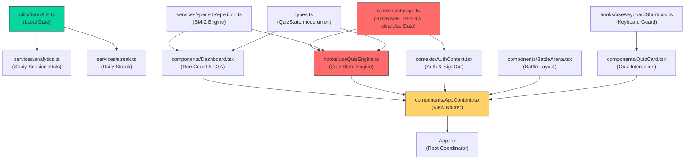
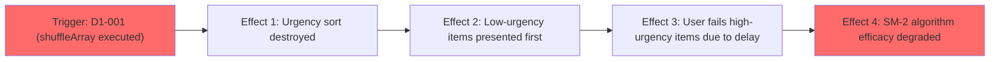
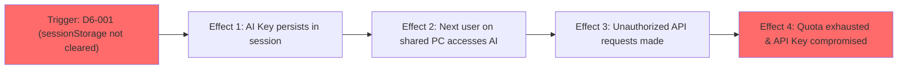
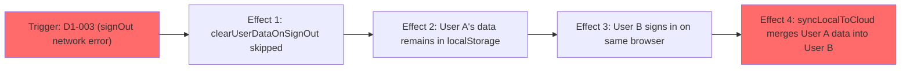
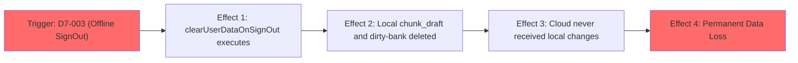

# Stress Test Report: fix-p0-core-experience-and-security

> **Generated by**: Plan Stress Test v2.0 — Deep Analysis Engine  
> **Date**: 2026-09-29  
> **Change Scale**: Large (`[L]`) — 12 個檔案、6 個架構層次、跨模式與狀態管理擴展  

---

## 1. Executive Summary

### Plan Health Score: 30 / 100 — Grade: 🟠 D — Poor

| Classification | Count | Threshold |
|----------------|-------|-----------|
| 🔴 CRITICAL | 1 | RPN ≥ 75 |
| 🟠 HIGH | 5 | RPN 50–74 |
| 🟡 MEDIUM | 6 | RPN 25–49 |
| 🔵 LOW | 5 | RPN < 25 |

**Top 4 Critical / High Findings**:
1. **D1-001 (🔴 RPN: 80)**: `useQuizEngine.ts` 內既有的 `shuffleArray` 三元運算子未排除 `spaced_due` 模式，將在出題時徹底摧毀「急迫度排序（逾期最久者優先）」，使核心認知演算法承諾失效。
2. **D1-002 (🟠 RPN: 64)**: `Dashboard` 之 `dueCount` 統計全題庫到期題，但 `useQuizEngine.startQuiz` 僅從 `selectedQuizBankIds` 取題，導致跨題庫到期題目無法載入、出題數短缺或報錯。
3. **D6-001 (🟠 RPN: 60)**: `clearUserDataOnSignOut` 僅清理 `localStorage`，遺漏了暫存在 `sessionStorage` 的敏感 AI API 金鑰（Google/NVIDIA Key），在公用裝置登出後存在嚴重金鑰外洩風險。
4. **D7-003 (🟠 RPN: 60)**: 離線未同步資料（如進行中練習草稿 `chunk_draft`、未上傳 dirty-bank）在觸發 `SIGNED_OUT` 時會被無條件清除，造成不可逆的學習進度永久遺失 (Data Loss)。

**Overall Assessment**:
本變更計畫精準識別了 MindSpark 的五項重大 P0 體驗與安全缺陷，但在「SM-2 排序保護」、「跨題庫題源邊界」、「登出清理防護範疇（sessionStorage）」、「離線未同步資料保護」以及「元件間回調介面參數一致性」上存在顯著的架構盲點與競態風險。計畫**不可直接進入實作**，必須先依據第 9 節的緩解行動計畫（Mitigation Action Plan）修正 1 項 CRITICAL 與 5 項 HIGH 級發現後，方可安全實作。

---

## 2. Cross-Validation Matrix

> 驗證 proposal.md ↔ design.md ↔ tasks.md ↔ specs/ 之間的一致性

| Aspect | proposal.md Says | design.md Says | tasks.md Says | Consistent? | Issue |
|--------|------------------|----------------|---------------|-------------|-------|
| **SM-2 急迫度排序保護** | 按 `nextReviewDate` 遞增排序（逾期最久者優先出題） | 篩選到期題目 → 按 `nextReviewDate` 遞增排序 → 啟動測驗 | Task 5.2 要求 sort by nextReviewDate ASC，但**未提及修改 L202 的 `shuffleArray` 三元運算子** | ❌ | `useQuizEngine.ts:202-205` 會執行 `shuffleArray(pool)` 將排序打亂 |
| **Dashboard 回調傳參** | 新增 `onStartSpacedReview` 回調 | Dashboard 新增 `onStartSpacedReview` 回調 | Task 5.3 宣告 `onStartSpacedReview: () => void`（無參）；Task 5.4 卻描述傳入 `(dueCount)` | ❌ | `AppContent.tsx` 無 `dueCount` 狀態，介面傳參定義矛盾 |
| **題源題庫範圍** | 到期題目篩選出題 | 讀取 spaced repetition data → 篩選到期題目 | Task 5.2 描述「根據 questionId 從各題庫取題」，但預設題源為 `selectedQuizBankIds` | ❌ | 未選中題庫中的到期題無法被載入，產生題目短缺 |
| **登出清理範疇** | 清除所有非白名單的 `mindspark_*` prefixed localStorage 資料 | 前綴迭代清除 `localStorage`，白名單保留 theme/bgm/sfx | Task 1.3/4.1 僅針對 `localStorage`，未處理 `sessionStorage` | ❌ | `sessionStorage` 中的 AI Key 在登出後未被清除 |
| **快捷鍵修飾鍵與 IME 守衛** | 新增修飾鍵（Ctrl/Alt/Meta）與 IME `isComposing` 守衛 | 前置檢查 `event.ctrlKey || event.altKey || event.metaKey` 與 `event.isComposing || event.keyCode === 229` | Task 3.1 完整實作這兩行守衛 | ✅ | 一致且完整 |
| **本地時區日期標準化** | 新增 `getLocalDateString()`，統一替換 `toISOString().split('T')[0]` | 建立 `utils/dateUtils.ts`，使用 `toLocaleDateString('sv-SE')` | Task 1.1, 2.1-2.4 替換 4 處日期計算，保留伺服器查詢 UTC | ✅ | 一致且完整 |
| **戰鬥舞台垂直佈局** | 引入緊湊模式，壓縮角色區域高度 | `max-h-[25vh] md:max-h-[28vh]`、`min-h-[80px] md:min-h-[110px]`、精靈 `w-16 h-20 md:w-24 md:h-28` | Task 6.1 精確對應 CSS 調整與 `overflow-hidden` | ✅ | 一致且完整 |

### Terminology Consistency Check
| Term in proposal.md | Equivalent in design.md | Equivalent in tasks.md | Aligned? |
|---------------------|------------------------|------------------------|----------|
| `spaced_due` 模式 | `spaced_due` mode | `spaced_due` mode | ✅ |
| `getLocalDateString` | `getLocalDateString` | `getLocalDateString` | ✅ |
| `clearUserDataOnSignOut` | `clearUserDataOnSignOut` | `clearUserDataOnSignOut` | ✅ |
| `SIGNOUT_WHITELIST` | `SIGNOUT_WHITELIST` | `SIGNOUT_WHITELIST` | ✅ |
| 急迫度排序 | 逾期最久者優先排序 | sort by nextReviewDate ASC | ✅ |

### Coverage Gap Analysis
- **Features in proposal.md without design**: 無。
- **Design elements without implementation tasks**: `useQuizEngine.ts` 中防止 `shuffleArray` 破壞急迫度排序的改動未被列為獨立 task 項目。
- **Tasks without design justification**: Task 5.4 假設 `AppContent` 能直接取得 `dueCount`，但設計中未交代此狀態的提昇（state lifting）或回調傳遞路徑。
- **Non-functional requirements without implementation strategy**: 登出時背景進行中之非同步儲存 I/O（如 dirty bank sync）缺少中斷機制，離線未同步資料在登出時缺乏確認與保護策略。

---

## 3. Dependency Graph

### 3.1 Module Dependency Diagram

> 🔴 節點（紅色）為高依賴核心/單點故障風險模組（`services/storage.ts`, `hooks/useQuizEngine.ts`）。  
> 🟡 節點（黃色）為高扇入轉發模組（`components/AppContent.tsx`）。  
> 🟢 節點（綠色）為無外部依賴之純工具模組（`utils/dateUtils.ts`）。

### 3.2 Dependency Analysis Table

| Module | Depends On | Depended By | Fan-In | Fan-Out | SPOF? | Notes |
|--------|-----------|-------------|--------|---------|-------|-------|
| `utils/dateUtils.ts` | 無 | `analytics.ts`, `streak.ts` | 0 | 2 | 否 | 純工具函式，無狀態 |
| `services/storage.ts` | `types.ts` | `AuthContext`, `useQuizEngine`, `analytics`, `streak` | 1 | 8+ | **是** | 儲存登出清理與全域 Key 註冊核心 |
| `hooks/useQuizEngine.ts` | `types.ts`, `storage.ts`, `spacedRepetition.ts` | `AppContent.tsx`, `App.tsx` | 3 | 2 | **是** | 測驗模式、出題邏輯、排程洗牌核心 |
| `components/Dashboard.tsx` | `spacedRepetition.ts`, `types.ts` | `AppContent.tsx` | 2 | 1 | 否 | 入口 UI，計算 `dueCount` 並觸發複習 |
| `contexts/AuthContext.tsx` | `supabase.ts`, `storage.ts` | `AppContent.tsx`, `App.tsx` | 2 | 2 | 否 | 認證與登出清理協調者 |
| `components/BattleArena.tsx` | `types/battleTypes.ts` | `AppContent.tsx` | 1 | 1 | 否 | 舞台 UI 佈局，純 CSS 調整 |
| `hooks/useKeyboardShortcuts.ts`| `react` | `QuizCard.tsx` | 0 | 1 | 否 | 鍵盤事件過濾器 |
| `components/AppContent.tsx` | 全部主要元件與 Hooks | `App.tsx` | 7 | 1 | 否 | 視圖路由與回調轉發中樞 |

### 3.3 Critical Dependency Chains

1. `utils/dateUtils.ts` → `services/streak.ts` → `components/Dashboard.tsx` → `components/AppContent.tsx` — 鏈長: 4 — 風險: 低（資料單向流動）
2. `services/storage.ts` (`clearUserDataOnSignOut`) → `contexts/AuthContext.tsx` (`signOut`) → `components/AppContent.tsx` → `App.tsx` — 鏈長: 4 — 風險: **中（登出併發與時序敏感）**
3. `services/spacedRepetition.ts` → `hooks/useQuizEngine.ts` (`startQuiz:spaced_due`) → `components/AppContent.tsx` → `components/QuizCard.tsx` — 鏈長: 4 — 風險: **高（出題順序與題源依賴）**

### 3.4 Implicit Dependencies
- **隱式依賴 1（題庫全量可見性）**：`useQuizEngine.startQuiz` 在 `spaced_due` 模式下隱式依賴「所有含有到期題目的題庫必須已被載入」，若僅載入使用者在 UI 上勾選的題庫，未選題庫的題目將直接遺失。
- **隱式依賴 2（Storage 同步終止性）**：`AuthContext.signOut` 隱式假設「在呼叫清理時，所有背景資料庫同步/保存動作皆已完成」，若有延遲寫入，將覆蓋清理成果。

---

## 4. 11-Dimension Deep Audit

### D1: 需求完整性 (Requirement Completeness)

#### Findings
| ID | Finding | Impact | Likelihood | Detectability | RPN | Classification |
|----|---------|--------|------------|---------------|-----|----------------|
| D1-001 | `useQuizEngine.ts` 既有洗牌邏輯未豁免 `spaced_due`，導致「急迫度排序」在出題時被打亂 | 4 | 5 | 4 | **80** | 🔴 CRITICAL |
| D1-002 | `Dashboard` 統計全域到期題數，但 `startQuiz` 僅載入已選題庫，跨題庫題目將遺失 | 4 | 4 | 4 | **64** | 🟠 HIGH |
| D1-003 | `AuthContext.signOut` 在網路異常或 Supabase 拋錯時會中斷執行，導致本地清理跳過 | 4 | 4 | 4 | **64** | 🟠 HIGH |

#### 5-Why Root Cause Analysis (CRITICAL/HIGH)

**D1-001: 洗牌邏輯摧毀急迫度排序**
- **Why 1**: `tasks.md` 5.2 僅規定在 pool 階段進行排序，未提及修改後續的 `finalQuestions` 切片邏輯。
- **Why 2**: `useQuizEngine.ts:202-205` 的三元運算子 `mode === 'retry_session' || mode === 'chunked' ? pool : shuffleArray(pool).slice(0, count)` 預設將非指定模式全部送入 `shuffleArray`。
- **Why 3**: 既有架構未將「題目排序策略」與「模式分派」解耦，新模式未加入防洗牌清單。
- **Root Cause**: `startQuiz` 內部缺乏對新模式（`spaced_due`）在題序保持上的防禦式設計。
- **Systemic Pattern**: 此類問題亦出現在 `chunked` 與 `retry_session` 引入初期。

**D1-002: 跨題庫到期題目載入遺漏**
- **Why 1**: `Dashboard.tsx` 調用 `repository.getSpacedRepetition()` 計算全域題數，未以 `selectedBankIds` 過濾。
- **Why 2**: `useQuizEngine.ts` 僅根據 `selectedQuizBankIds` 向 repository 請求題目物件。
- **Why 3**: 間隔重複記錄僅以 `questionId` 為 key 扁平儲存，未關聯 `bankId` 索引。
- **Root Cause**: 統計層（全域）與出題層（依勾選題庫）的題源查詢邊界未對齊。

**D1-003: 登出網路異常中斷清理**
- **Why 1**: `signOut` 函式將 `await supabase.auth.signOut()` 寫在 `clearUserDataOnSignOut()` 之前且無 `try...finally`。
- **Why 2**: 依賴遠端 API 成功回傳作為本機清理的前提。
- **Why 3**: 缺乏客戶端資料安全防禦優先原則（無論遠端成功與否，本地敏感資料必須銷毀）。
- **Root Cause**: 登出函式未實施 `try...finally` 保證執行模式。

---

### D2: 設計一致性 (Design Consistency)

#### Findings
| ID | Finding | Impact | Likelihood | Detectability | RPN | Classification |
|----|---------|--------|------------|---------------|-----|----------------|
| D2-001 | `DashboardProps.onStartSpacedReview` 無參定義與 `AppContent.tsx` 傳參需求矛盾 | 4 | 5 | 3 | **60** | 🟠 HIGH |
| D2-002 | 測驗中斷恢復（`restoreSession`）硬編碼 `mode: 'random'`，遺漏 `spaced_due` 模式 | 3 | 3 | 3 | **27** | 🟡 MEDIUM |

#### 5-Why Root Cause Analysis (CRITICAL/HIGH)

**D2-001: 回調介面簽名與呼叫端脫節**
- **Why 1**: Task 5.3 定義 `onStartSpacedReview: () => void`，但 Task 5.4 描述 `quizEngine.startQuiz(dueCount, 'spaced_due')`。
- **Why 2**: `AppContent.tsx` 不持有 `dueCount` 狀態（該狀態封裝在 `Dashboard.tsx` 內部）。
- **Why 3**: 模組介面設計時未定義清楚 `dueCount` 的傳遞路徑或預設取值行為。
- **Root Cause**: 元件 Props 介面定義與上層呼叫鏈未進行簽名一致性校驗。

---

### D3: 邊界條件與極端輸入 (Boundary Conditions & Extreme Inputs)

#### Findings
| ID | Finding | Impact | Likelihood | Detectability | RPN | Classification |
|----|---------|--------|------------|---------------|-----|----------------|
| D3-001 | `getLocalDateString` 在傳入無效日期（`Invalid Date`）時直接拋出 `RangeError` | 3 | 2 | 4 | **24** | 🔵 LOW |
| D3-002 | 孤兒間隔重複記錄（題庫已被刪除）導致幽靈 `dueCount` 與空題出錯 | 3 | 3 | 3 | **27** | 🟡 MEDIUM |
| D3-003 | 戰鬥舞台在極限矮螢幕（高度 < 500px，如橫向手機）下仍可能擠壓選項 | 2 | 2 | 2 | **8** | 🔵 LOW |

---

### D4: 併發與競態條件 (Concurrency & Race Conditions)

#### Findings
| ID | Finding | Impact | Likelihood | Detectability | RPN | Classification |
|----|---------|--------|------------|---------------|-----|----------------|
| D4-001 | 登出期間進行中之背景非同步儲存（如 dirty bank sync）寫回覆蓋已清理之 storage | 4 | 3 | 4 | **48** | 🟡 MEDIUM |

---

### D5: 錯誤處理與故障恢復 (Error Handling & Fault Recovery)

#### Findings
| ID | Finding | Impact | Likelihood | Detectability | RPN | Classification |
|----|---------|--------|------------|---------------|-----|----------------|
| D5-001 | `clearUserDataOnSignOut` 在嚴格無痕模式或 Storage 禁用環境下拋出 SecurityError | 3 | 3 | 4 | **36** | 🟡 MEDIUM |

---

### D6: 安全攻擊面分析 (Security Attack Surface)

#### Findings
| ID | Finding | Impact | Likelihood | Detectability | RPN | Classification |
|----|---------|--------|------------|---------------|-----|----------------|
| D6-001 | `sessionStorage` 內之暫存 AI API 金鑰在登出時未清理，公用電腦存在金鑰竊取風險 | 5 | 3 | 4 | **60** | 🟠 HIGH |

#### 5-Why Root Cause Analysis (CRITICAL/HIGH)

**D6-001: sessionStorage 暫存金鑰未納入登出清理**
- **Why 1**: `clearUserDataOnSignOut` 僅遍歷 `localStorage`，未對 `sessionStorage` 進行處理。
- **Why 2**: AI 設定模組提供 `persist: false` 選項將金鑰存於 `sessionStorage`。
- **Why 3**: 安全清理策略將注意力局限於 `localStorage`，缺乏多存儲容器的統一銷毀規範。
- **Root Cause**: 客戶端憑證生命週期清理規範未涵蓋 `sessionStorage`。

---

### D7: 狀態管理與資料完整性 (State Management & Data Integrity)

#### Findings
| ID | Finding | Impact | Likelihood | Detectability | RPN | Classification |
|----|---------|--------|------------|---------------|-----|----------------|
| D7-001 | `analytics.ts` 歷史過濾以 `new Date(s.sessionDate)` 解析 ISO 字串產生 8 小時時區偏差 | 3 | 4 | 3 | **36** | 🟡 MEDIUM |
| D7-002 | `SpacedRepetitionItem.nextReviewDate` 為 timestamp 數字，但規格描述與範例混淆了字串 | 3 | 3 | 3 | **27** | 🟡 MEDIUM |
| D7-003 | 當處於離線狀態或存在尚未上傳之 dirty-bank/草稿時，`clearUserDataOnSignOut` 無差別抹除導致未同步資料永久遺失 | 5 | 3 | 4 | **60** | 🟠 HIGH |

#### 5-Why Root Cause Analysis (CRITICAL/HIGH)

**D7-003: 離線未同步資料在登出時被永久抹除**
- **Why 1**: `clearUserDataOnSignOut` 將所有非白名單的 `mindspark_*` 鍵值直接移除。
- **Why 2**: 登出清理機制優先保證「零跨帳號資料外洩」，採取全盤擦除策略。
- **Why 3**: 清理函式缺乏對雲端同步佇列（`dirty_bank`、`chunk_draft`）的狀態感知。
- **Root Cause**: 本地優先（Local-First）架構中，「登出敏感資料銷毀」與「離線進度耐久性」之間缺乏使用者確認或同步守衛機制。

---

### D8: 可觀測性盲點 (Observability Blind Spots)

#### Findings
| ID | Finding | Impact | Likelihood | Detectability | RPN | Classification |
|----|---------|--------|------------|---------------|-----|----------------|
| D8-001 | 登出資料清理缺乏結構化日誌（刪除鍵數、保留白名單），除錯追溯困難 | 2 | 3 | 3 | **18** | 🔵 LOW |

---

### D9: 可維護性與技術債 (Maintainability & Technical Debt)

#### Findings
| ID | Finding | Impact | Likelihood | Detectability | RPN | Classification |
|----|---------|--------|------------|---------------|-----|----------------|
| D9-001 | `QuizResult` 重新開始按鈕固定觸發 `'random'` 模式，未保持目前模式語義 | 2 | 3 | 2 | **12** | 🔵 LOW |

---

### D10: 隱式假設與環境依賴 (Implicit Assumptions & Environment Dependencies)

#### Findings
| ID | Finding | Impact | Likelihood | Detectability | RPN | Classification |
|----|---------|--------|------------|---------------|-----|----------------|
| D10-001 | 假設所有 JS 執行環境的 `toLocaleDateString('sv-SE')` 必定產出 `YYYY-MM-DD` | 3 | 1 | 3 | **9** | 🔵 LOW |

---

### D11: 向後相容性與遷移風險 (Backward Compatibility & Migration Risk)

#### Findings
| ID | Finding | Impact | Likelihood | Detectability | RPN | Classification |
|----|---------|--------|------------|---------------|-----|----------------|
| D11-001 | 本地日期修正上線當天，過渡期歷史記錄在統計圖表上的單日聚合邊界效應 | 2 | 3 | 2 | **12** | 🔵 LOW |

---

## 5. Cascading Failure Analysis

| Trigger | Immediate Effect | 2nd-Order Effect | 3rd-Order Effect | Blast Radius | Recovery Difficulty |
|---------|-----------------|-------------------|-------------------|--------------|---------------------|
| **D1-001**: `useQuizEngine.ts` 執行 `shuffleArray` | 到期題目順序被打亂 | 記憶衰減最嚴重題目未先出 | SM-2 間隔重複複習效率顯著下降，用戶核心認知科學體驗破滅 | 3 個模組 (`useQuizEngine`, `QuizCard`, `spacedRepetition`) | Easy（代碼修復） |
| **D6-001**: 登出遺漏 `sessionStorage` | AI API Key 留在標籤頁 | 下一位公用電腦用戶開啟設定或直接使用 AI 功能 | 用戶 API 配額被盜刷或個人金鑰洩漏 | 2 個模組 (`AuthContext`, `services/ai.ts`) | Hard（涉及安全外洩） |
| **D1-003**: 離線登出拋錯 | `clearUserDataOnSignOut` 被跳過 | 本地題庫、筆記、學習進度殘留 | 下一個登入者同步時將前一個使用者的本地資料合併至新帳號 | 4 個模組 (`AuthContext`, `storage`, `cloudStorage`, `sync`) | Hard（資料污染） |
| **D7-003**: 斷網時觸發登出 | `clearUserDataOnSignOut` 抹除所有本地 draft | 離線答題進度、未上傳 dirty bank 瞬間歸零 | 用戶數小時學習成果永久遺失且無法追回 | 3 個模組 (`AuthContext`, `storage`, `ChunkedPractice`) | Impossible (本地已刪除) |

### Cascade Diagrams (Top 4)

#### Cascade 1: 題序洗牌破壞認知學習效益 (D1-001)

#### Cascade 2: 公用電腦金鑰殘留外洩 (D6-001)

#### Cascade 3: 登出失敗導致跨帳號資料污染 (D1-003)

#### Cascade 4: 離線登出引發進度永久遺失 (D7-003)

---

## 6. Adversarial Attack Scenarios

### 🎭 Role: Security Adversary
| Attack Vector | Target | Preconditions | Steps | Expected Impact | Mitigation |
|---------------|--------|---------------|-------|-----------------|------------|
| 公用電腦 Session 殘留金鑰竊取 | `sessionStorage` (`mindspark_ai_config`) | 使用者在圖書館/學校電腦使用 MindSpark 並勾選暫存金鑰，隨後點擊登出 | 1. 使用者點擊登出 2. 攻擊者在同瀏覽器開啟開發者工具 3. 讀取 `sessionStorage.getItem('mindspark_ai_config')` | 竊取使用者的付費 AI API 金鑰 | 在 `clearUserDataOnSignOut` 中同步清空 `sessionStorage` 中所有 `mindspark_` key |

### 🎭 Role: Chaos Engineer
| Failure Injection | Target | Scenario | Expected Behavior | Actual (Predicted) Behavior | Gap |
|-------------------|--------|----------|--------------------|-----------------------------|-----|
| 弱網/斷線登出 | `AuthContext.signOut` | 在離線模式（Airplane mode）點擊登出按鈕 | 本地立即完成登出與資料銷毀，返回登入畫面 | `supabase.signOut()` 拋出 NetworkError，本地清理被中斷，停留在已登入狀態 | 將清理代碼放入 `finally` 區塊 |

### 🎭 Role: Domain Skeptic
| Assumption Challenged | Evidence For | Evidence Against | Risk if Wrong | Recommendation |
|----------------------|-------------|-----------------|---------------|----------------|
| 「使用者複習時只會複習已勾選題庫的題目」 | `startQuiz` 預設從 `selectedQuizBankIds` 取題 | Dashboard 的 `dueCount` 呈現的是全題庫總到期數 | 使用者看到「有 10 題需要複習」，點擊進去卻只有 2 題或跳出空題目警告 | 在 `spaced_due` 模式下自動載入所有題庫的到期題目 |

### 🎭 Role: Maintainability Critic
| Concern | Location | Current Design | Problem in 6 Months | Suggested Improvement |
|---------|----------|----------------|---------------------|----------------------|
| `useQuizEngine.ts` 模式判斷條件散布且冗長 | `hooks/useQuizEngine.ts` | 到處使用 `mode === 'chunked' || mode === 'retry_session'` 條件判斷 | 每新增一個模式（如 `spaced_due`）都容易在某個 `if/else` 分支遺漏 | 封裝策略物件或 helper（如 `isPreservedOrderMode(mode)`） |

---

## 7. Comprehensive Test Matrix

| Priority | Module | Test Scenario | Dimension | Type | Automation | Preconditions | Expected Outcome | Risk if Untested |
|----------|--------|---------------|-----------|------|------------|---------------|------------------|------------------|
| **P0** | `useQuizEngine` | `spaced_due` 模式出題順序嚴格符合 `nextReviewDate` 遞增，不被 `shuffleArray` 打亂 | D1 | Unit | Auto | 準備 3 題不同到期時間的題目 | 出題順序與 `nextReviewDate` 遞增順序 100% 一致 | 🔴 RPN: 80 |
| **P0** | `AuthContext` | `signOut` 在 Supabase 拋出網路異常時，仍強制清除 localStorage 與 sessionStorage | D1, D6 | Unit | Auto | mock `supabase.auth.signOut` reject | 本地敏感 key 全部被清空，白名單保留 | 🟠 RPN: 64 |
| **P0** | `storage` | `clearUserDataOnSignOut` 同步清理 `sessionStorage` 且保留白名單 | D6 | Unit | Auto | localStorage 與 sessionStorage 存入測試資料 | 敏感資料銷毀，白名單保留 | 🟠 RPN: 60 |
| **P0** | `useQuizEngine` | `spaced_due` 模式能跨題庫載入所有到期題目 | D1 | Unit | Auto | 題庫 A 與題庫 B 各有到期題，UI 僅勾選題庫 A | 測驗同時包含題庫 A 與 B 的到期題目 | 🟠 RPN: 64 |
| **P0** | `AuthContext` | 離線登出時若存在未同步草稿，觸發確認警告防範進度抹除 | D7 | Unit/Integration | Auto | 注入 `mindspark_chunk_draft` 且 `navigator.onLine = false` | 彈出警告確認，防止無預警遺失 | 🟠 RPN: 60 |
| **P1** | `Dashboard` | 點擊複習按鈕正確傳遞 `dueCount` 或啟動 `spaced_due` 模式 | D2 | Unit/Integration | Auto | `dueCount > 0` | 正確切換至測驗頁面並載入題目 | 🟠 RPN: 60 |
| **P1** | `dateUtils` | `getLocalDateString` 在傳入 `new Date(NaN)` 時優雅降級為當日本地日期 | D3 | Unit | Auto | 傳入無效 Date | 回傳當日本地 `YYYY-MM-DD` 不拋錯 | 🔵 RPN: 24 |
| **P1** | `useKeyboardShortcuts` | `Ctrl+1`, `Alt+Enter`, `Meta+Escape`, IME 組字時不觸發捷徑且不攔截預設事件 | D1 | Unit | Auto | 發送附帶修飾鍵的鍵盤事件 | handler 不被呼叫，事件不被 `preventDefault` | 🔵 RPN: 20 |
| **P1** | `BattleArena` | 1366×768 解析度下舞台高度 ≤ 28vh，QuizCard 完整可見無需滾動 | D3 | E2E | Auto | 設定 viewport 1366×768 | 首屏露出所有選項 | 🔵 RPN: 8 |

### Test Coverage Summary
| Dimension | Total Scenarios | P0 | P1 | P2 | Auto-able | Manual-only |
|-----------|----------------|----|----|----|-----------| ------------|
| D1: 需求完整性 | 4 | 3 | 1 | 0 | 4 | 0 |
| D2: 設計一致性 | 2 | 1 | 1 | 0 | 2 | 0 |
| D3: 邊界極端值 | 3 | 0 | 2 | 1 | 3 | 0 |
| D4: 併發競態 | 1 | 0 | 1 | 0 | 1 | 0 |
| D5: 錯誤恢復 | 1 | 1 | 0 | 0 | 1 | 0 |
| D6: 安全攻擊面 | 2 | 2 | 0 | 0 | 2 | 0 |
| D7: 狀態完整性 | 3 | 1 | 2 | 0 | 3 | 0 |
| D8: 可觀測性 | 1 | 0 | 0 | 1 | 1 | 0 |
| D9: 可維護性 | 1 | 0 | 1 | 0 | 1 | 0 |
| D10: 環境依賴 | 1 | 0 | 1 | 0 | 1 | 0 |
| D11: 向後相容 | 1 | 0 | 0 | 1 | 1 | 0 |

---

## 8. Consolidated Risk Register

| Rank | ID | Finding | Dimension | Impact | Likelihood | Detectability | RPN | Classification | Mitigation | Owner Module | Status |
|------|----|---------|-----------|--------|------------|---------------|-----|----------------|------------|-------------|--------|
| 1 | D1-001 | `useQuizEngine.ts` 洗牌邏輯打亂 `spaced_due` 急迫度排序 | D1 | 4 | 5 | 4 | **80** | 🔴 CRITICAL | 修改洗牌三元運算子豁免 `spaced_due` | `useQuizEngine` | Open |
| 2 | D1-002 | `Dashboard` 全域統計與 `startQuiz` 單一題庫取題範圍不一致 | D1 | 4 | 4 | 4 | **64** | 🟠 HIGH | `spaced_due` 模式強制載入所有題庫到期題 | `useQuizEngine` | Open |
| 3 | D1-003 | `AuthContext.signOut` 遠端拋錯導致本地清理被跳過 | D1 | 4 | 4 | 4 | **64** | 🟠 HIGH | 採用 `try...finally` 保證清理必執行 | `AuthContext` | Open |
| 4 | D2-001 | `DashboardProps.onStartSpacedReview` 簽名與父元件呼叫脫節 | D2 | 4 | 5 | 3 | **60** | 🟠 HIGH | 統一回調簽名並傳遞 `dueCount` | `Dashboard` / `AppContent` | Open |
| 5 | D6-001 | `sessionStorage` 內 AI API 金鑰在登出時未被銷毀 | D6 | 5 | 3 | 4 | **60** | 🟠 HIGH | `clearUserDataOnSignOut` 納入 `sessionStorage` | `storage.ts` | Open |
| 6 | D7-003 | 離線未同步資料遭 `clearUserDataOnSignOut` 無差別抹除 | D7 | 5 | 3 | 4 | **60** | 🟠 HIGH | 登出前檢測未同步草稿並提醒確認 | `AuthContext` / `storage` | Open |
| 7 | D4-001 | 登出期間非同步儲存寫回覆蓋清理成果 | D4 | 4 | 3 | 4 | **48** | 🟡 MEDIUM | 設置登出狀態標誌阻斷後續寫入 | `storage.ts` | Open |
| 8 | D5-001 | 嚴格無痕模式下 Storage 存取拋出 SecurityError | D5 | 3 | 3 | 4 | **36** | 🟡 MEDIUM | 包裹 `try...catch` 防護 | `storage.ts` | Open |
| 9 | D7-001 | `analytics.ts` 歷史過濾以 ISO 字串轉換 Date 產生 8 小時偏差 | D7 | 3 | 4 | 3 | **36** | 🟡 MEDIUM | 改用字串比較或本地時區 Date 比較 | `analytics.ts` | Open |
| 10 | D2-002 | 測驗中斷恢復硬編碼 `mode: 'random'` 遺漏 `spaced_due` | D2 | 3 | 3 | 3 | **27** | 🟡 MEDIUM | `SavedQuizProgress` 新增可選 `mode` 欄位 | `types.ts` / `useQuizEngine` | Open |
| 11 | D3-002 | 孤兒間隔重複記錄引發幽靈 `dueCount` 與空題目 | D3 | 3 | 3 | 3 | **27** | 🟡 MEDIUM | 出題前校驗並清理不存在的題目 ID | `useQuizEngine` | Open |
| 12 | D7-002 | `nextReviewDate` 數字型別在規格描述中與字串混淆 | D7 | 3 | 3 | 3 | **27** | 🟡 MEDIUM | 規範明確使用數字 timestamp 相減排序 | `specs/spaced-due-review` | Open |
| 13 | D3-001 | `getLocalDateString` 在傳入無效 Date 時拋錯 | D3 | 3 | 2 | 4 | **24** | 🔵 LOW | 增加 `isNaN(date.getTime())` 守衛 | `dateUtils.ts` | Open |
| 14 | D8-001 | 登出清理缺乏結構化審計日誌 | D8 | 2 | 3 | 3 | **18** | 🔵 LOW | 增加 `console.debug` 記錄清理統計 | `storage.ts` | Open |
| 15 | D9-001 | `QuizResult` 重新開始固定為 `'random'` 模式 | D9 | 2 | 3 | 2 | **12** | 🔵 LOW | 依當前模式動態重啟 | `AppContent.tsx` | Open |
| 16 | D11-001 | 本地日期修正過渡期的單日歷史圖表聚合效應 | D11 | 2 | 3 | 2 | **12** | 🔵 LOW | 記錄於開發日誌作為已知行為 | `docs/DEVELOPMENT_LOG` | Open |
| 17 | D10-001 | 假設 `sv-SE` locale 必定產出 `YYYY-MM-DD` | D10 | 3 | 1 | 3 | **9** | 🔵 LOW | 加入正則檢驗與 fallback 拼接 | `dateUtils.ts` | Open |
| 18 | D3-003 | 極限矮螢幕（< 500px）下戰鬥卡片微幅溢出 | D3 | 2 | 2 | 2 | **8** | 🔵 LOW | 外層容器保留 `overflow-y-auto` | `AppContent.tsx` | Open |

---

## 9. Mitigation Action Plan

### 🔴 CRITICAL — Must Fix Before Implementation

| # | Finding ID | Action | Affected Files | Effort Estimate | Dependency |
|---|-----------|--------|----------------|-----------------|------------|
| 1 | **D1-001** | 在 `useQuizEngine.ts` 中修改題目切片邏輯，將 `spaced_due` 納入豁免洗牌條件： `const finalQuestions = (mode === 'retry_session' || mode === 'chunked' || mode === 'spaced_due') ? pool.slice(0, count) : shuffleArray(pool).slice(0, count);` | `hooks/useQuizEngine.ts` | Small | 無 |

### 🟠 HIGH — Should Fix During Implementation

| # | Finding ID | Action | Affected Files | Effort Estimate | Dependency |
|---|-----------|--------|----------------|-----------------|------------|
| 2 | **D1-002** | 在 `useQuizEngine.ts` 的 `startQuiz` 中，當 `mode === 'spaced_due'` 時，自動載入所有已存在題庫的題目以確保跨題庫到期題皆可命中： `const allBankIds = (await repository.getBanks()).map(b => b.id);` | `hooks/useQuizEngine.ts` | Small | 無 |
| 3 | **D1-003** | 在 `AuthContext.tsx` 的 `signOut` 中採用 `try...finally` 結構，確保即使遠端 API 異常仍 100% 執行本地清理： `try { await supabase.auth.signOut(); } finally { clearUserDataOnSignOut(); }` | `contexts/AuthContext.tsx` | Small | Task 1.3 |
| 4 | **D2-001** | 將 `DashboardProps` 定義修正為 `onStartSpacedReview: (count?: number) => void`，並在 `Dashboard.tsx` 點擊時傳入 `dueCount`，`AppContent.tsx` 接收後傳遞給 `quizEngine.startQuiz` | `components/Dashboard.tsx`, `components/AppContent.tsx` | Small | 無 |
| 5 | **D6-001** | 擴展 `clearUserDataOnSignOut` 函式，同步清理 `sessionStorage` 中所有 `mindspark_` 開頭之項目（特別是 `mindspark_ai_config`），消除公用電腦金鑰外洩風險 | `services/storage.ts` | Small | Task 1.3 |
| 6 | **D7-003** | 在主動登出流程中加入未同步狀態感知：若偵測到離線 (`!navigator.onLine`) 且本地有進行中草稿 (`mindspark_chunk_draft`) 或未同步資料，於 UI 彈出確認對話框警告用戶「離線未同步資料將在登出後清除」 | `contexts/AuthContext.tsx`, `components/AppContent.tsx` | Small | Task 1.3 |

### 🟡 MEDIUM — Track and Address

| # | Finding ID | Action | Notes |
|---|-----------|--------|-------|
| 7 | **D4-001** | 在 `storage.ts` 中加入登出狀態檢查，防止非同步回調在登出後寫回 | 於 Task 1.3 實作中納入防禦 |
| 8 | **D5-001** | 在 `clearUserDataOnSignOut` 中包裹 `try...catch` 防止無痕模式拋錯 | 於 Task 1.3 實作中加入 |
| 9 | **D7-001** | 在 `analytics.ts` 中將 7 天/30 天歷史過濾改為直接比對本地日期字串 | 於 Task 2.1 實作中一併修正 |
| 10 | **D2-002** | 在 `SavedQuizProgress` 中加入 `mode` 欄位，支援 `spaced_due` 測驗恢復 | 於 Task 5.1/5.2 中補齊型別 |
| 11 | **D3-002** | 在 `useQuizEngine` 中若過濾出孤兒題，自動從儲存中移除失效記錄 | 於 Task 5.2 增強防禦 |
| 12 | **D7-002** | 規範 `nextReviewDate` 排序一律使用數字減法 `(a, b) => a.nextReviewDate - b.nextReviewDate` | 於 Task 5.2 實作遵守 |

### 🔵 LOW — Acknowledge and Monitor

| # | Finding ID | Action | Notes |
|---|-----------|--------|-------|
| 13 | **D3-001** | 在 `getLocalDateString` 加入 `isNaN(date.getTime())` 檢查 | 於 Task 1.1 加入防禦 |
| 14 | **D8-001** | 在 `clearUserDataOnSignOut` 結尾輸出 debug log | 開發輔助 |
| 15 | **D9-001** | `QuizResult` 重新開始時依 `quizState.mode` 決定行為 | 未來 UI 迭代優化 |
| 16 | **D10-001** | `getLocalDateString` 加入正則檢驗與 fallback 拼接 | 增強極端環境相容性 |
| 17 | **D11-001** | 記錄於 `docs/DEVELOPMENT_LOG.md` | 文件維護 |
| 18 | **D3-003** | 確認外層 Quiz 容器具備 `overflow-y-auto` | 佈局防禦 |
