# 設計：P1 資料完整性與執行期防禦硬化

## 1. 設計目標與邊界

本變更採「入口驗證、下游簡化、現有抽象重用」原則：所有外部 JSON 在進入 import plan 或 quiz consumer 前轉為可信的 `Question[]`；所有音效由既有 `useSoundEffects` 控制；所有首屏 theme 判斷在瀏覽器第一次 paint 前完成。不得引入 schema migration、後端 API 或第二套儲存 key。

## 2. 現況與控制點

| 控制點 | 現況證據 | 設計責任 |
|---|---|---|
| 題庫匯入 | `components/BankManager.tsx:327-330` parse 後直接 normalize | 先 BOM clean，再用共用 guard 過濾，部分略過時 Toast 回饋 |
| 題庫匯出 | `components/BankManager.tsx:357-363` Data URI | Blob URL，1000ms 延遲 revoke 與連點防抖 |
| 題庫讀取 | `services/storage.ts:555-560` 直接 JSON.parse | parse 後共用 guard，warn + safe subset |
| 題庫寫入 | `services/storage.ts:564-578` 直接 JSON.stringify 與 count | 寫入前共用 guard，只存有效題，count 精確對齊，全無效拒收 |
| guard | `utils/typeGuards.ts:1-9` 只有 answer type 判斷 | 新增包含性檢驗與數值 id: 0 相容之 guard，isRecord 內聯 |
| Quiz 音效 | `components/QuizCard.tsx:164-165` use-sound | 呼叫 `useSoundEffects().playQuizFeedback` |
| Howler | `hooks/useSoundEffects.ts:127-132` 全域 SFX state | 增加 quiz cue 常駐單例，尊重 `isSfxEnabled`，cleanup 僅 stop |
| theme bootstrap | `ThemeContext.tsx:21-45` effect 後才加 class | `index.html` head inline defensive bootstrap |

## 3. 資料模型與 runtime guard

### 3.1 共用 guard contract

在 `utils/typeGuards.ts` 新增下列窄化函式，全部以 `unknown` 入參，禁止 `any`；內部使用內聯物件判斷 `isRecord`，不對外增加非必要 export 以符合極簡主義 (Ponytail)：

- `isQuestion(value: unknown): value is Question`：
  - `id` 驗證：接受非空字串或有限數值（`(typeof id === 'string' && id.trim().length > 0) || (typeof id === 'number' && Number.isFinite(id))`），防範 `id: 0` 被 falsy 誤判。
  - `question` 驗證：必須為非空字串。
  - `options` 驗證：必須為非空字串陣列。
  - `answer` 語意完整性驗證：
    - 單選：`typeof answer === 'string'` 且 `options.includes(answer)`。
    - 多選：`Array.isArray(answer)` 且 `answer.length > 0` 且 `answer.every(a => typeof a === 'string' && options.includes(a))`。
    - 排除答案不存在於選項之畸形題目，避免做題卡不可解之邏輯死鎖。
  - 可選欄位容錯：`hint`、`explanation`、`tags` 等可選欄位若存在，容許為 `undefined` 或字串（包含空字串 `""`），不得強制 non-empty 避免損毀歷史資料。
- `parseQuestions(value: unknown, source = 'unknown'): Question[]`：
  - 要求 root 為陣列，非陣列回傳安全 `[]`。
  - 逐項過濾保留合法 `Question`；非法項目發出警告。
  - **日誌防洪保護 (Bounded Warnings)**：單次解析最多輸出前 5 則詳細警告 `[QuestionGuard] Corrupted item skipped...`，超過 5 則其餘項目聚合為 `[QuestionGuard] ...and ${remaining} more malformed questions omitted.`，防範極限損毀資料導致主執行緒卡頓。

`isMultipleAnswer` 維持既有實作與簽名，不破壞既有呼叫點；`normalizeQuestionForPersistence` 仍負責 fingerprint 與 ID 相容行為。

### 3.2 完整資料流

```mermaid
flowchart LR
  A[FileReader / Paste] --> B[BOM clean]
  B --> C[JSON.parse unknown]
  C --> D[parseQuestions]
  D --> E[normalizeImportedQuestions]
  E --> F[planQuestionImport]
  F --> G[ConfirmDialog]
  G --> H[saveQuestions gate]
  H --> H2[parseQuestions]
  H2 --> I[localStorage or Supabase]
  I --> J[getQuestions]
  J --> D2[parseQuestions]
  D2 --> K[QuizContext / hooks]
  K --> L[Quiz engine / QuizCard / Battle]
```

入口與寫入阻斷策略：

- File / paste：BOM 清洗後若 JSON 無效或沒有合法題目，停止 import，不呼叫 confirm、save 或 parent update。
- Partial Import UI 回饋：若有部分題目損毀被略過，確認匯入後 Toast 提示：「成功匯入 X 題（已自動略過 Y 題格式不符題目）」。
- localStorage 讀取：損毀 bank 不使讀取拋出，回傳合法子集；下游永遠取得 `Question[]`。
- localStorage 寫入門禁：`saveQuestions` 在寫入前同樣呼叫 `parseQuestions` 防禦性過濾，僅持久化有效資料，且 metadata 之 `questionCount` 必須與有效題數精確一致；傳入陣列若全部無效且非空時拒絕寫入。
- legacy migration：`getBanksMeta` 讀取 legacy bank 時也經過同一 guard，`questionCount` 以合法題目數計算，避免把損毀長度寫回 metadata。
- repository / Supabase：入口與寫入端已保證合法 `Question[]`，現有 repository mock 必須維持同一 contract。

### 3.3 警告與資料安全

警告不得包含題目答案全文、API key 或完整使用者資料，只記錄 source、index 與缺失欄位摘要。每一次 bad item 可隔離，但不得默默把整批有效資料丟失。若全部無效，UI 顯示既有錯誤狀態並保持原題庫不變。

## 4. BOM 清洗與 Blob 匯出

### 4.1 匯入

在 `processJson` 入口建立 `const sanitizedJson = jsonString.replace(/^\uFEFF+/, '')`；僅清洗字串開頭的 BOM，不移除題目內容中合法的 Unicode 字元。`JSON.parse` 仍以 `unknown` 接收，後續交給 `parseQuestions`。

### 4.2 匯出

`handleExport` 使用：

1. `new Blob([JSON.stringify(currentQuestions, null, 2)], { type: 'application/json;charset=utf-8' })`。
2. `const url = URL.createObjectURL(blob)`。
3. 建立 anchor、設定 `href` 與既有檔名、click、remove。
4. 透過 `setTimeout(() => URL.revokeObjectURL(url), 1000)` 延遲 1000ms 釋放，兼顧 Firefox/WebKit 等非同步下載啟動相容性與徹底回收記憶體。
5. 匯出按鈕在點擊觸發後加入 1000ms 暫態 disabled 或防抖狀態，避免極限連點重複生成 Object URL 與定時器。

不新增 base64、Data URI 或自訂下載 service。瀏覽器不支援 Blob URL 時維持錯誤提示，不污染 state。

## 5. Howler 音效統一

### 5.1 Consumer contract

在 `hooks/useSoundEffects.ts` 的 return contract 新增：

- `playQuizFeedback: (result: 'correct' | 'wrong') => void`

Hook 內以延遲建立的模組級常駐單例（Lazy Singleton）`Howl` instances 對應 `/sounds/correct.mp3` 與 `/sounds/wrong.mp3`，或沿用現有 battle asset manifest 若正式資產已有 canonical path。不得在 QuizCard 建立 Howl、直接讀 localStorage 或維護第二個 enabled state。

`playQuizFeedback` 必須：

- 先判斷 `isSfxEnabled`，關閉時 no-op。
- 捕捉初始化與播放錯誤，僅 `console.warn` 並讓作答流程繼續。
- 使用既有 effect cleanup：unmount 時停止播放中之音效（`sound.stop()`），但**保持音訊解碼緩衝區常駐**，不調用 `unload()`，以避免切題時反覆重新解碼引發作答提示音延遲 (Audio Latency)。

`QuizCard` 移除 `use-sound` import、`soundEnabled` 本地 state 與兩個 player，改由 `const { playQuizFeedback } = useSoundEffects()` 使用相同答對／答錯事件。答題狀態、battle cue 與全域 toggle 的既有邏輯不變。

### 5.2 依賴與測試清理

從 `package.json` 移除 `use-sound`，以 npm uninstall 或等價 lockfile 更新同步移除 `package-lock.json` 節點。刪除兩個測試的 `vi.mock('use-sound')`。測試若需 mock 音效，改 mock `useSoundEffects` 的 `playQuizFeedback`，只 mock consumer boundary，不保留孤兒套件 mock。

## 6. Dark mode FOUC bootstrap

在 `index.html` `<head>` 早期插入阻斷型 inline script，邏輯限制如下：

- 預設 effective theme 為 `light`。
- try 讀取 `localStorage.getItem('mindspark_theme')`；只有 `light`、`dark`、`system` 被接受，其他值視為 `light`。
- `dark` 直接加 `document.documentElement.classList.add('dark')`。
- `system` 以 `window.matchMedia('(prefers-color-scheme: dark)').matches` 判斷；matchMedia 不存在或拋錯時採 light。
- localStorage SecurityError、document 不可用或任何非預期例外均吞掉並維持 light，不阻塞 HTML。

此 bootstrap 與 `ThemeContext` 共用 key 與語意，但不重複持有 React state。React mount 後仍由 ThemeProvider 以現有 effect 修正狀態。CSP 現況已允許 `'unsafe-inline'`；若未來移除，需以 nonce/hash 退場，不在本變更擴大 CSP 範圍。

## 7. 測試策略

### 單元／整合

- `typeGuards`：合法 single/multiple、null、缺 id、數值 `id: 0`、空 options、非字串 option、答案不存在於選項之死鎖防禦、空字串可選欄位容錯、混合有效／無效陣列、warn 上限 5 則聚合且不洩漏答案。
- `storage`：損毀 bank、合法子集、非陣列、JSON syntax error、legacy migration count、`saveQuestions` 寫入過濾與全無效拒收。
- `BankManager`：BOM import、全無效不 save、部分有效 save 與 Toast 成功/略過提示、Blob URL 建立、1000ms 延遲 revoke 與連點防抖。
- `QuizCard`：`useSoundEffects` mock 收到 correct/wrong，SFX disabled 不播放；既有 auto-advance 行為不變。
- `useSoundEffects`：SFX 開關、播放失敗降級、cleanup stop（保留緩衝區常駐）。
- theme bootstrap：以 jsdom／獨立 DOM 執行 inline 邏輯或等價 extracted test harness 覆蓋四個 theme、無效值、storage/matchMedia 例外及初次 class。

### CLI／品質閘門

- `npx tsc --noEmit`
- `npm test -- --run`（先跑受影響測試，再全量）
- `npm run build`
- `npm run lint`
- `npx knip --reporter compact`
- `Select-String` 檢查 source、test、package manifest/lockfile 無 `use-sound` 命中，並檢查 `any`、`.skip`、`.only` 未新增。

## 8. 失敗處理與回滾

- 若 runtime guard 造成合法歷史題目被過濾：以測試 fixture 重現，縮窄必要欄位規則；不可先放寬成 cast 或移除 guard。
- 若 import 全部失敗：不呼叫 save；使用者可修正檔案後重試，既有題庫不變。
- 若 Blob URL 在特定瀏覽器失敗：保留既有匯出功能的錯誤提示，回滾只涉及 `handleExport` 的 commit，不回退 guard。
- 若 Howler quiz cue 影響答題：關閉 SFX 應立即停止聲音；可回退 QuizCard consumer commit，但 `use-sound` 移除前需先修正測試與 contract。
- 若 FOUC bootstrap 發生 CSP／瀏覽器例外：script 必須 fail-open 到 light；可移除該 script 回到既有 ThemeContext，不涉及資料層回滾。
- 不執行 localStorage 清除或破壞性 migration；所有測試使用獨立 jsdom／mock storage。

## 9. Design ↔ Tasks 覆蓋表

| 設計決策 | 必須有的任務群 |
|---|---|
| 共用 unknown guard（含 answer ⊆ options、id: 0、上限 5 警告聚合） | 任務 1.2、單元測試 |
| BOM 清洗與部分略過 UI Toast 回饋 | 任務 3.1、匯入測試 |
| Blob 1000ms 延遲釋放與按鈕防抖 | 任務 3.2、匯出測試 |
| 讀取與寫入雙向門禁（getQuestions + saveQuestions 防禦） | 任務 2.1、儲存測試 |
| Howler 常駐單例 consumer contract（cleanup 僅 stop） | 任務 4.1、4.2、音效測試 |
| 移除 use-sound 與孤兒 mocks | 任務 4.3、依賴檢驗 |
| theme pre-paint bootstrap | 任務 5.1、DOM 測試、CSP check |
| source → cache → context → engine 流程 | 任務 2.2、整合測試、E2E smoke |
| rollback 與 no destructive data operation | 每階段 DoD、品質閘門與回滾驗證 |
