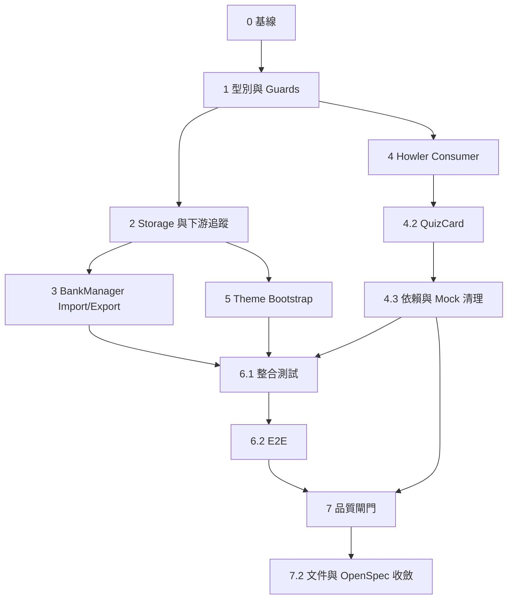

# 執行任務：P1 資料完整性與執行期防禦硬化

> 執行順序固定為：型別／runtime contract → guard 實作 → storage 與匯入入口 → 前端音效 consumer → HTML bootstrap → 測試 → 全量品質閘門。每項任務不得以 `any`、`.skip`、`.only` 或修改既有 assertion 逃避驗證。

### 0. 基線與安全邊界

- [x] **0.1 建立變更前基線與隔離測試資料**
  - **依賴**：無；所有後續任務的前置。
  - **範圍**：記錄 `npx tsc --noEmit`、受影響 Vitest、`npm run build` 現況；確認測試只使用 jsdom mock localStorage，不操作正式 `mindspark_*` 使用者資料；保存 `package.json`／`package-lock.json` 依賴基線。
  - **自動驗證**：`npx tsc --noEmit`；`npm test -- --run src/__tests__/autoAdvance.test.tsx src/__tests__/remediateBypass.challenger.test.ts`。
  - **DoD**：基線命令結果與測試資料隔離規則記入本 change 的執行紀錄；無任何正式 localStorage 清除或 migration。
  - **回滾**：若基線命令無法執行，停止後續 runtime 編輯並保留新 change artifacts；不可用破壞性清理「修復」基線。

## 1. 型別與共用 Runtime Contract

- [x] **1.1 定義 quiz feedback contract 並確認 Question schema**
  - **依賴**：0.1。
  - **範圍**：在既有型別模組（優先 `types.ts` 或 `types/battleTypes.ts`）定義 `QuizFeedbackKind = 'correct' | 'wrong'`；核對 `Question` 必要欄位與既有 `userAnswerMap` optional 相容性，不新增假資料或重寫題目 schema。
  - **自動驗證**：`npx tsc --noEmit`；型別測試以 `tsc` 驗證 consumer 僅接受兩種 feedback 值。
  - **DoD**：沒有 `any`；Hook 與 QuizCard 共用同一型別；既有公開 API 不被不必要改名。
  - **回滾**：若型別造成既有測試大量 cascade failure，還原新增 type alias，先以既有 literal type 保持行為，禁止把型別改成 `any`。

- [x] **1.2 擴充 `utils/typeGuards.ts` 的 unknown guards**
  - **依賴**：1.1。
  - **範圍**：新增 `isQuestion` 與 `parseQuestions`，`isRecord` 採模組私有內聯以簡化公開 API (Ponytail)；`isQuestion` 嚴格驗證 id（字串或有限數值，含 `id: 0`）、question、options、answer（單選/多選答案必須包含於 options 中，排除死鎖題目），可選欄位容許 `undefined` 或空字串；保留既有 `isMultipleAnswer` 語意與簽名。`parseQuestions(value: unknown, source?: string)` 採可選 source，對無效項目以警告隔離並設 5 則上限後聚合，防範日誌洪泛，警告不得輸出答案全文或 secrets。
  - **自動驗證**：新增 `src/__tests__/typeGuards.test.ts`，覆蓋合法 single/multiple、null、空 options、非字串 option、答案不在 options 之死鎖攔截、`id: 0`、可選空字串、混合陣列、超過 5 則警告之聚合輸出。
  - **DoD**：所有輸入為 `unknown`；不使用 unsafe cast 繞過檢查；單元測試證明不會拋出到 render path；無不必要之孤兒 export。
  - **回滾**：若合法歷史題目被誤判，先以 fixture 鎖定欄位差異並縮窄修正；不可直接移除 guard 或把 parse 結果 cast 為 `Question[]`。

## 2. Storage 反序列化與資料流閉環

- [x] **2.1 將 `services/storage.ts` 的題庫讀取與寫入接到共用 guard**
  - **依賴**：1.2。
  - **範圍**：`getQuestions` 對 localStorage raw JSON 執行 parse-as-unknown → `parseQuestions`；`saveQuestions` 寫入入口同樣加入防禦門禁，只持久化有效題目，更新題庫 metadata 時 `questionCount` 精準等於有效題目數，傳入全為無效資料時拒絕寫入；legacy bank migration 的 `questionCount` 以合法題目數計算，不以不可信 `.length` 計數。
  - **自動驗證**：新增／更新 storage 單元測試，覆蓋損毀 JSON、非陣列、混合題目、寫入端過濾與全無效拒收、legacy migration；確認回傳值永遠是 array。
  - **DoD**：讀取與寫入雙向閉環防禦；下游 `QuizContext`、repository、quiz engine 收到的 bank data 都是合法 `Question[]`；不改 localStorage key、同步 schema 或 Supabase schema。
  - **回滾**：若 storage regression 影響既有 bank 載入或寫入，回退本 task 的接線但保留獨立 guard tests；不得清除或重寫使用者 bank。

- [x] **2.2 追蹤 Source → Cache → Context → Engine 的下游防護**
  - **依賴**：2.1。
  - **範圍**：檢查 repository／`RepositoryContext`／`QuizContext`／`useQuizEngine` 的題庫消費點，不新增重複 guard；確認入口過濾後 `.map()`、`.join()`、選項洗牌與作答判斷只接收有效資料；必要時補安全空陣列分支。
  - **自動驗證**：針對 malformed localStorage 的整合測試，從 `getQuestions` 走到 quiz pool／QuizCard render；`npx tsc --noEmit`。
  - **DoD**：入口阻斷能保護所有已識別下游；沒有孤兒 parser 或只在單一 UI 行修條件的狹隘 patch。
  - **回滾**：若發現另一個直接反序列化入口，將其列為本 change 的相鄰修正並補測；若無法安全修正，保留安全 fallback 並阻斷該資料流，不放寬型別。

## 3. BankManager 匯入與匯出

- [x] **3.1 加入 BOM 清洗與嚴格匯入 gate 及 UI 回饋**
  - **依賴**：2.1。
  - **範圍**：`components/BankManager.tsx` 的 `processJson` 先執行 `^\uFEFF+` 清洗，再 parse unknown → `parseQuestions` → 既有 `normalizeImportedQuestions`／`planQuestionImport`；全無效時不開 confirm、不 save、不更新 parent；若部分題目被略過，Toast 提示：「成功匯入 X 題，已自動略過 Y 題格式不符題目」；保留 append/merge/replace 行為。
  - **自動驗證**：匯入測試覆蓋 BOM、無效 JSON、root object、部分有效（驗證 Toast 包含成功與略過題數）、全無效；spy `repository.saveQuestions`、`onUpdateQuestions` 與 toast/error。
  - **DoD**：合法 BOM 檔與無 BOM 檔產生等價 import；無效題目以 warn 隔離；既有 confirm 仍是唯一寫入前門戶；UI 明確告知使用者略過題數。
  - **回滾**：若既有匯入模式行為改變，回退 processJson 接線並保留 guard；不得改動 `questionIdentity` 去掩蓋入口問題。

- [x] **3.2 將題庫匯出改為 Blob URL、延遲釋放並加入連點防抖**
  - **依賴**：3.1。
  - **範圍**：`handleExport` 使用 `Blob({ type: 'application/json;charset=utf-8' })`、`URL.createObjectURL`、既有檔名與 anchor click；透過 `setTimeout(() => URL.revokeObjectURL(url), 1000)` 延遲 1000ms 釋放，兼顧 Firefox/WebKit 等非同步下載啟動相容性；匯出觸發後加入 1000ms 暫態 disabled 或防抖狀態；移除 Data URI／`encodeURIComponent` 路徑。
  - **自動驗證**：mock Blob、create/revokeObjectURL、anchor click/remove；確認 payload 為完整 JSON、在定時器到期後 revoke 恰好執行一次；模擬 5 次快速連擊確認僅建立一個 Object URL；加入 createObjectURL throw 的錯誤降級測試。
  - **DoD**：大型題庫不建立 Data URI；URL 每次匯出都於延遲後 revoke；連點不產生多餘 URL；題目 state 不被修改；瀏覽器 API 失敗不造成白屏。
  - **回滾**：若特定瀏覽器無 Blob URL，回退只限 export implementation 並保留錯誤提示；不得恢復無上限 Data URI 作為默認方案。

## 4. Howler 音效統一與依賴清理

- [x] **4.1 擴充 `useSoundEffects` 的 quiz feedback 常駐單例 consumer**
  - **依賴**：1.1、0.1。
  - **範圍**：在 `hooks/useSoundEffects.ts` 增加 `playQuizFeedback(QuizFeedbackKind)`；沿用 `STORAGE_KEYS.SFX_ENABLED` 與既有 `isSfxEnabled`；quiz cue 使用 Howler 模組級常駐單例（Lazy Singleton）、載入／播放失敗 warn + no-op；cleanup 停止播放中之音效（`stop()`），但保持解碼緩衝區常駐（不調用 `unload()`），消除切題延遲與記憶體重複解碼開銷 (Ponytail)；不影響 battle singleton。
  - **自動驗證**：Hook 測試覆蓋 enabled/disabled、correct/wrong、Howler throw、unmount stop 與快取保留；`npx tsc --noEmit`。
  - **DoD**：新方法有生產 consumer（4.2），沒有只定義不使用的 API；所有音效失敗不影響 answer flow；切題音效無重新加載延遲；不新增第二個 SFX localStorage key。
  - **回滾**：若音效 cleanup 與既有 battle lifecycle 衝突，回退 quiz cue instance 管理並保留 consumer signature，修正生命週期後再接回；不可恢復 use-sound。

- [x] **4.2 將 `QuizCard` 接到全域 Howler SFX**
  - **依賴**：4.1。
  - **範圍**：移除 `use-sound` import、`soundEnabled` 本地 state 與 local players；在原答對／答錯事件呼叫 `playQuizFeedback('correct'|'wrong')`；不改 auto-advance、battle presentation 或 answer state。
  - **自動驗證**：更新 `autoAdvance.test.tsx` 與相關 QuizCard tests mock `useSoundEffects`，確認正誤各呼叫一次、disabled 不呼叫播放；執行受影響測試。
  - **DoD**：QuizCard 無孤立音效狀態；全域 toggle 立即決定答題提示音；既有作答、戰鬥與自動切題 assertions 原樣通過。
  - **回滾**：若作答回呼時序回歸，回退 consumer 呼叫位置而保留 Hook contract；不得新增第三套播放器。

- [x] **4.3 移除 `use-sound` 依賴與孤兒 mocks**
  - **依賴**：4.2。
  - **範圍**：從 `package.json` 移除 `use-sound`，以 npm 更新 `package-lock.json`；刪除 `autoAdvance.test.tsx`、`remediateBypass.challenger.test.ts` 的 `vi.mock('use-sound')`；全庫搜尋確認沒有 source/test/manifest/lockfile 殘留。
  - **自動驗證**：`npm install --package-lock-only` 或等價鎖檔驗證；PowerShell `Select-String -Path (Get-ChildItem -Recurse -File) -Pattern 'use-sound'` 針對 source/test/package 檔案零命中；`npm test -- --run`。
  - **DoD**：依賴樹無 `use-sound`；Howler 是唯一答題音效實作；不修改無關套件版本。
  - **回滾**：若 lockfile 產生非必要大範圍 churn，還原 lockfile 機械變更後用 npm 版本一致的 uninstall 重做；不得手寫半套 lockfile。

## 5. Dark mode FOUC

- [x] **5.1 在 `index.html` head 加入防禦型 theme bootstrap**
  - **依賴**：2.1（確認 key 與合法 theme 語意）；可與 4.x 平行但合併前依賴 0.1。
  - **範圍**：在 root/module 前的 `<head>` inline script 讀 `mindspark_theme`；接受 light/dark/system；system 讀 matchMedia；所有 storage／DOM／media 例外 fail-open 到 light；不新增 runtime state 或改 CSP 允許範圍。
  - **自動驗證**：bootstrap DOM 測試覆蓋 dark、light、system match/mismatch、無效值、storage throw、matchMedia unavailable/throw；確認 script 位於 module 前。
  - **DoD**：初次 module render 前已有正確 `dark` class；React ThemeProvider mount 後可正常接管；inline script 無 `any`／外部資料／阻塞性 throw。
  - **回滾**：若 CSP／瀏覽器行為不相容，移除 bootstrap script 即回到既有 ThemeContext；保留測試以重現失敗，不改 ThemeProvider 作為繞過。

## 6. 端到端與回歸驗證

- [x] **6.1 建立本變更的整合測試矩陣**
  - **依賴**：3.1、3.2、4.2、5.1。
  - **範圍**：補齊或新增測試檔：`questionDataIntegrity.test.ts`、`bankManagerImportExport.test.tsx`、`quizAudio.test.tsx`、`themeBootstrap.test.ts`；涵蓋 Source → cache → context → engine 的 malformed data，答案包含性與 `id: 0` 邊界，`saveQuestions` 寫入過濾與拒絕，警告上限 5 則聚合，匯入 Toast 成功／略過題數提示，匯出 1000ms 延遲釋放與連點防抖，Howler 常駐單例無延遲，音效 toggle 與初次 paint。
  - **自動驗證**：`npm test -- --run`；不得 skip、only 或改弱既有 assertion。
  - **DoD**：每項新增／修改 behavior 至少一個正向與一個負向測試；mock storage 使用獨立 keyspace；無正式資料操作。
  - **回滾**：若測試暴露實作缺陷，回到對應上游任務修正並重跑同一測試檔；不得刪測試或放寬斷言。

- [x] **6.2 執行瀏覽器 smoke／必要 E2E 驗證**
  - **依賴**：6.1。
  - **範圍**：以 Playwright 驗證題庫 BOM import、Blob download、答對／答錯音效開關不阻塞作答、dark/system 初次載入；下載與 storage 使用隔離 context。
  - **自動驗證**：`npm run test:e2e -- --grep "import|audio|theme"`；若既有 E2E 無對應標籤，使用專用 spec 或 Playwright CLI smoke，不改正式資料。
  - **DoD**：功能消費者真正呼叫新增 contract；沒有只測 mock 而未測 UI wiring 的孤兒端點；desktop/mobile 至少各一 viewport。
  - **回滾**：若 Windows Playwright server teardown 問題阻塞，改用既有 direct Chromium helper／單次測試，不跳過功能驗證；記錄環境限制。

## 7. 品質閘門、文件與收斂

- [x] **7.1 執行全量品質閘門與設計／任務雙向覆蓋核對**
  - **依賴**：6.2、4.3。
  - **範圍**：逐項核對 `design.md` 的 D1-D6、資料流、rollback、non-goals 已在 tasks／specs 落地；執行完整 gate。
  - **自動驗證**：`npx tsc --noEmit`；`npm test -- --run`；`npm run lint`；`npm run build`；`npx knip --reporter compact`；搜尋 `use-sound`、新增 `any`、`.skip`、`.only`。
  - **DoD**：全量通過；沒有新增死碼、孤兒 export、未清理 legacy mock 或 lockfile 殘留；tasks 逐項可標記完成。
  - **回滾**：任何 gate 失敗只回到最近一個相關任務修正；不得在尾端進行跨模組大改或靜默忽略失敗。

- [x] **7.2 更新專案追蹤文件並標記 OpenSpec 狀態**
  - **依賴**：7.1。
  - **範圍**：更新 `CHECKLIST.md` 的本次 P1 計畫狀態與 `docs/DEVELOPMENT_LOG.md` 的變更紀錄；實作完成後才把本檔案對應項目標記 `[x]`，規劃階段保持 `[ ]`；必要時更新 `MEMORY.md` 的 durable fact／risk。
  - **自動驗證**：檢查文件連結存在、change 目錄包含 proposal/design/specs/tasks；`openspec status --change p1-data-integrity-and-runtime-hardening`。
  - **DoD**：文件不宣稱尚未實作的功能已完成；OpenSpec verify 前 tasks 狀態與實際 gate 一致；無新增 `GEMINI.md` 或重複 memory。
  - **回滾**：若文件狀態與 runtime 不一致，回退文件標記並重新核對 gate，不回退程式碼或刪除歷史紀錄。

## 依賴順序總覽



## 最終全自動驗證指令

```powershell
npx tsc --noEmit
npm test -- --run
npm run lint
npm run build
npx knip --reporter compact
Select-String -Path package.json,package-lock.json,components, hooks, services, utils, src, index.html -Pattern 'use-sound|\.skip\(|\.only\(' -AllMatches
openspec status --change p1-data-integrity-and-runtime-hardening
```

完成所有 DoD 後，本變更才具備 apply-ready 條件；實作階段不得先標記 tasks 為 `[x]`，也不得在未驗證前 archive。
