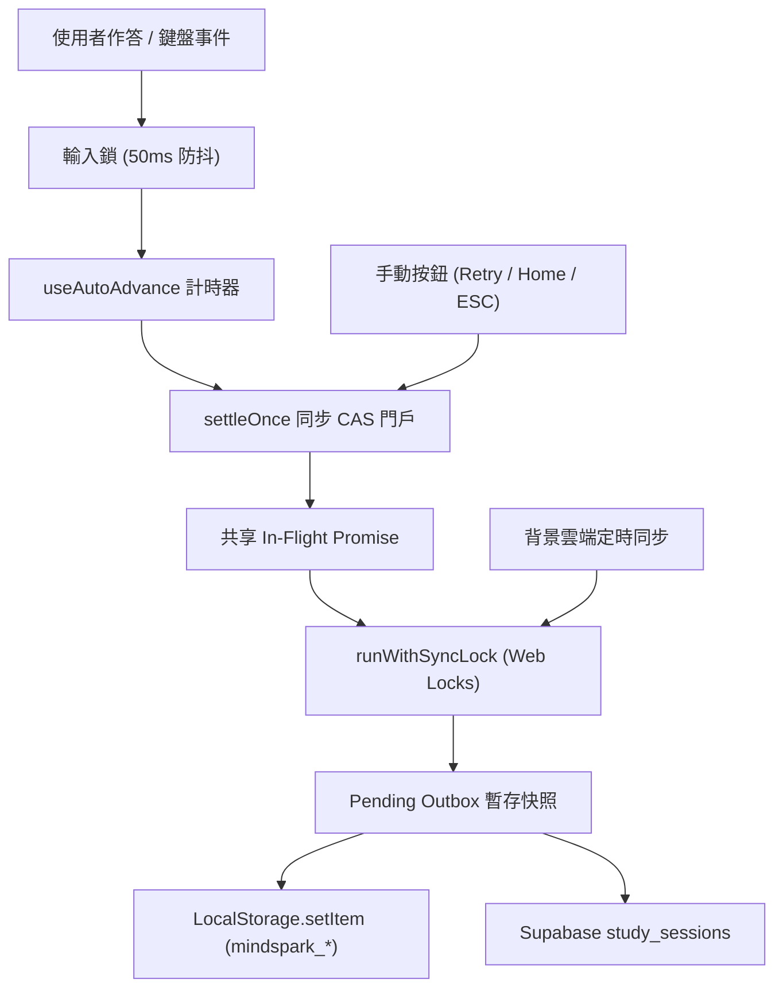

# Performance Benchmark Specification: p1-learning-experience-and-stats

> **Generated by**: Plan Stress Test v2.0 — Deep Analysis Engine (Supercharged SPA Edition)
> **Date**: 2026-09-29
> **Change Scale**: Large `[L]`
> **Architecture Focus**: Client-Side Single Page Application (Vite + React 18 + Tailwind CSS + Web Locks + LocalStorage + Supabase)

---

## 1. Performance Objectives & Service Level Objectives (SLOs)

由於本系統為高互動的前端 SPA 應用，傳統伺服器端「請求/秒 (Throughput)」指標無法準確反映使用者體驗。因此全面採用 **「使用者旅程流暢度、微動效延遲、持久化無損率與主執行緒健康度」** 作為核心 SLO 指標。

### 1.1 Service Level Objectives (SLOs)

| Metric | Target | Warning Threshold | Critical Threshold | Measurement Method |
|---|---|---|---|---|
| **首頁可互動耗時 (Dashboard TTI)** | `p95 < 1200ms` | `> 1800ms` | `> 3000ms` | Playwright Navigation to First Usable Control |
| **作答即時三態渲染延遲** | `p95 < 50ms` (一幀內) | `> 100ms` | `> 250ms` (明顯卡頓) | `performance.mark` 封裝作答狀態更新至 DOM 落地 |
| **自動切題計時偏差 (Auto-Advance Precision)** | `800ms ± 15ms` 內 | `> ±50ms` | `> ±150ms` | 高精度 `performance.now()` 差值採樣 |
| **戰鬥動畫演出協調推進** | 動畫結束後 `400ms ± 20ms` | `> ±60ms` | `> ±150ms` | 演出 Promise 解決至 `onNext` 呼叫間隔 |
| **戰鬥動畫丟失兜底逾時** | `2000ms ± 25ms` 準確強制推進 | `> 2100ms` | `> 2500ms` 或死鎖凍結 | 模擬未觸發回呼時的強制切題計時器 |
| **本地結算確認時延 (Local Settlement)** | `p95 < 50ms` (含 Web Locks) | `> 150ms` | `> 300ms` | `settleCurrentSession` 調用到本地持久化確認 |
| **雲端結算同步時延 (Cloud Sync)** | `p95 < 1200ms` | `> 2500ms` | `> 5000ms` | Supabase Mock / Staging 異步端到端計時 |
| **結算重複率 (Duplicate Settlement Rate)** | **嚴格 0 筆** (per 10,000 次) | `> 0` | 任何可復現重複 | 以唯一 `sessionId` 聚合對帳校驗 |
| **結算丟失率 (Persistence Loss Rate)** | **嚴格 0%** (0 容忍) | `> 0%` | 任何非預期丟失 | 注入故障前後的對帳快照比對 |
| **FocusTimer 完成回呼觸發率** | **100.0%** (不被 5s 誤殺) | `< 100%` | 任何專注漏算 | 完成計時器與統計接收計數器雙向校驗 |
| **無障礙標籤覆蓋率 (a11y Announcement)** | **100.0%** | `< 100%` | 缺失 ARIA 標籤 | Playwright axe-core 自動化無障礙掃描 |

### 1.2 瀏覽器端資源預算 (Resource Constraints)

| Resource | Baseline Budget | Peak Budget | Hard Limit | Alert Threshold |
|---|---|---|---|---|
| **主執行緒長任務 (Long Tasks > 50ms)** | `0 次 / 10 題` | `<= 1 次 / 10 題` | `單次 > 150ms` | 任何 `> 50ms` |
| **JS Heap 記憶體淨增長 (100 輪測驗循環)** | `< 1.0MB / 小時` | `< 3.0MB / 小時` | `> 10MB` (記憶體洩漏) | `> 5MB` |
| **LocalStorage 寫入延遲** | `p95 < 10ms` | `p95 < 25ms` | `> 100ms` | `> 35ms` |
| **Supabase 並發寫入佇列** | `<= 2 / session` | `<= 5 (並發同步時)` | `> 15` 佇列堆疊 | 佇列深度 `> 8` |
| **結算頁 DOM 節點數量 (50 題回顧)** | `<= 400 節點` | `<= 1200 節點 (200 題)` | `> 2500 節點` | `> 1500 節點` |

---

## 2. Benchmark Scenarios (六大基準與壓力情境)

### Scenario A: Cold Start (冷啟動加載 100 道錯題)
- **測試目標**：檢驗全新 Chromium 乾淨環境下，加載大量錯題對比時的渲染效能與首繪流暢度。
- **配置條件**：
  - Fresh Chromium context，快取為空，注入 100 道題庫（其中 50 道錯題，包含單選與多選混合）。
- **度量指標**：
  - 導航至結果頁的第一時間 Meaningful Paint (FMP)：`< 1200ms`。
  - 50 道錯題三態標籤與 ARIA 屬性完整建構：`< 25ms`。
- **通過標準**：無任何長任務（Long Task > 50ms），頁面可立即 60fps 平滑滾動，30 次冷啟動成功率 100%。

### Scenario B: Baseline Steady-State (常規測驗心流穩定態)
- **測試目標**：模擬真實使用者在開啟「答對自動切題」下的標準刷題心流。
- **測試流程**：
  - 5 個並發瀏覽器 Context，執行 15 分鐘持續測驗。
  - 節奏：60% 答對（800ms 自動切題）、20% 答錯（停留看解析）、10% 重試錯題、10% FocusTimer 專注。
- **通過標準**：
  - 定時器偏差嚴格在 `800ms ± 15ms` 內。
  - 結算零重複、零丟失。
  - 15 分鐘運行後 JS Heap 保持水平平穩。

### Scenario C: Peak Load & Rapid Fire (極速連擊與並發退出)
- **測試目標**：模擬極速作答、手動快捷鍵狂按與連續連擊「重試錯題」下的狀態機韌性。
- **測試流程**：
  - 在 500ms 內以鍵盤快速連擊作答 20 題。
  - 在結果頁以每秒 5 次的頻率快速連擊「重試錯題」按鈕與 Enter 鍵。
- **通過標準**：
  - 觸發同步 CAS 門戶，20 題僅產生 1 筆合法的結算紀錄。
  - 手動按 Enter 瞬間 100% 取消計時器，無連跳兩題現象。
  - 無未捕獲的 Promise 異常。

### Scenario D: Sustained Stress / Soak Test (2 小時長時浸泡測試)
- **測試目標**：排查計時器洩漏、未清理的 Event Listeners 與記憶體退化。
- **測試流程**：
  - 2 小時持續循環：執行 10 題測驗 → 進入結算 → 重試錯題 → 啟動 25 分鐘 FocusTimer → 切換路由。
  - 每 60 秒採樣一次 DOM 節點數、JS Heap Snapshot 與活躍定時器數量。
- **通過標準**：
  - 排除前 20 分鐘 JIT 預熱後，記憶體增長 `< 1MB / 小時`。
  - 元件卸載後回呼觸發次數為 **嚴格 0 次**。
  - 累計 500 筆 session 歷史記錄後，`getStudyStats` 聚合耗時依舊 `< 15ms`。

### Scenario E: Chaos & Fault Injection (深層故障與混亂注入)
- **注入項目 1：LocalStorage Quota Exceeded (儲存滿額)**
  - 在 LocalStorage 預填 4.9MB 資料，使 `setItem` 拋出 `QuotaExceededError`。
  - **驗收標準**：`settleCurrentSession` 異常被捕獲並隔離，記錄寫入 Pending Outbox，導航回呼 100% 成功執行，畫面不卡死。
- **注入項目 2：Supabase 5s 逾時與連線拒絕**
  - Mock Supabase 網路延遲 5 秒並返回 500 / 400 錯誤。
  - **驗收標準**：本地 LocalStorage 立即在 50ms 內完成確認，雲端寫入被標記為 retryable，無重複記錄，UI 不阻塞。
- **注入項目 3：戰鬥打擊動畫回呼永久丟失**
  - 答對戰鬥題目後，故意攔截 `completePresentationEvent` 使其永不解決。
  - **驗收標準**：在 2000ms safety deadline 到期瞬間，系統強制推進下一題，畫面絕不凍結。
- **注入項目 4：定時器在 100ms / 400ms / 799ms 極限卸載**
  - 在自動切題排程進行中，分別於 100ms、400ms、799ms 觸發路由離開或按 ESC。
  - **驗收標準**：定時器立即被 `clearTimeout` 釋放，卸載後無任何 `setState` 或越界 `onNext` 呼叫。
- **注入項目 5：延遲寫入期間登出切換身分**
  - 在結算非同步排隊期間，立即切換登入身分。
  - **驗收標準**：舊 Session 鎖定原 `sessionOwnerId`，拒絕寫入新使用者帳戶，杜絕跨帳號污染。
- **注入項目 6：背景分頁節流掛起 (Page Visibility)**
  - 答對後立即切換至其他瀏覽器分頁，等待 30 秒後切回。
  - **驗收標準**：切回前景時不發生突發暴衝跳題，流暢維持或手動等待。

### Scenario F: Data Scale Progression (巨量歷史數據階梯)

| 歷史數據規模 | `getStudyStats` 預期耗時 | `getDailyStats` 預期耗時 | 驗收規範與防禦標準 |
|---|:---:|:---:|---|
| **100 rows** / 10 題 | `< 5ms` | `< 5ms` | 基線效能，無感聚合 |
| **1,000 rows** / 100 題 | `< 15ms` | `< 15ms` | 線性成長，0 題專注記錄完全排除於勝率分母 |
| **10,000 rows** / 500 題 | `< 35ms` | `< 40ms` | 近 30 天日期分組正確，無長任務阻塞 |
| **100,000 rows** / 1K 題 | `< 150ms` | `< 200ms` | 必須啟動分塊或 Web Worker 異步聚合計算預警 |
| **1,000,000 rows** | 基準測試極限 | 基準測試極限 | 禁止凍結瀏覽器，提供歸檔與伺服器聚合降級方案 |

---

## 3. Warm-up & JIT Expectations

1. **V8 Monomorphic 存取優化**：
   - `wrongAnswerMap` 使用 `Record<string, string | string[]>`。為避免 V8 引擎在頻繁讀寫中退化為 Megamorphic，存取包裝統一由型別守衛負責：
     ```ts
     export function extractUserAnswer(
       map: Record<string, string | string[]> | undefined,
       questionId: string
     ): string | string[] | undefined {
       if (!map) return undefined;
       return Object.prototype.hasOwnProperty.call(map, questionId) ? map[questionId] : undefined;
     }
     ```
2. **多選題集合運算靜態化**：
   - 選項三態標籤運算提升為純函式，避免在 `QuizResult` 每次元件 rerender 時重新分配記憶體或構造大量 Set 物件。

---

## 4. Memory Leak Detection Protocol

### 4.1 四維指標檢驗清單
1. **JS Heap 穩定性**：執行 Scenario D 浸泡測試 2 小時，剔除前 20 分鐘後，每小時淨增長不得超過 `1.0MB`。
2. **DOM 節點回收**：離開測驗結算頁回到 Dashboard 後，DOM 節點總數必須完全回落至基線值（容差 `< 1%`）。
3. **活躍計時器歸零**：測驗完成或中途退出後，瀏覽器 active timer count 必須恢復為基線，無孤兒定時器。
4. **非同步 Promise 結清**：In-Flight Promise 必須在結算結束後被清空，無懸掛（hanging）Promise。

### 4.2 Playwright 自動化記憶體檢驗腳本規範
```ts
// e2e/benchmarks/memory-leak.spec.ts
test('Verify 50 quiz cycles do not leak memory or timers', async ({ page }) => {
  await page.goto('/#/');
  await page.waitForLoadState('networkidle');
  
  // 觸發手動垃圾回收 (需在啟動 Chromium 時帶 --js-flags="--expose-gc")
  await page.evaluate(() => window.gc && window.gc());
  const initialHeap = await page.evaluate(() => (performance as any).memory?.usedJSHeapSize);

  for (let cycle = 0; cycle < 50; cycle++) {
    await startQuiz(page);
    await completeQuizWithAutoAdvance(page);
    await page.click('#home-button');
    await page.waitForSelector('#dashboard-view');
  }

  await page.evaluate(() => window.gc && window.gc());
  const finalHeap = await page.evaluate(() => (performance as any).memory?.usedJSHeapSize);
  const heapGrowthMB = (finalHeap - initialHeap) / (1024 * 1024);

  // 斷言：50 輪循環淨增長小於 2.0MB
  expect(heapGrowthMB).toBeLessThan(2.0);
});
```

---

## 5. Resource Contention Map



- **核心互斥邊界**：
  1. **記憶體級互斥**：由 `settleOnce` 透過 CAS 門戶與 `inFlightPromise` 攔截同一頁面內的連擊。
  2. **跨分頁與儲存級互斥**：由 `runWithSyncLock` 透過瀏覽器原生 Web Locks API 解決跨分頁與背景雲端同步競爭。

---

## 6. Graceful Degradation & Overload Curves

| 負載狀態 | 觸發條件 | 降級行為 (Degradation Behavior) | 恢復機制 |
|---|---|---|---|
| **綠色正常** | 正常運作 | 標準 800ms 切題 + 戰鬥動畫全開 + 雲端即時同步 | - |
| **黃色中度** | 低端設備掉幀 (FPS < 40) | 自動簡化攻擊動畫特效，維持 800ms 精準切題 | 幀率穩定 5 秒後恢復動效 |
| **橙色重度** | 雲端同步失敗 / 網路離線 | 轉入 Local-First 離線模式，記錄留於 Pending Outbox | 監測到 `online` 事件自動重試同步 |
| **紅色極限** | LocalStorage 滿額 (Quota Exceeded) | 異常隔離保障導航順暢，以記憶體模式運行並跳出清理提示 | 空間釋放後恢復寫入 |

---

## 7. Capacity Planning & Projections (3 / 6 / 12 個月規劃)

| 指標維度 | 成長預設 | 3 個月規模 | 6 個月規模 | 12 個月規模 | 架構擴展觸發條件 (Scale-Up Trigger) |
|---|---|---|---|---|---|
| **單一使用者累計 Session 數** | +150 筆 / 月 | 450 筆 (~135KB) | 900 筆 (~270KB) | 1,800 筆 (~540KB) | 累積 `> 5,000` 筆或查詢 `> 50ms` 時啟動分頁 |
| **每日產生 Session 總量** | +25% / 月 | 1.95x | 3.81x | 14.55x | 雲端寫入隊列平均等待 `> 3 秒` |
| **單次結果頁選項數量** | 題庫擴充 | 50 選項 | 100 選項 | 300 選項 | 單視圖節點 `> 1,500` 時引入虛擬列表 (Virtualization) |
| **LocalStorage 佔用率** | 穩定增長 | ~20% 配額 | ~35% 配額 | ~60% 配額 | 空間使用率 `> 70%` 時啟動歷史記錄月度聚合歸檔 |

---

## 8. Complete Benchmark Harness Specification

### 8.1 測試執行環境要求
- **OS**: Windows 11 / macOS / Ubuntu
- **Node.js**: v20+ LTS
- **瀏覽器**: Chromium (由 Playwright 鎖定版本)
- **編譯模式**: **必須以 Vite Production Preview (`npm run build && npm run preview`) 運行基準測試**，嚴禁用開發伺服器（Dev Server）進行效能度量。
- **測試隔離鐵規**：測試資料必須使用獨立的 LocalStorage 前綴與 Supabase 測試隔離命名空間，絕對禁止觸碰任何真實使用者正式資料。

### 8.2 執行指令集 (PowerShell)
```powershell
# 1. 執行單元層級高精度計時與演算法基準測試
npm test -- src/__tests__/benchmark.test.ts

# 2. 執行 E2E 端到端流暢度、記憶體洩漏與無障礙基準套件
npx playwright test e2e/p1-learning-experience.spec.ts --project=chromium --headed=false
```

### 8.3 通過判定標準 (Pass/Fail Gate)
1. ✅ **自動切題精度**：10 題基準測驗延遲誤差嚴格在 `800ms ± 15ms` 內。
2. ✅ **持久化無損**：所有退出路徑零重複、零丟失（Duplicate = 0, Loss = 0%）。
3. ✅ **FocusTimer 100% 留存**：1~4 秒短時專注 100% 成功沉澱至統計，不被誤殺。
4. ✅ **故障隔離**：儲存滿額注入情境下 100% 成功跳轉導航，介面零卡死。
5. ✅ **無障礙達標**：axe-core 自動化檢測 0 項 critical / serious 違規。
