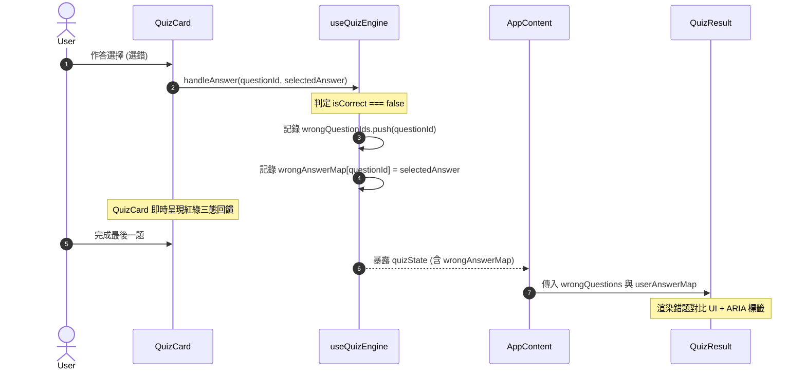
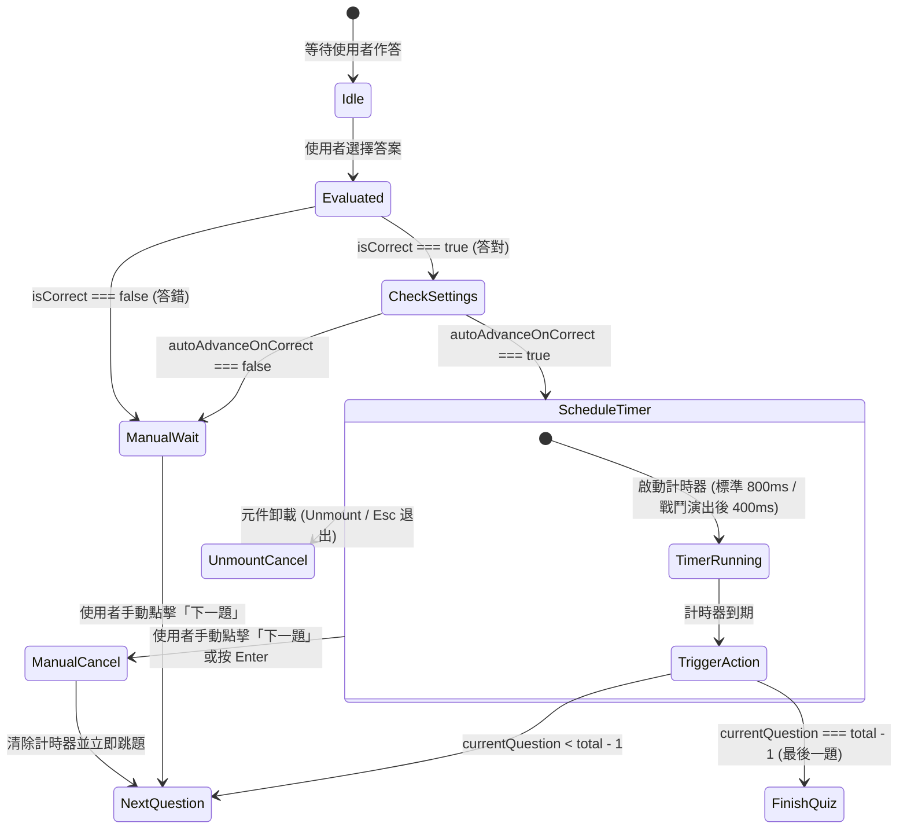

## Context

MindSpark P0 核心修復已全數歸檔（SM-2 入口打通、快捷鍵防劫持、UTC 時區、登出隔離、戰鬥佈局），代碼庫處於穩定基底。然而深入審計發現 5 項關鍵體驗與統計數據斷層：

1. **錯題缺乏使用者答題對照與無障礙支援**：
   - [QuizResult.tsx](file:///c:/Users/user/Desktop/Quiz-app-/components/QuizResult.tsx) 目前只顯示正確答案，註解直言「We don't know what user picked」。
   - 使用者無法對比自己的思維盲點，且僅依賴色彩提示未達 WCAG 無障礙要求。
   - 此外，`QuizCard` 在作答瞬間的視覺反饋也未提供一致的三態（正確、錯誤所選、中立未選）呈現。
2. **答對缺乏自動切題流暢感**：
   - 無論答對或答錯，使用者必須手動點擊或按鍵切題，打斷專注心流。
   - 缺乏對「最後一題自動結束」、「手動切題與自動計時器衝突消解」及「RPG 戰鬥打擊演出協調」的完整邊界處理。
3. **成就系統虛假繁榮與歷史髒資料隱患**：
   - 定義了 22 個成就，但 `useAchievementTracker.ts` 僅追蹤 4 個。其餘 18 個為無法觸發的幽靈成就。
   - 過去可能存在舊版解鎖紀錄殘留於 `localStorage`，若包含未知 ID 可能導致 UI 算錯進度或顯示異常。
4. **統計結算全路徑斷裂**：
   - `recordStudySession` 僅在測驗正常完成並點擊 `onHome` 時被觸發。
   - 點擊「重試錯題」(`onRetry`)、「重新開始」(`onRestart`)、按 ESC 中途退出、分段練習中途離開或在 `RestBreakModal` 中點擊「結束休息並退出」時，該輪學習的題數與時間全數遺失。
   - 連續點擊未設冪等性保護，易造成重複寫入。
5. **FocusTimer 專注數據孤島**：
   - Dashboard 渲染 `<FocusTimer />` 時未傳入 `onSessionComplete`，番茄鐘計時器完成的純學習時間未進入使用者的學習時長統計。
   - 需防範 0 題純專注時段對做題平均正確率的稀釋效應。

## Goals / Non-Goals

**Goals:**
- **G1 (錯題對比 & 無障礙)**：QuizResult 與 QuizCard 在答錯時，以紅/綠/中立三態對比呈現「你的選擇」與「正確答案」，並提供文字標籤與 ARIA 屬性（WCAG 2.1 AA 友善）。
- **G2 (自動切題 & 防衝突)**：Settings 提供 `autoAdvanceOnCorrect` 開關（支援舊設定自動相容）；答對時依模式自動推進（標準 800ms / 戰鬥模式動畫結束後 400ms，上限 2000ms）；最後一題自動進入結算；手動操作或 unmount 即時取消計時器。
- **G3 (成就純淨 & 容錯對齊)**：透過白名單機制隱藏 18 個幽靈成就，總數與進度準確對齊 4 個已實作成就；自動過濾歷史未知成就 ID；提供單元測試鎖定 Allowlist 與 Tracker 的 100% 雙向對齊。
- **G4 (統計結算閉環 & 冪等防禦)**：全路徑結算（`onHome`、`onRetry`、`onRestart`、`handleExitQuiz`、Chunked 練習退出、RestBreak 結束退出）；引入 session settlement token 與結算鎖防止重複計入；時間防禦下限為 1 秒。
- **G5 (FocusTimer 統計安全)**：Dashboard 綁定 FocusTimer 專注完成事件；寫入純專注時長；正確率計算過濾 0 題時段；雙軌相容（訪客與雲端）。

**Non-Goals:**
- 不擴展新的成就追蹤邏輯（僅做幽靈成就隱藏與清理，新增成就留待後續專屬變更）。
- 不調整 SM-2 間隔重複評分演算法核心（留待 P2）。
- 不重構獨立音效系統（Howler / Web Audio API 維持現狀）。
- 不重寫 Supabase 雲端資料庫架構（確保 0 題純時長寫入相容於現有 table schema 即可）。

---

## Architecture & Data Flow

### 1. 錯題對比資料流 (QuizEngine -> QuizResult)



### 2. 自動切題狀態機與衝突防護 (QuizCard Auto-Advance)



### 3. 全路徑結算資料流 (Study Session Settlement)

```mermaid
flowchart TD
    A[測驗進行中 / 結算介面] --> B{觸發退出路徑}
    B -->|點擊返回首頁 onHome| S[settleCurrentSession]
    B -->|點擊重試錯題 onRetry| S
    B -->|點擊重新開始 onRestart| S
    B -->|按 ESC / 點擊中途退出 handleExitQuiz| S
    B -->|Chunked Practice 完成或中途離開| S
    B -->|RestBreak 彈窗點擊結束並退出| S

    subgraph SettleGuard [結算冪等性與防護]
        S --> C{sessionStartTime != null?}
        C -- No --> End[安全結束 / 不重複結算]
        C -- Yes --> D{已答題數 > 0 或 時長 > 0?}
        D -- No --> Reset[重置 sessionStartTime = null]
        D -- Yes --> E[檢查 settlementToken 是否已被消耗]
        E -- 已消耗 --> End
        E -- 未消耗 --> F[計算 duration = Math.max(1, now - sessionStartTime)]
        F --> G[標記 token 消耗 / 清空 sessionStartTime]
        G --> H[呼叫 recordStudySession]
        H --> I[呼叫 trackQuizCompletion]
    end
    
    I --> J[執行後續動作: startQuiz / navigate / close]
```

---

## Detailed Design & Decisions

### D1：錯題選項對比、多選四態集合運算與無障礙 (Accessibility First)

**方案**：
1. **資料層**：
   - 在 `QuizState` 中新增 `userAnswerMap: Record<string, string | string[]>`。
   - `handleAnswer` 在答題判定時同步將 `userAnswerMap[questionId] = selectedAnswer` 記錄於 state；測驗啟動時重置為 `{}`。
2. **UI 渲染層 (`QuizResult.tsx`)**：
   - 接收 `userAnswerMap?: Record<string, string | string[]>`。
   - **單選題三態邏輯**：
     - **使用者錯誤選擇**：紅色高亮（`bg-red-500/10 text-red-600 dark:text-red-400 border-red-500/40`），前綴「`❌ 你的選擇: `」，標註 `aria-invalid="true"`。
     - **正確答案**：綠色高亮（`bg-green-500/10 text-green-600 dark:text-green-400 border-green-500/40`），前綴「`✅ 正確答案: `」，標註 `aria-label="正確答案"`。
     - **中立未選選項**：維持淡灰低調邊框（`opacity-60 border-slate-200 dark:border-slate-800`）。
   - **多選題四態集合運算模型**：
     - **選對 (True Positive, `User ∩ Correct`)**：綠色高亮 + 勾選圖示 + 前綴「`[已選/正確]`」與 `aria-label="正確且已選擇"`。
     - **錯選 (False Positive, `User \ Correct`)**：紅色高亮 + 叉叉圖示 + 前綴「`[❌ 你的選擇/錯誤]`」與 `aria-invalid="true"`。
     - **漏選 (False Negative, `Correct \ User`)**：琥珀/黃色虛線框 + 提示圖示 + 前綴「`[✅ 正確答案/漏選]`」與 `aria-label="正確答案但未選"`。
     - **中立 (True Negative, `Universal \ (User ∪ Correct)`)**：淡灰低調邊框。
   - **優雅降級**：若 `userAnswerMap` 未傳或缺失該題記錄，退化為僅顯示正確答案，嚴禁介面崩潰。
3. **即時作答反饋 (`QuizCard.tsx`)**：
   - 作答提交後，選項列表同步呈現對應狀態樣式，確保答題瞬間與結算回顧體驗完全一致。

### D2：答對自動切題、衝突消除與極簡內聚

**方案**：
1. **設定與資料安全**：
   - `UserSettings` 新增 `autoAdvanceOnCorrect?: boolean`。
   - `storage.ts` 的 `getUserSettings()` 加入 normalize 守衛：
     ```ts
     autoAdvanceOnCorrect: typeof stored.autoAdvanceOnCorrect === 'boolean' ? stored.autoAdvanceOnCorrect : false
     ```
2. **極簡內聚管理（Ponytail 減法，無需抽取獨立 Hook）**：
   - 全部定時排程由 `QuizCard.tsx` 內部 `timerRef: useRef<NodeJS.Timeout | null>` 與 `useEffect` 管理。
   - 普通模式：延遲 800ms。
   - RPG 戰鬥模式：監聽戰鬥演出狀態，若有 `activePresentationEvent` 進行中，等待動畫事件結束後再延遲 400ms；設定 2000ms safety deadline 兜底，防止動畫回呼丟失導致死鎖。
3. **邊界處理**：
   - **最後一題與單題保護**：檢查 `currentQuestionIndex >= totalQuestions - 1`，若為最後一題（或單題測驗 $N=1$），計時器觸發時直接調用測驗完成處理（進入結算階段），嚴禁呼叫越界的 `onNext()`。
   - **衝突消除**：在 `onNext` 按鈕點擊或 Enter 鍵按下時，一律先執行 `if (timerRef.current) { clearTimeout(timerRef.current); timerRef.current = null; }`，杜絕手動與自動雙重推進。
   - **生命週期清理**：`useEffect` 的 return cleanup 必須清除計時器。

### D3：成就系統白名單過濾與強型別雙向對齊

**方案**：
1. **常數定義**：
   - 在 `constants/achievements.ts` 定義已實作白名單：
     ```ts
     export const IMPLEMENTED_ACHIEVEMENT_IDS = new Set<string>([
       'perfect_score',
       'first_question',
       'night_owl',
       'early_bird'
     ]);
     ```
   - 保持 `ACHIEVEMENTS` 原始 22 個項目不刪減，為未來擴展保留元數據。
2. **消費端過濾與清洗**：
   - `AchievementsCard` 與 `AchievementsModal`：
     - 顯示總數計算：`const visibleAchievements = ACHIEVEMENTS.filter(a => IMPLEMENTED_ACHIEVEMENT_IDS.has(a.id));`
     - 總數由 22 改為 4。進度條百分比按 `unlockedInSet / visibleAchievements.length` 計算。
     - 本地儲存可能讀到的未知/廢棄 ID 直接忽略，不渲染也不計入已解鎖。
3. **強型別雙向對齊（廢除脆弱文本正則）**：
   - `hooks/useAchievementTracker.ts` 顯式導出 `TRACKED_ACHIEVEMENT_IDS = new Set<string>(['perfect_score', 'first_question', 'night_owl', 'early_bird'])`。
   - 單元測試直接比對 `IMPLEMENTED_ACHIEVEMENT_IDS` 與 `TRACKED_ACHIEVEMENT_IDS` 集合等價性，防止成就系統出現幽靈或遺漏。

### D4：統計結算全路徑閉環、兩階段 CAS 門戶與異常隔離

**方案**：
1. **封裝結算管理（內聚於 `AppContent.tsx`，直接調用 `analytics.ts`）**：
   - 引入兩階段 CAS 門戶標記：
     ```ts
     const isSettlingRef = useRef(false);
     const isSettledRef = useRef(false);
     const activeSessionTokenRef = useRef<string | null>(null);
     ```
   - 每次 `startQuiz` 產生新的 session token，並將 `isSettlingRef.current = false; isSettledRef.current = false;`。
   - 結算時若 `isSettlingRef.current || isSettledRef.current` 則立即返回（防連擊與非同步並發重入）。
   - 標記 `isSettlingRef.current = true;`，在 try-catch 中呼叫 `recordStudySession`；成功後標記 `isSettledRef.current = true; isSettlingRef.current = false;`；若拋出例外則重置 `isSettlingRef.current = false;` 保留重試能力。
   - **異常隔離 (Fault-Isolated Navigation)**：儲存失敗不阻礙 `onHome`/`onRetry`/`onRestart` 跳轉，保障使用者流暢操作。
2. **全退出路徑涵蓋**：
   - `onHome`：呼叫 `settleCurrentSession('home')` 後切換至首頁。
   - `onRetry`：呼叫 `settleCurrentSession('retry')` 後以錯題重新開始。
   - `onRestart`：呼叫 `settleCurrentSession('restart')` 後重新開始。
   - `handleExitQuiz`：在中途退出前呼叫 `settleCurrentSession('exit')`。
   - `ChunkedPractice`：分段完成或中途終止時呼叫結算。
   - `RestBreakModal`：點擊終止測驗時先結算再導離。
3. **時長與題數防禦**：
   - 測驗會話誤觸過濾：若為測驗會話且 `questionsAnswered === 0 && durationSeconds < 5`（誤開即關），安全忽略不記錄。
   - 時長計算：`const duration = Math.max(1, Math.round((Date.now() - sessionStartTime) / 1000));`。

### D5：FocusTimer 統計接入與生命週期安全

**方案**：
1. **Dashboard 綁定**：
   - `<FocusTimer onSessionComplete={handleFocusComplete} />`
2. **回呼行為**：
   - 僅在專注倒數完成（`mode === 'focus'` 且計時歸零）時觸發。
   - 呼叫 `recordStudySession(0, 0, durationSeconds)`。
   - 負向防禦：休息倒數完成、使用者中途手動重置/取消、元件 unmount 均嚴格禁止觸發回呼。
   - 防止 rerender 重複觸發：內部維護 `lastCompletedTimestampRef`，1 秒內相同時段不重複上報。
3. **統計隔離與底層放行**：
   - 底層 `recordStudySession` 與 `recordLocalStudySession` 介面契約明確允許 `questionsAnswered: 0` 且 `durationSeconds > 0` 的記錄寫入（不套用測驗專用的 5 秒誤觸過濾）。
   - 在 `services/analytics.ts` 的 `getStudyStats` 與 `getDailyStats` 中，勝率/正確率計算顯式過濾 `questionsAnswered === 0`：
     ```ts
     const validQuizSessions = sessions.filter(s => s.questionsAnswered > 0);
     const overallAccuracy = validQuizSessions.length > 0 
       ? totalCorrect / totalQuestionsAnswered 
       : 0;
     ```
   - 總學習時長累加全部 sessions（包含 FocusTimer 專注時段）。
   - 訪客模式與 Supabase 雲端資料庫雙軌相容。

---

## Migration & Rollback Strategy

1. **資料向下相容 (Backward Compatibility)**：
   - `UserSettings`：若無 `autoAdvanceOnCorrect`，自動 fallback 為 `false`。
   - `Achievements`：歷史舊資料若存在未在白名單中的 ID，UI 只做過濾顯示，不強制刪除使用者 localStorage，確保回滾時數據不丟失。
2. **回滾方案 (Rollback Plan)**：
   - 若上線後發現自動切題行為異常，使用者可在 Settings 關閉 toggle。
   - 若有任何嚴重迴歸，可直接還原本次變更的提交，所有 localStorage 資料欄位具備完全向上向下相容性。

---

## Risks & Mitigations

| 風險項目 | 潛在影響 | 緩解措施 |
|:---|:---|:---|
| **最後一題自動前進越界** | 拋出 index out of bounds 錯誤 | 在排程前與計時器回呼中雙重檢查 `currentQuestionIndex === totalQuestions - 1`，直接轉向 finished 狀態。 |
| **手動按 Enter 與自動切題雙重推進** | 連跳兩題，漏做題目 | 手動前進按鍵與按鈕監聽器最優先清除定時器引用 (`clearTimeout`)。 |
| **0 題 FocusTimer 記錄拉低平均勝率** | 儀表板正確率驟降，影響使用者積極性 | 在 `analytics.ts` 聚合計算中將 `questionsAnswered === 0` 記錄從勝率分母中排除，僅計入時長。 |
| **連點重試導致重複結算** | 統計數據被重複灌水 | 採用 Token-based 結算鎖，單一 session 僅允許一次結算消耗。 |
| **色弱使用者無法辨識錯題** | 不符合 WCAG 標準 | 增加顯式文字前綴（`❌ 你的選擇` / `✅ 正確答案`）與 ARIA 語義標籤。 |
| **戰鬥動畫未結束即切題** | 攻擊音效或特效被截斷 | 監聽 `activePresentationEvent` 完成狀態，並設 2000ms 兜底安全計時。 |
