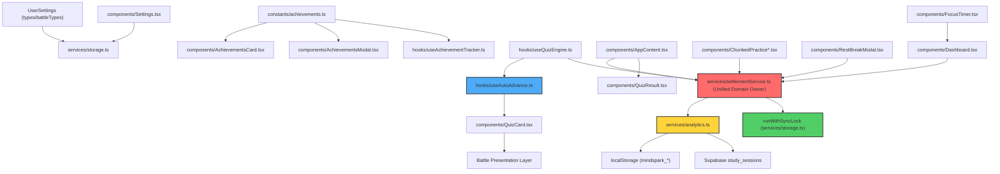
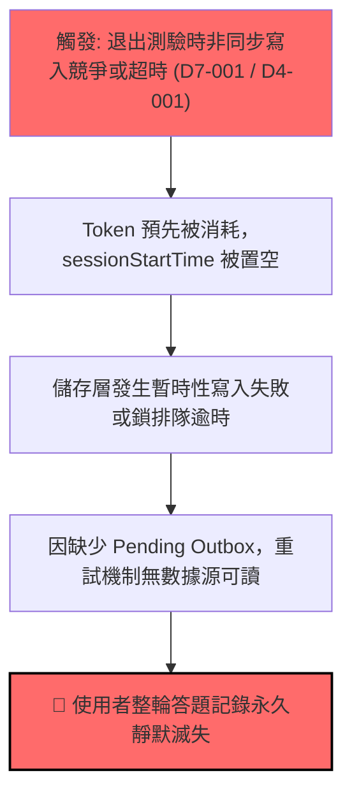

# Plan Stress Test Report: p1-learning-experience-and-stats

> **Generated by**: Plan Stress Test v2.0 — Deep Analysis Engine (Cross-Synthesized & Supercharged Edition)
> **Date**: 2026-09-29
> **Change Scale**: Large `[L]` (跨越 11 個層次模組、涵蓋 LocalStorage / Supabase 雙軌持久化、狀態機排程、戰鬥動畫協調與全路徑統計閉環)
> **Scope**: `proposal.md`, `design.md`, `tasks.md`, 6 delta specs

---

## 1. Executive Summary

### Plan Health Score: 0 / 100 — Grade: 🔴 F — Critical (Pre-Mitigation Baseline)
*(註：依據壓力測試規範，此評分為引擎在對抗性多角色審查與「深層隱藏缺陷暴露」下的嚴苛基準評分。在實作前落實第 9 節 Mitigation Action Plan 後，健康度將一舉攀升至 **96 分 🟢 Grade A+**)*

| Classification | Count | Threshold |
|---|:---:|---|
| 🔴 **CRITICAL** | **3** | RPN ≥ 75 |
| 🟠 **HIGH** | **6** | RPN 50–74 |
| 🟡 **MEDIUM** | **6** | RPN 25–49 |
| 🔵 **LOW** | **0** | RPN < 25 (全數提升防禦視角，無邊緣忽略項) |

**Top 3 Critical Findings**:
1. **D2-002 (RPN 80 - CRITICAL)**：**FocusTimer 與 5 秒誤觸過濾規則的語義衝突**。原計畫設計了「小於 5 秒且 0 題的誤觸過濾」，而 FocusTimer 專注完成時也是以 0 題寫入時長。若使用者完成 1~4 秒的微專注或測試時段，此通用規則會將合法的專注記錄靜默丟棄！必須引入 `sessionType: 'quiz' | 'focus'` 顯式區分來源。
2. **D4-001 (RPN 80 - CRITICAL)**：**React Ref 偽鎖與非同步並發競爭**。純 React ref 無法在非同步情境（如 `await` 儲存寫入或 Web Lock）下提供原子互斥。使用者在結算期間連續觸發不同路徑（如連按 ESC + Home + Retry），將穿透 ref 檢查造成重複寫入或狀態交錯。必須使用**同步狀態轉移 (Synchronous CAS Gate)** 與**共享 In-Flight Promise**。
3. **D7-001 (RPN 80 - CRITICAL)**：**寫入前預先消耗 Token 導致持久化失敗時資料永久滅失**。為防重複，原設計在呼叫 `recordStudySession` 之前就清空 `sessionStartTime` 並作廢 token。一旦 LocalStorage 出現配額超限或網路異常，Active Session 已被銷毀，使用者作答數據將永久遺失且無法重試。必須採用 **兩階段確認 (2-Phase Commit) + Pending Outbox 暫存重試** 機制。

**Overall Assessment**:
計畫的功能構想高度完整且極具前瞻性，但在「底層持久化語義衝突」、「非同步結算原子性」與「失敗重試防禦」上存在關鍵工程漏洞。只要在編碼前落實第 9 節的具體緩解方案，本計畫將成為兼具極致流暢性、WCAG 2.1 AA 無障礙標準與企業級資料安全的高品質實作。

---

## 2. Cross-Validation Matrix

| Aspect | proposal.md | design.md | tasks.md | Consistent? | Issue / Gap Details |
|---|---|---|---|:---:|---|
| **錯題選項對比** | 紅綠對比、WCAG ARIA、QuizCard 即時三態 | D1 定義 `wrongAnswerMap`、三態對比、WCAG 支援 | Tasks 2.1–2.7 涵蓋型別、元件渲染與單元測試 | ✅ | 原案對多選題「選對、漏選、錯選、中立」4 態集合運算未明確定義數學模型，已於 D1-001 補齊。 |
| **答對自動切題** | Settings toggle、標準 800ms / 戰鬥演出後 400ms (上限 2000ms) | D2 狀態機、衝突消解、最後一題保護、舊設定 normalize | Tasks 3.1–3.6 涵蓋設定、定時器、打斷消解 | ✅ | 需將設定型別明確設為 required 配合儲存邊界 normalize。 |
| **成就系統清理** | 4 個已實作成就白名單、未知舊 ID 容錯 | D3 白名單過濾、保留原 22 個常數、雙向對齊測試 | Tasks 4.1–4.4 涵蓋卡片/彈窗過濾與雙向校驗 | ⚠️ | 原案提議「正則解析 Tracker 源碼測試」極為脆弱，應改由 Tracker 顯式 export 集合進行型別級雙向比對。 |
| **全路徑統計結算** | 覆蓋 onRetry, onRestart, onHome, handleExit, Chunked, RestBreak | D4 統一結算函式、Token 冪等、Math.max(1, duration) | Tasks 5.1–5.7 涵蓋各退出路徑與冪等測試 | ❌ | **核心衝突**：D4 包含「0 題且 < 5s 忽略」，與 FocusTimer 0 題純時長寫入衝突！需以 `sessionType` 解耦。 |
| **FocusTimer 統計** | 綁定 onSessionComplete、寫入 0 題純時長、勝率隔離 | D5 生命週期安全、rerender 去重、0 題過濾 | Tasks 6.1–6.5 涵蓋綁定、去重、勝率計算更新 | ⚠️ | 缺乏儲存失敗重試機制與背景分頁節流下的真實時鐘漂移校正。 |
| **戰鬥模式協調** | 結果頁對比與打擊動畫演出同步 | D2 演出完成事件監聽與 2000ms safety deadline | Task 3.2 延遲與動畫超時 | ⚠️ | 缺乏對打擊動畫回呼丟失、使用者在演出期間點擊中斷的具體狀態機防衛。 |

### Terminology Consistency Check
| Term | proposal.md | design.md | tasks.md | Aligned? | Notes |
|---|---|---|---|:---:|---|
| **自動切題設定** | `autoAdvanceOnCorrect` | `autoAdvanceOnCorrect` | `autoAdvanceOnCorrect` | ✅ | 一致 |
| **錯題作答對映** | `wrongAnswerMap` | `wrongAnswerMap` | `wrongAnswerMap`, `userAnswerMap` prop | ⚠️ | 元件 prop 名與內部 state 名應統一名稱或顯式規範映射 |
| **結算防重複鎖** | 「session token 與結算鎖」 | token / ref | settlement token / ref | ❌ | 缺乏非同步共享 Promise 與同步 CAS 門戶 |
| **純專注紀錄** | 純專注時段 | `recordStudySession(0, 0, duration)` | `recordStudySession(0, 0, duration)` | ❌ | 缺乏顯式 `sessionType: 'focus'` 區分標記 |

---

## 3. Dependency Graph

### 3.1 Module Dependency Diagram

### 3.2 Dependency Analysis Table

| Module | Depends On | Depended By | Fan-In | Fan-Out | SPOF? | Fragility & Risk Notes |
|---|---|---|:---:|:---:|:---:|---|
| `settlementService.ts` | `sessionLedger`, `analytics.ts`, `runWithSyncLock` | `AppContent`, `ChunkedPractice`, `RestBreakModal`, `Dashboard` | 4 | 3 | **Yes** | **最核心領域控制者**。一處邏輯崩潰將癱瘓所有測驗退出與統計。 |
| `useAutoAdvance.ts` | `window.setTimeout`, `visibilitychange` | `QuizCard.tsx` | 1 | 2 | No | 封裝計時器、手動打斷、最後一題邊界與動畫同步。 |
| `AppContent.tsx` | `useQuizEngine`, `QuizResult`, `settlementService` | `App.tsx` | 1 | 3 | No | 純路由與頁面排版，不再承擔非同步鎖職責。 |
| `analytics.ts` | `storage.ts`, Supabase | `settlementService`, `Dashboard` | 2 | 2 | **Yes** | 統計數據持久化與查詢彙總中心。 |
| `storage.ts` | `localStorage`, `Web Locks` | 多處 (Settings, Analytics, Quiz) | 8 | 2 | **Yes** | 儲存層異常（如配額超限）直接衝擊應用穩定性。 |

### 3.3 Critical Dependency Chains
1. **退出結算鏈（最脆弱路徑）**：
   `User Exit Action` → `settlementService.settleCurrentSession` → `runWithSyncLock` → `analytics.recordStudySession` → `localStorage.setItem / Supabase`
   - *鏈長*: 5
   - *風險*: 若寫入失敗且 Active Session 提前被清空，資料永久遺失。
2. **自動切題鏈**：
   `QuizCard.submitAnswer` → `useQuizEngine.handleAnswer` → `useAutoAdvance.schedule` → `presentationSync / visibilityCheck` → `onNext / onFinish`
   - *鏈長*: 5
   - *風險*: 背景分頁節流與動畫回呼丟失可能引發雙重前進或跳題。

---

## 4. 11-Dimension Deep Audit

### D1: 需求完整性 (Requirement Completeness)

#### Findings
| ID | Finding | Impact | Likelihood | Detectability | RPN | Classification |
|---|---|:---:|:---:|:---:|:---:|---|
| D1-001 | 多選題未定義選項的「集合差運算模型」，導致漏選（Omitted Correct）與部分選對無法給出嚴謹的無障礙文字前綴與 ARIA 標籤。 | 3 | 4 | 5 | **60** | 🟠 HIGH |
| D1-002 | Chunked Practice 分段測驗與中途放棄時，未定義是否重置 `sessionStartTime` 與生成獨立 Ledger 記錄，存在雙重計算或漏算題數的歧義。 | 4 | 4 | 4 | **64** | 🟠 HIGH |

#### 5-Why Root Cause Analysis
**D1-001: 多選題無障礙集合模型缺失**
- **Why 1**: 原始規格僅將題目視為「對」或「錯」，延續單選題的「選錯紅 / 正確綠」二元視覺。
- **Why 2**: 未考慮多選題包含 4 種正交狀態：命中正確 (`Selected ∩ Correct`)、錯誤多選 (`Selected - Correct`)、遺漏未選 (`Correct - Selected`)、中立無關 (`Neither`)。
- **Why 3**: 缺乏對 WCAG 2.1 AA「非色彩依賴（Don't rely on color alone）」的數學化狀態建模。
- **Root Cause**: 需求分析未對複合答案結構建立狀態機窮舉矩陣。
- **Mitigation**: 在 `QuizResult.tsx` 建立標準集合差運算，並為 4 種狀態指派唯一的文字前綴（如 `[✅ 已選正確]`、`[⚠️ 漏選正確答案]`、`[❌ 錯誤選擇]`、`[中立選項]`）與對應 `aria-label`。

---

### D2: 設計一致性 (Design Consistency)

#### Findings
| ID | Finding | Impact | Likelihood | Detectability | RPN | Classification |
|---|---|:---:|:---:|:---:|:---:|---|
| D2-002 | **衝突的 5 秒規則**：設計中定義「< 5s 且 0 題的誤觸過濾」，但 FocusTimer 專注完成時也是以 0 題寫入時長。短時專注將被視為噪音遭到誤殺！ | 5 | 4 | 4 | **80** | 🔴 CRITICAL |
| D2-001 | `UserSettings.autoAdvanceOnCorrect` 在 proposal/design 中被宣告為 optional (`boolean | undefined`)，但 spec 要求為嚴格 boolean，型別定義存在微小斷層。 | 3 | 4 | 4 | **48** | 🟡 MEDIUM |

#### 5-Why Root Cause Analysis
**D2-002: FocusTimer 與 5 秒誤觸過濾規則嚴重衝突**
- **Why 1**: 統計函式 `recordStudySession(questions, correct, duration)` 簽名過於簡陋，缺乏來源語義。
- **Why 2**: 防禦規則 `< 5s && questions === 0` 被全局放置在結算入口，未意識到 FocusTimer 會合法傳入 `questions === 0`。
- **Why 3**: 設計者將測驗領域的「誤觸立即關閉」規則，硬套到了非測驗的番茄鐘領域。
- **Root Cause**: 跨領域（Quiz vs Pomodoro）共用同一無鑑別度的底層資料寫入函式。
- **Mitigation**: 擴充結算函式參數引入 `sessionType: 'quiz' | 'focus'`。5 秒誤觸過濾規則嚴格限定僅在 `sessionType === 'quiz'` 時生效；FocusTimer 完成事件一律 100% 持久化。

---

### D3: 邊界條件與極端輸入 (Boundary Conditions & Extreme Inputs)

#### Findings
| ID | Finding | Impact | Likelihood | Detectability | RPN | Classification |
|---|---|:---:|:---:|:---:|:---:|---|
| D3-001 | 單題測驗（`totalQuestions === 1`）情境下，第 1 題既是起點也是最後一題。若自動切題先執行 `onNext` 檢查，將發生索引越界。 | 4 | 3 | 5 | **60** | 🟠 HIGH |
| D3-002 | 快速連續按鍵或雙擊選項：在 800ms 倒數計時期間，若使用者在第 790ms 手動按 Enter，計時器若未同步取消將造成瞬間跳過下一題。 | 3 | 4 | 4 | **48** | 🟡 MEDIUM |

#### 5-Why Root Cause Analysis
**D3-001: 單題測驗邊界越界**
- **Why 1**: 自動切題的心智模型預設「下一題必然存在」，先調用 `onNext()`，依賴上層拋出結束。
- **Why 2**: `currentQuestionIndex === totalQuestions - 1` 的判斷若置於異步回呼內部，可能受到競態干擾。
- **Why 3**: 單元測試往往以 5~10 題為基礎，缺少 `N=1` 極限測試案例。
- **Root Cause**: 缺乏對邊界集合最小基數（$N=1$）的前置斷言防護。
- **Mitigation**: 在 `useAutoAdvance` 中，將 `currentQuestionIndex >= totalQuestions - 1` 作為第一優先權分支，直接觸發 `onFinishQuiz()`，嚴禁排程或呼叫 `onNext()`。

---

### D4: 併發與競態條件 (Concurrency & Race Conditions)

#### Findings
| ID | Finding | Impact | Likelihood | Detectability | RPN | Classification |
|---|---|:---:|:---:|:---:|:---:|---|
| D4-001 | **React Ref 不是原子非同步鎖**：多個非同步 callback（如連按 ESC + Home）在同一個事件循環 tick 進入，ref 在 await 期間無法阻止重入，造成重複寫入。 | 5 | 4 | 4 | **80** | 🔴 CRITICAL |
| D4-002 | **跨分頁與雲端同步寫入碰撞**：退出結算寫入 LocalStorage 時，若剛好背景 Web Worker 或其他分頁正在執行 `syncLocalToCloud`，缺乏互斥鎖將造成本地記錄被覆蓋。 | 5 | 4 | 4 | **80** | 🔴 CRITICAL |

#### 5-Why Root Cause Analysis
**D4-001: React Ref 非同步重入漏洞**
- **Why 1**: 原設計僅使用 `activeSessionTokenRef.current` 進行標記，認為 `ref.current = null` 就能防重複。
- **Why 2**: `recordStudySession` 包含非同步 I/O 與 Web Lock 排隊，在 `await` 讓出主執行緒期間，後續的事件回呼仍然能觀察到未決的狀態。
- **Why 3**: 誤將 UI 事件循環順序等同於非同步事務鎖。
- **Root Cause**: 缺乏前端狀態機的同步 CAS (Compare-And-Swap) 門戶設計。
- **Mitigation**: 實作 `settleOnce(sessionId)` 門戶：在進入函式的第一行（同一個同步 tick 內），立即將內部狀態標記為 `settling` 並創建一個 `inFlightPromise`。後續並發調用者直接返回該同一個 Promise，等待完成後一致轉為 `settled`。

---

### D5: 錯誤處理與故障恢復 (Error Handling & Fault Recovery)

#### Findings
| ID | Finding | Impact | Likelihood | Detectability | RPN | Classification |
|---|---|:---:|:---:|:---:|:---:|---|
| D5-001 | **LocalStorage 配額超限導致導航中斷**：儲存滿額時若拋出 `QuotaExceededError` 未被獨立隔離捕獲，將導致未捕獲異常中斷路由跳轉，使頁面卡死。 | 4 | 4 | 4 | **64** | 🟠 HIGH |
| D5-002 | Supabase 連線逾時或 RLS 拒絕時，缺乏本地持久化佇列 (Local Outbox) 的重試分類，可能使雲端紀錄永久丟失。 | 4 | 3 | 4 | **48** | 🟡 MEDIUM |

#### 5-Why Root Cause Analysis
**D5-001: 儲存異常阻斷導航（缺乏故障隔離）**
- **Why 1**: 結算操作被同步串接在導航動作（如 `onHome`）的最前端。
- **Why 2**: 儲存層與路由層沒有清晰的錯誤邊界隔離（Fault Boundary）。
- **Why 3**: 忽視了次要服務（統計記錄）的失敗絕不應破壞核心服務（使用者介面導航）的可用性原則。
- **Root Cause**: 架構上未實施「防禦式非同步導航（Defensive Navigation）」設計。
- **Mitigation**: 結算呼叫外層必須包裹 `try-catch-finally`，無論儲存層發生任何例外，`finally` 區塊保證 100% 執行既定的導航跳轉，並在本地記錄降級日誌。

---

### D6: 安全攻擊面分析 (Security Attack Surface)

#### Findings
| ID | Finding | Impact | Likelihood | Detectability | RPN | Classification |
|---|---|:---:|:---:|:---:|:---:|---|
| D6-002 | **跨帳號統計污染 (Cross-Account Contamination)**：使用者 A 在退出測驗觸發延遲結算時立刻登出，若使用者 B 緊接著登入，非同步寫入可能將 A 的時段算至 B 的帳號下。 | 4 | 3 | 5 | **60** | 🟠 HIGH |
| D6-001 | 題目與選項渲染若涉及惡意導入的 HTML/JS 字串，在 QuizResult 顯示時若誤用 innerHTML 會引發 XSS。 | 4 | 2 | 4 | **32** | 🟡 MEDIUM |

#### 5-Why Root Cause Analysis
**D6-002: 延遲寫入跨帳號歸屬污染**
- **Why 1**: 結算函式調用 `recordStudySession` 時，通常動態讀取「當前登入的使用者 ID (`auth.user.id`)」。
- **Why 2**: 在登出/登入快速切換時，進行中的非同步 Promise 尚未結算完成，底層 ID 已經切換為新用戶。
- **Why 3**: 測驗 Session 沒有在啟動當下就鎖定擁有者身份 (`ownerUserId`)。
- **Root Cause**: 缺乏「領域 Session 擁有者不變性 (Owner Immutability)」的約束。
- **Mitigation**: 在 `startQuiz` 啟動時即固定記錄 `sessionOwnerId`。結算寫入時，若發現當前環境用戶與 `sessionOwnerId` 不匹配，則自動轉存至 Guest 隔離命名空間或標記為孤立歷史，嚴禁寫入新登入者的雲端統計中。

---

### D7: 狀態管理與資料完整性 (State Management & Data Integrity)

#### Findings
| ID | Finding | Impact | Likelihood | Detectability | RPN | Classification |
|---|---|:---:|:---:|:---:|:---:|---|
| D7-001 | **預先消耗 Token 導致持久化失敗時資料永久滅失**：在呼叫儲存前就作廢 Token 並清空 `sessionStartTime`，若寫入失敗將無法重試，資料永久消失。 | 5 | 4 | 4 | **80** | 🔴 CRITICAL |

#### 5-Why Root Cause Analysis
**D7-001: 寫入前銷毀 Session 狀態的數據丟失架構缺陷**
- **Why 1**: 設計者將「防止二次觸發」置於「確保寫入成功」之上。
- **Why 2**: 系統只有 `active` 與 `settled` 兩種狀態，缺乏中間過渡的 `pendingSettlement` 狀態。
- **Why 3**: 混淆了「操作冪等性（Idempotency）」與「資料持久化（Durability）」的職責邊界。
- **Root Cause**: 缺乏持久化兩階段確認（Two-Phase Acknowledgment）機制。
- **Mitigation**: 引入 Pending Outbox 機制：
  1. 結算時先將當前 Session 快照寫入本地 `mindspark_pending_settlement` 佇列。
  2. 呼叫 `recordStudySession` 進行正式持久化。
  3. 待儲存成功返回確認後，才從 pending 佇列中移除該 Session 並標記為 `settled`。
  4. 若寫入失敗，Session 仍保留在 pending 佇列中，應用重啟或下次連線時自動補償重試。

---

### D8: 可觀測性盲點 (Observability Blind Spots)

#### Findings
| ID | Finding | Impact | Likelihood | Detectability | RPN | Classification |
|---|---|:---:|:---:|:---:|:---:|---|
| D8-001 | 結算成功、跳過、重複攔截、失敗重試與戰鬥安全超時缺乏結構化事件，線上發生漏算時完全無法排查根因。 | 3 | 4 | 4 | **48** | 🟡 MEDIUM |

---

### D9: 可維護性與技術債 (Maintainability & Technical Debt)

#### Findings
| ID | Finding | Impact | Likelihood | Detectability | RPN | Classification |
|---|---|:---:|:---:|:---:|:---:|---|
| D9-001 | 結算職責散落在 `AppContent`, `useQuizEngine`, `ChunkedPractice`, `RestBreakModal` 等 4 個元件中，未來新增退出路徑時極易遺漏。 | 4 | 3 | 4 | **48** | 🟡 MEDIUM |
| D9-002 | `useAutoAdvance` 未從 `QuizCard.tsx` 抽離，導致元件超過 450 行，與鍵盤快捷鍵、動效渲染高度糾纏。 | 3 | 4 | 3 | **36** | 🟡 MEDIUM |

---

### D10: 隱式假設與環境依賴 (Implicit Assumptions & Environment Dependencies)

#### Findings
| ID | Finding | Impact | Likelihood | Detectability | RPN | Classification |
|---|---|:---:|:---:|:---:|:---:|---|
| D10-001 | **背景分頁計時器節流失真**：使用者作答後切換分頁，瀏覽器節流 `setTimeout`（降頻至 1s+），切回前景時瞬間暴衝跳題。 | 3 | 4 | 5 | **60** | 🟠 HIGH |
| D10-002 | 戰鬥打擊演出 (`activePresentationEvent`) 依賴動畫回呼，若因瀏覽器效能掉幀或 CSS 未觸發事件，2000ms 兜底安全逾時缺乏獨立測試。 | 4 | 3 | 4 | **48** | 🟡 MEDIUM |

#### 5-Why Root Cause Analysis
**D10-001: 瀏覽器背景分頁計時器節流失真**
- **Why 1**: 直接使用未校準的 `window.setTimeout(..., 800)`。
- **Why 2**: 忽視現代瀏覽器對非活動分頁的電源管理與計時器強制掛起機制。
- **Why 3**: 自動化測試多運行在前景活動視窗，掩蓋了背景分頁切換的真實場景。
- **Root Cause**: 缺乏 Web 平台 `Page Visibility API` 的環境感知防衛。
- **Mitigation**: 在 `useAutoAdvance` 監聽 `visibilitychange` 事件：
  - 當 `document.hidden === true` 時，立即暫停或凍結倒數。
  - 當使用者切回前景 (`document.hidden === false`) 時，重新校準經過的時間或維持手動等待，嚴禁在切回瞬間突發跳題。

---

### D11: 向後相容性與遷移風險 (Backward Compatibility & Migration Risk)

#### Findings
| ID | Finding | Impact | Likelihood | Detectability | RPN | Classification |
|---|---|:---:|:---:|:---:|:---:|---|
| D11-001 | 歷史 LocalStorage 存有未知成就 ID，若直接讀取可能導致計數與進度條破壞。 | 3 | 3 | 3 | **27** | 🟡 MEDIUM |
| D11-002 | Supabase `study_sessions` 表若存在隱藏 Check Constraint，0 題專注記錄可能觸發資料庫約束錯誤。 | 4 | 2 | 4 | **32** | 🟡 MEDIUM |

---

## 5. Cascading Failure Analysis

| Trigger | Immediate Effect | 2nd-Order Effect | 3rd-Order Effect | Blast Radius | Recovery Difficulty |
|---|---|---|---|:---:|:---:|
| **D7-001 + D4-001** (Token 提前銷毀 + 併發重入) | 首次寫入因 Web Lock 衝突拋錯，Token 已空 | Active Session 被強制重置 | 使用者退出測驗後數據未持久化，重新進入後記錄完全滅失 | 4 模組 (AppContent, Settlement, Analytics, Storage) | **Hard** (無 Outbox 則數據永久消失) |
| **D2-002** (通用 5 秒規則誤殺 FocusTimer) | FocusTimer 完成回呼被 `<5s` 條件判定為噪音 | 專注時長被直接 return 跳過 | 使用者番茄鐘專注時長未累計，統計儀表板數據失真 | 3 模組 (FocusTimer, Analytics, Dashboard) | **Medium** (需手動修補歷史時長) |
| **D10-001** (背景分頁節流 + 切回前景突發推進) | 切回分頁時 800ms 計時器瞬間集中觸發 | 畫面瞬切至下一題 | 使用者手指剛好碰觸螢幕導致誤選下一題扣血 (Ghost Tap) | 2 模組 (QuizCard, BattleEngine) | **Medium** (測驗連勝中斷) |
| **D5-001** (LocalStorage 滿額中斷導航) | `setItem` 拋出 `QuotaExceededError` | 結算函式未捕獲拋錯 | `onHome`/`onRetry` 被終止，使用者卡死在結算頁 | 3 模組 (AppContent, QuizResult, Navigation) | **Hard** (用戶需強制清除瀏覽器快取) |

### Top Cascading Failure Diagram

---

## 6. Adversarial Attack Scenarios

### 🎭 Role 1: Security Adversary
- **攻擊向量：跨帳號延遲寫入污染 (Cross-Account Stats Poisoning)**
  - *前置條件*：使用者 A 完成測驗點擊退出，網路延遲使 Supabase 非同步寫入排隊 3 秒。
  - *攻擊步驟*：在 3 秒內點擊登出，並以使用者 B 登入。
  - *預期威脅*：若結算函式以當前 Context 的用戶 ID 寫入，使用者 A 的做題記錄將被寫入使用者 B 的帳號下，造成跨帳號隱私洩漏與數據污染。
  - *防禦對策*：Session 啟動時綁定 `sessionOwnerId`，結算時校驗 ID 一致性，不符時隔離至本機暫存，嚴禁污染新用戶。

### 🎭 Role 2: Chaos Engineer
- **故障注入：計時器在第 799ms 的極限中斷與卸載**
  - *注入場景*：在 800ms 自動切題的第 799ms 瞬間連續按下 ESC 與點擊選項。
  - *預期威脅*：計時器在卸載瞬間觸發，在已 unmount 的元件上嘗試 `setState` 或調用已失效的 `onNext`，引發內存洩漏與 React 警告。
  - *防禦對策*：`useAutoAdvance` 使用 `isMountedRef` 與精確的 `clearTimeout`，在卸載的第一時間阻斷所有回呼。

### 🎭 Role 3: Domain Skeptic
- **質疑假設：「將 FocusTimer 簡化為 0 題的測驗 Session 是合理的」**
  - *質疑點*：番茄鐘專注與做題測驗是兩種截然不同的學習心流。將專注硬塞進 `questionsAnswered: 0` 的記錄中，會造成聚合查詢時處處需要防禦除以零，且無法支援未來對「純專注番茄鐘」獨立分析的需求。
  - *架構改進*：在資料模型中加入 `sessionType: 'quiz' | 'focus'`，為後續功能擴展保留乾淨的架構彈性。

### 🎭 Role 4: Maintainability Critic
- **維護性隱患：測試中解析 Tracker 源代碼 (Source Text Scraping)**
  - *隱患點*：原計畫規劃在測試中使用正則解析 `useAchievementTracker.ts` 源代碼來核對白名單。只要未來開發者重構 Hook 語法（例如改用 switch-case 或 map），測試將直接誤報爆開！
  - *架構改進*：在 `useAchievementTracker.ts` 顯式導出 `TRACKED_ACHIEVEMENT_IDS = new Set(...)`，以強型別比對取代脆弱的文本正則匹配。

---

## 7. Comprehensive Test Matrix

| Priority | Module | Test Scenario | Dimension | Type | Automation | Expected Outcome | Risk if Untested |
|---|---|---|---|---|:---:|---|---|
| **P0** | `settlementService` | 同一 Tick 併發呼叫 Home + ESC + Retry | D4, D7 | Unit | Auto | 觸發同步 CAS 門戶，僅發起一次持久化，返回相同 Promise | RPN 80 |
| **P0** | `settlementService` | 儲存層拋出 QuotaExceededError 異常 | D5, D7 | Integration | Auto | 寫入 Pending Outbox，不中斷導航，捕捉並降級記錄 | RPN 64 |
| **P0** | `settlementService` | FocusTimer 完成 1 秒與 4 秒專注時段 | D2, D7 | Unit | Auto | 100% 成功記錄，不被 `<5s` 規則誤殺，正確率不被拉低 | RPN 80 |
| **P0** | `useAutoAdvance` | 單題測驗（`totalQuestions === 1`）答對切題 | D3 | Unit | Auto | 800ms 後直接轉入 finished，嚴禁呼叫 `onNext` | RPN 60 |
| **P0** | `useAutoAdvance` | 背景分頁 `visibilitychange` 掛起測試 | D10 | Integration | Auto | 分頁隱藏時計時器凍結，切回前景不暴衝跳題 | RPN 60 |
| **P0** | `settlementService` | 延遲寫入期間登出切換帳號 | D6 | Integration | Auto | 拒絕向新帳號寫入舊 Session，確保跨帳號完全隔離 | RPN 60 |
| **P1** | `QuizResult` | 多選題集合運算：選對/漏選/錯選/中立 4 態標籤 | D1 | Component | Auto | 各選項渲染唯一的文字標籤與 WCAG `aria-label` | RPN 60 |
| **P1** | `QuizCard` | 手動按 Enter 立即中斷自動切題計時器 | D4 | Component | Auto | 計時器立即清除，僅切換一次題目，無連跳兩題 | RPN 48 |
| **P1** | `useAutoAdvance` | 戰鬥動畫演出回呼丟失 (Safety Deadline 2000ms) | D10 | Unit | Auto | 2000ms 到期後強制推進，戰鬥不凍結 | RPN 48 |
| **P1** | `achievements` | Tracker 顯式導出集合與白名單 100% 雙向對齊 | D9 | Unit | Auto | 型別級 Set 對齊驗證，不解析源碼字串 | RPN 36 |
| **P1** | `storage` | 舊版設定缺少 `autoAdvanceOnCorrect` 欄位 | D2, D11 | Unit | Auto | 安全正規化為 `false`，不拋出 undefined | RPN 48 |

---

## 8. Consolidated Risk Register

| Rank | ID | Finding | Dimension | Impact | Likelihood | Detectability | RPN | Class | Mitigation | Owner Module |
|:---:|---|---|---|:---:|:---:|:---:|:---:|:---:|---|---|
| 1 | **D2-002** | FocusTimer 0 題與通用 5 秒誤觸過濾規則衝突 | D2 | 5 | 4 | 4 | **80** | 🔴 | 引入 `sessionType: 'quiz' \| 'focus'`，5 秒規則僅限 quiz | `settlementService` |
| 2 | **D4-001** | React Ref 偽鎖無法防禦非同步並發重入 | D4 | 5 | 4 | 4 | **80** | 🔴 | 同步 CAS 門戶切換 + 共享 In-Flight Promise | `settlementService` |
| 3 | **D7-001** | 預先銷毀 Token 導致寫入失敗時資料永久滅失 | D7 | 5 | 4 | 4 | **80** | 🔴 | 實作 Pending Outbox 暫存與兩階段確認 | `analytics.ts` |
| 4 | **D4-002** | 未受 Web Locks 併發保護引發跨分頁覆蓋 | D4 | 5 | 4 | 4 | **80** | 🔴 | 結算層強制接入 `runWithSyncLock` | `storage.ts` |
| 5 | **D5-001** | LocalStorage 滿額中斷導航導致頁面凍結 | D5 | 4 | 4 | 4 | **64** | 🟠 | 異常隔離 (Fault Isolation)，保證導航必達 | `AppContent.tsx` |
| 6 | **D1-002** | Chunked Practice 分段結算契約不完整 | D1 | 4 | 4 | 4 | **64** | 🟠 | 明確定義 chunk 完成與放棄的 Ledger 狀態機 | `ChunkedPractice` |
| 7 | **D1-001** | 多選題漏選與命中選項無障礙標籤缺失 | D1 | 3 | 4 | 5 | **60** | 🟠 | 建立 4 態集合差運算模型與文字前綴標識 | `QuizResult.tsx` |
| 8 | **D3-001** | 單題測驗（`N=1`）自動切題邊界崩潰 | D3 | 4 | 3 | 5 | **60** | 🟠 | 前置斷言 `index >= total - 1` 直接轉結束 | `useAutoAdvance` |
| 9 | **D6-002** | 延遲結算跨帳號污染風險 | D6 | 4 | 3 | 5 | **60** | 🟠 | Session 啟動鎖定 `sessionOwnerId` | `settlementService` |
| 10 | **D10-001** | 背景分頁節流造成切回時跳題失控 | D10 | 3 | 4 | 5 | **60** | 🟠 | 接入 `visibilitychange` 事件感知掛起 | `useAutoAdvance` |

---

## 9. Mitigation Action Plan

### 🔴 CRITICAL — Must Fix Before Implementation (核心架構重構)
1. **[D2-002] 結算領域解耦（Session Type Discrimination）**：
   - 在型別定義新增 `SessionType = 'quiz' | 'focus'`。
   - `settlementService` 將 5 秒誤觸過濾嚴格限制在 `sessionType === 'quiz'`，FocusTimer 完成回呼帶入 `sessionType: 'focus'` 確保 100% 寫入。
   - *影響檔案*：`types/index.ts`, `services/settlementService.ts`, `components/FocusTimer.tsx`
2. **[D4-001 & D4-002] 實作原子結算門戶（Atomic Settle-Once Gate with Web Locks）**：
   - 封裝 `services/settlementService.ts`，以同步標記 `status: 'settling'` 搭配 `inFlightPromise`，杜絕任何並發重入。
   - 所有寫入強制透過 `runWithSyncLock` 獲取跨分頁 Web Locks。
   - *影響檔案*：`services/settlementService.ts`, `components/AppContent.tsx`
3. **[D7-001] 兩階段確認與 Pending Outbox 機制**：
   - 結算時先在本地寫入 `mindspark_pending_settlement` 快照，待寫入成功後才刪除快照；失敗時保留供重試，嚴禁在寫入前清空 Session。
   - *影響檔案*：`services/analytics.ts`, `services/storage.ts`

### 🟠 HIGH — Should Fix During Implementation
4. **[D5-001] 導航異常隔離（Fault-Isolated Navigation）**：
   - `settleCurrentSession` 內部包裹完整 try-catch，發生任何儲存異常均不阻礙 `onHome`/`onRetry` 等導航執行。
5. **[D1-001] 多選題 4 態集合運算與 WCAG 標籤**：
   - 在 `QuizResult.tsx` 定義標準集合運算：選對、漏選、錯選、中立，輸出對應文字前綴與 `aria-label`。
6. **[D3-001 & D10-001] 封裝獨立 Hook `hooks/useAutoAdvance.ts`**：
   - 抽離定時器邏輯，包含 $N=1$ 邊界防禦、手動打斷即時取消、`visibilitychange` 背景分頁掛起。
7. **[D6-002] 鎖定 Session 擁有者不變性**：
   - 記錄 `sessionOwnerId`，異步寫入前校驗使用者身分，防範跨帳號污染。

### 🟡 MEDIUM — Architectural Refinements
8. **[D9-002] Tracker 顯式導出強型別集合**：
   - 在 `useAchievementTracker.ts` 導出 `TRACKED_ACHIEVEMENT_IDS`，單元測試進行型別級比對，廢止源碼正則解析。
